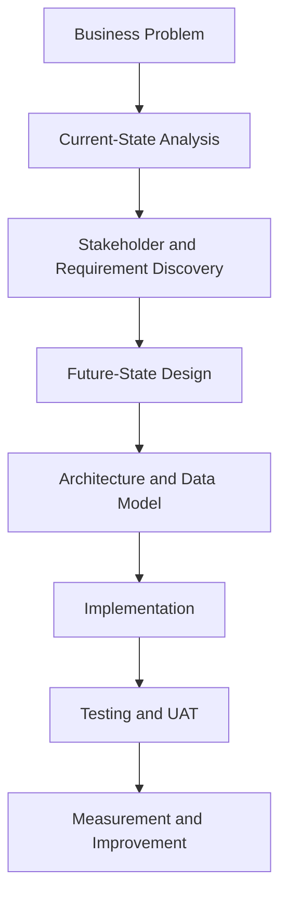
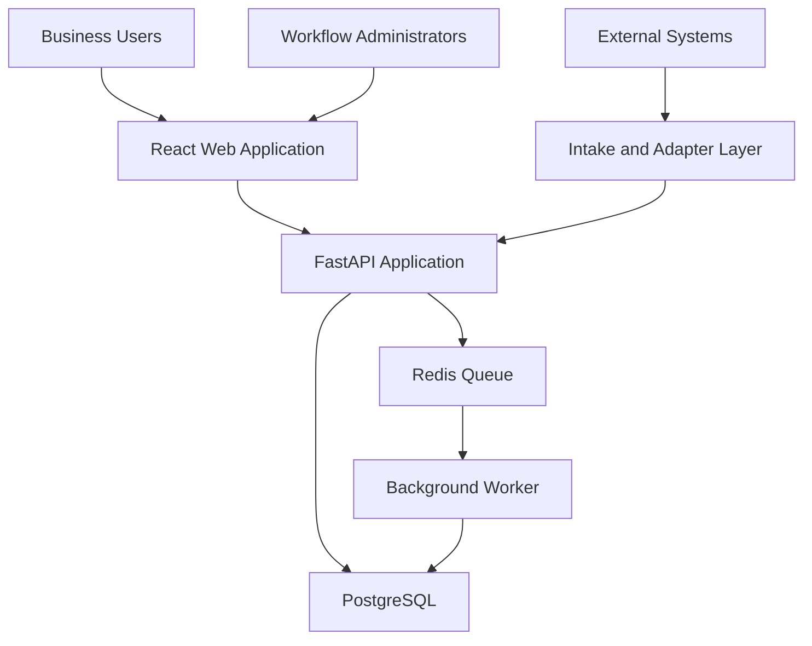

# FlowLens

**Turn fragmented business processes into configurable, measurable workflows.**

FlowLens is an open-source, self-hosted workflow-transformation platform designed to help teams understand how work moves across their organization, identify operational friction, and implement a controlled future state.

Instead of replacing every existing business system, FlowLens acts as a coordination and intelligence layer across them. It centralizes workflow ownership, requirements, approvals, exceptions, integrations, audit history, and operational measurements.

> **Current status:** Product definition and system design are complete, and the application foundation is running. FlowLens now includes an interactive React frontend, a FastAPI backend, containerized PostgreSQL, SQLAlchemy persistence, Alembic migrations, API health and database-readiness checks, and automated backend tests. The current interface uses synthetic demonstration data while database-backed workflow features are implemented.

---

## Why FlowLens Exists

Important business workflows rarely live inside one application.

A single process may depend on:

- Customer records in a CRM
- Contracts in an electronic-signature platform
- Approvals in email or chat
- Tasks in a project-management system
- Financial information in a billing platform
- Status tracking in spreadsheets
- Institutional knowledge held by individual employees

Each system may perform its own responsibility adequately while the overall workflow remains fragmented.

That fragmentation creates problems such as:

- Duplicate data entry
- Unclear ownership
- Missing next actions
- Approvals without structured evidence
- Status reports assembled manually
- Exceptions hidden in email or chat
- Integration failures visible only in logs
- Risks discovered after deadlines are missed
- Different teams reporting conflicting status
- Limited ability to measure process performance

FlowLens is being built to address the coordination layer between those systems.

---

## Product Vision

FlowLens will allow an organization to:

1. Define a reusable workflow template.
2. Configure stages, fields, requirements, approvals, roles, and rules.
3. Create work items manually or through integrations.
4. Assign one accountable owner and an explicit next action.
5. Move work through controlled stages.
6. Prevent invalid transitions.
7. Surface risks and exceptions before deadlines are missed.
8. Record every important action in an audit history.
9. Measure workflow performance from structured events.
10. Improve the process without discarding systems that still provide value.

The goal is not simply to display workflow data.

The goal is to turn a fragmented process into an operational system people can actually use.

---

## Product Capabilities

The initial usable release is designed to include the following capabilities.

### Configurable Workflow Templates

Administrators will be able to define:

- Workflow stages
- Custom fields
- Required information
- Completion requirements
- Approval requirements
- User roles
- Assignment rules
- Entry and exit conditions
- Service-level targets
- Risk rules
- Exception rules
- Measurement definitions

Published template versions will be immutable so historical work remains interpretable.

### Work-Item Management

Users will be able to:

- Create work items
- View active work
- Update configured fields
- See the current workflow stage
- Review stage history
- Identify the accountable owner
- Track the next required action
- Review target dates
- Complete requirements
- Request transitions
- Complete or cancel work through controlled actions

### Structured Assignments

Every active work item can have:

- One accountable owner
- A next action
- A due date when required
- An assignment reason
- Assignment history
- Escalation visibility

### Structured Approvals

Approvals will record:

- Approval type
- Decision-maker
- Requested date
- Decision
- Decision timestamp
- Conditions
- Rejection reason
- Related workflow stage

An email or chat message alone will not count as a tracked approval.

### Exception Management

FlowLens will make operational problems visible and actionable.

Exceptions can include:

- Type
- Severity
- Summary
- Owning user or department
- Related workflow stage
- Created date
- Resolution target
- Resolution outcome
- Approved deferral
- Supporting audit events

Critical exceptions can prevent workflow completion.

### Risk Detection

Configurable rules will identify conditions such as:

- Missing ownership
- Overdue assignments
- Incomplete requirements
- Approaching target dates
- Stalled workflow stages
- Rejected approvals
- Failed integrations
- Conflicting external information
- Unresolved critical exceptions

The first release will use explainable, rule-based risk detection.

### Operational Dashboard

The planned dashboard will show:

- Total active work items
- Work by workflow stage
- Work by accountable owner
- On-track, at-risk, and blocked work
- Upcoming target dates
- Overdue assignments
- Open exceptions by severity
- Approval status
- Average cycle time
- Stage aging
- First-pass handoff acceptance
- Integration-processing health
- Performance against defined targets

### Audit History

Significant actions will create append-only workflow events.

Examples include:

- Work item created
- Owner assigned
- Owner changed
- Stage entered
- Stage completed
- Requirement completed
- Approval requested
- Approval decided
- Exception created
- Exception resolved
- Risk detected
- Integration received
- Integration failed
- Work item completed
- Work item canceled

Historical evidence will not be silently overwritten.

### Multiple Intake Methods

FlowLens is designed to accept work through:

- Manual browser entry
- CSV import
- REST API
- Generic webhooks
- Source-specific adapters

All intake methods will use the same validation and workflow rules.

### Integration Safety

The integration layer is designed to support:

- Versioned contracts
- Schema validation
- Registered sources
- Correlation identifiers
- Idempotency
- Duplicate-event protection
- Retry policies
- Processing history
- Visible integration failures
- Adapter-based field mapping

---

## From Analysis to Implementation

FlowLens is intentionally more than a coding exercise.

The repository demonstrates an end-to-end systems-analysis process:



This project shows how a systems analyst can:

- Inherit a messy workflow
- Understand the systems already in place
- Identify what is working
- Find process and ownership gaps
- Define measurable outcomes
- Translate business needs into requirements
- Design a controlled future state
- Establish traceability
- Define technical contracts
- Guide implementation
- Validate the finished system

---

## Northstar Demonstration Scenario

FlowLens includes a fictional company named **Northstar Business Services** as its primary demonstration scenario.

Northstar manages a contract-to-launch workflow involving:

- Sales
- Legal
- Finance
- Implementation
- Service Delivery
- Operations

Its existing environment includes fictional uses of:

- Salesforce
- DocuSign
- Gmail
- Google Sheets
- Slack
- Jira
- NetSuite

The current process depends on manual handoffs, spreadsheet reconciliation, scattered approvals, and informal exception management.

The Northstar scenario is used to demonstrate how FlowLens can:

- Preserve useful source systems
- Coordinate work across departments
- Establish accountable ownership
- Enforce requirements
- Record approvals
- Detect risk
- Manage exceptions
- Process external events
- Produce measurable workflow data

Northstar is a bundled configuration and synthetic dataset. It is not hardcoded into the FlowLens platform.

Another organization could configure a different workflow without changing the core workflow engine.

---

## Product and Demonstration Separation

| FlowLens Platform | Northstar Demonstration |
|---|---|
| Generic workflow templates | Contract-to-launch template |
| Configurable stages | Northstar launch stages |
| Configurable fields | Customer and contract fields |
| Generic assignments | Department ownership rules |
| Generic approvals | Legal and Finance approvals |
| Generic exceptions | Missing contract and billing blockers |
| Generic metrics | Launch-performance measures |
| Adapter framework | Synthetic Salesforce and NetSuite events |
| Reusable work items | Synthetic customer launches |
| Self-hosted application | Preloaded demonstration environment |

This separation prevents FlowLens from becoming a one-company or one-workflow application.

---

## Technology Stack

| Layer | Technology | Status |
|---|---|---|
| Frontend | React, TypeScript, and Vite | Implemented |
| Client routing | React Router | Implemented |
| Server-state management | TanStack Query | Planned |
| Dashboard visualization | Recharts | Planned |
| Backend API | FastAPI and Python | Implemented |
| Request validation | Pydantic | Implemented |
| Database | PostgreSQL | Implemented |
| Persistence | SQLAlchemy | Implemented |
| Database migrations | Alembic | Implemented |
| Background processing | Celery | Planned |
| Queue and cache | Redis | Planned |
| Backend testing | Pytest | Implemented |
| Frontend testing | Vitest and Testing Library | Planned |
| End-to-end testing | Playwright | Planned |
| Local services | Docker Compose | PostgreSQL implemented |
| Continuous integration | GitHub Actions | Planned |
| API documentation | OpenAPI through FastAPI | Implemented |

The initial application will use a modular-monolith architecture. This provides strong domain boundaries without introducing unnecessary distributed-system complexity.

---

## High-Level Architecture



The current implementation includes the React application, FastAPI service, and PostgreSQL database. Redis and the background worker remain part of the planned architecture.

The complete local environment will eventually be deployable using Docker Compose with:

- Web application
- API application
- Background worker
- PostgreSQL
- Redis
- Persistent database storage

---

## Core Domain Model

FlowLens is built around generic platform concepts.

### Administration

- Organization
- User
- Role
- User role

### Workflow Configuration

- Workflow template
- Workflow-template version
- Stage definition
- Field definition
- Requirement definition
- Approval definition
- Rule definition
- Metric definition

### Workflow Runtime

- Work item
- Field value
- External reference
- Stage history
- Assignment
- Approval
- Requirement
- Exception
- Risk snapshot

### Integration and Audit

- Workflow event
- Integration event
- Import job
- Processing attempt
- Correlation identifier

The complete model is documented in [`docs/data-model.md`](docs/data-model.md).

---

## Run the Current Application Foundation

### Prerequisites

- Git
- Docker with Docker Compose
- Python 3.12 or later
- Node.js 24 or later
- npm

### 1. Clone and configure FlowLens

```bash
git clone https://github.com/kay-freeman/flowlens.git
cd flowlens
cp .env.example .env
```

The included environment file contains development-only values. Do not use these credentials for a public or production deployment.

### 2. Start PostgreSQL

```bash
docker compose up -d postgres
docker compose ps
```

The PostgreSQL service should report a healthy status before migrations are applied.

### 3. Install and prepare the API

```bash
python3 -m venv .venv
source .venv/bin/activate
python -m pip install -e "apps/api[dev]"

cd apps/api
alembic upgrade head
cd ../..
```

### 4. Run the API

```bash
uvicorn flowlens.main:app \
  --app-dir apps/api/src \
  --host 0.0.0.0 \
  --port 8000 \
  --reload
```

The current API provides:

- `GET /health` for API process health
- `GET /ready` for API and PostgreSQL readiness
- `/docs` for interactive OpenAPI documentation

### 5. Run the frontend

In a second terminal:

```bash
cd flowlens/apps/web
npm install
npm run dev -- --host 0.0.0.0
```

Vite will display the browser address for the frontend, typically using port `5173`.

### 6. Run the current checks

Backend:

```bash
cd flowlens
source .venv/bin/activate
pytest apps/api/tests -v
```

Frontend:

```bash
cd flowlens/apps/web
npm run lint
npm run build
```

Database schema consistency:

```bash
cd flowlens/apps/api
source ../../.venv/bin/activate
alembic check
```

The frontend is currently an interactive synthetic demonstration. The organization schema is persisted in PostgreSQL, but the frontend is not yet connected to database-backed workflow records.

---

## Definition of Usable

FlowLens will not be considered usable merely because screenshots or interface mockups exist.

The initial release must allow someone to:

- Clone the repository
- Configure environment variables
- Start the application with documented commands
- Open the application in a browser
- Use a persistent database
- Load a workflow template
- Create work items
- Assign ownership
- Complete requirements
- Record approvals
- Move work through valid stages
- Create and resolve exceptions
- Review workflow history
- Import records using CSV
- Submit records through an API
- Process generic webhook events
- Review dashboard measurements
- Restart the application without losing data
- Follow documentation without assistance from the original developer

---

## Current Project Status

### Working Today

- Interactive React and TypeScript demonstration interface
- Navigable routes for work items, approvals, exceptions, integrations, audit history, templates, people, and settings
- Synthetic Northstar dashboard and workflow records
- FastAPI application with generated OpenAPI documentation
- API health and PostgreSQL readiness endpoints
- Dockerized PostgreSQL with persistent local storage
- Environment-based application configuration
- SQLAlchemy database sessions and declarative models
- Alembic migration history
- Persisted organization table with a unique organization slug
- Backend tests for health, readiness, and database-unavailable behavior
- Passing frontend lint and production build checks

### Current Limitation

The frontend experience is functional and navigable, but its demonstration records are still stored as synthetic frontend data. The next implementation milestone connects API endpoints and PostgreSQL persistence to the interface, beginning with organization management.

### Phase 1: Business Analysis and Product Definition

- [x] Define the transformation case
- [x] Document the current state
- [x] Analyze the existing system landscape
- [x] Identify pain points and root causes
- [x] Identify stakeholders
- [x] Define measurable outcomes
- [x] Define guardrail measures
- [x] Establish the reusable product scope
- [x] Separate the platform from the demonstration scenario

### Phase 2: Requirements and Future-State Design

- [x] Document functional requirements
- [x] Document business rules
- [x] Document reporting requirements
- [x] Document data requirements
- [x] Document nonfunctional requirements
- [x] Define acceptance criteria
- [x] Create the requirements traceability matrix
- [x] Design the future-state workflow
- [x] Define the platform data model
- [x] Define the application architecture
- [x] Define integration contracts

### Phase 3: Application Foundation

- [x] Create the monorepo structure
- [x] Scaffold the FastAPI backend
- [x] Scaffold the React frontend
- [x] Configure PostgreSQL
- [x] Configure SQLAlchemy and Alembic
- [ ] Configure Redis and Celery
- [x] Create the PostgreSQL Docker Compose service
- [ ] Add remaining application services to Docker Compose
- [x] Add API and database health checks
- [x] Add environment configuration
- [ ] Establish automated test workflows

### Phase 4: Configurable Workflow Engine

- [ ] Implement organization API operations
- [ ] Implement users and roles
- [ ] Implement workflow templates
- [ ] Implement template versioning
- [ ] Implement stage and field definitions
- [ ] Implement work items
- [ ] Implement configurable transitions
- [ ] Implement assignment rules
- [ ] Implement requirements
- [ ] Implement structured approvals
- [ ] Implement exceptions
- [ ] Implement workflow events
- [ ] Implement rule-based risk evaluation

### Phase 5: Intake and Integrations

- [ ] Implement manual work-item intake
- [ ] Implement CSV validation preview
- [ ] Implement confirmed CSV processing
- [ ] Implement REST API intake
- [ ] Implement generic webhook intake
- [ ] Implement idempotency
- [ ] Implement retry handling
- [ ] Implement visible integration failures
- [ ] Implement the adapter registry
- [ ] Add Northstar demonstration adapters

### Phase 6: User Experience and Reporting

- [ ] Build the operational dashboard
- [ ] Build the work-item queue
- [ ] Build work-item details
- [ ] Build the approval queue
- [ ] Build the exception queue
- [ ] Build workflow-template administration
- [ ] Build integration monitoring
- [ ] Build audit-history views
- [ ] Add measurement calculations
- [ ] Add accessible empty, loading, and error states

### Phase 7: Validation and Release

- [ ] Complete backend unit tests
- [ ] Complete API integration tests
- [ ] Complete frontend tests
- [ ] Complete end-to-end tests
- [ ] Execute Northstar demonstration scenarios
- [ ] Complete UAT
- [ ] Validate Docker installation from a clean environment
- [ ] Add backup and recovery instructions
- [ ] Complete deployment documentation
- [ ] Publish the first usable release
- [ ] Update the portfolio with the completed system

---

## Documentation

### Business Analysis

- [Business Case](docs/business-case.md)
- [Current-State Analysis](docs/current-state.md)
- [Stakeholder Analysis](docs/stakeholders.md)
- [Success Measures](docs/success-measures.md)

### Requirements and Traceability

- [Product Scope](docs/product-scope.md)
- [Requirements Specification](docs/requirements.md)
- [Acceptance Criteria](docs/acceptance-criteria.md)
- [Requirements Traceability Matrix](docs/traceability-matrix.md)

### Solution Design

- [Future-State Design](docs/future-state.md)
- [Architecture](docs/architecture.md)
- [Data Model](docs/data-model.md)
- [Integration Contracts](docs/integration-contracts.md)

The repository also includes working application source under `apps/api` and `apps/web`, an Alembic migration history, Docker Compose configuration, and automated backend tests. Additional implementation, testing, deployment, administration, and user documentation will be added as the product develops.

---

## Success Measures

The Northstar demonstration will model improvement targets such as:

- Reduced end-to-end workflow cycle time
- Fewer manual data-entry touchpoints
- Clear accountable ownership
- Increased structured approval coverage
- Earlier risk detection
- Reduced reporting-preparation time
- Faster exception resolution
- Improved first-pass handoff acceptance
- Reduced customer-data re-entry
- Reliable integration processing
- Visible integration failures
- Complete audit evidence

Because FlowLens is currently a portfolio project, displayed improvements will be labeled as:

- Synthetic
- Simulated
- Modeled
- Baseline
- Target

The project will not present synthetic outcomes as real organizational results.

---

## Guardrails

Operational improvement must not weaken required controls.

FlowLens will verify that:

- Required approvals cannot be bypassed.
- Work cannot be completed with unresolved critical exceptions.
- Duplicate external events do not create duplicate workflow actions.
- Failed integrations create visible exceptions.
- Human decisions cannot be changed without audit evidence.
- Restricted decision details remain protected.
- Workflow events are not silently discarded.
- Demonstration data contains no real customer, employer, or proprietary information.

---

## Project Boundaries

The first release will not claim to provide:

- Full multi-tenant SaaS isolation
- Enterprise single sign-on
- Production-certified third-party connectors
- High-availability or multi-region deployment
- A visual drag-and-drop workflow designer
- Arbitrary user-authored executable rules
- Automated migration of active work between template versions
- Machine-learning risk prediction
- Native mobile applications
- Replacement functionality for specialized CRMs, financial platforms, contract systems, or project-management tools

These boundaries keep the first release achievable while preserving a strong reusable foundation.

---

## Portfolio Value

FlowLens demonstrates work across:

- Systems analysis
- Business-process analysis
- Current-state assessment
- Future-state design
- Requirements engineering
- Stakeholder analysis
- Process governance
- Data modeling
- Solution architecture
- API and integration design
- Workflow automation
- Auditability
- Risk management
- Reporting strategy
- Test planning
- User acceptance testing
- Technical documentation
- Product implementation
- Self-hosted deployment

It is designed to show not only the ability to build software, but the ability to determine what should be built, why it should exist, how it should behave, and how its success should be measured.

---

## Data and Privacy

All organizations, people, customer records, transactions, and integration events included in this repository are fictional and synthetic.

FlowLens must not contain:

- Real customer information
- Employer-owned data
- Proprietary documentation
- Production credentials
- Real access tokens
- Confidential integration payloads

---

## License

FlowLens is available under the [MIT License](LICENSE).

---

## Author

Created by [Kay Freeman](https://github.com/kay-freeman) as a portfolio project focused on systems analysis, business-systems transformation, workflow design, integration architecture, and operational improvement.