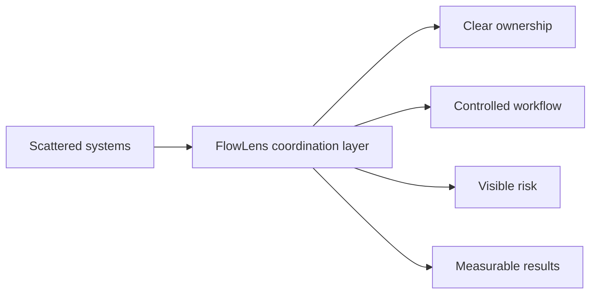
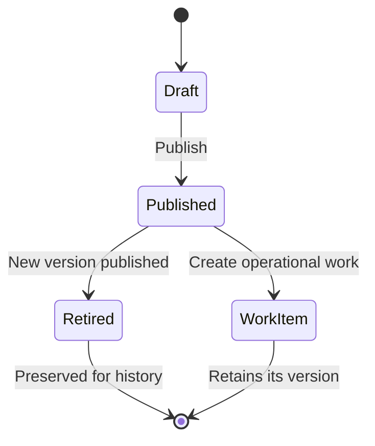
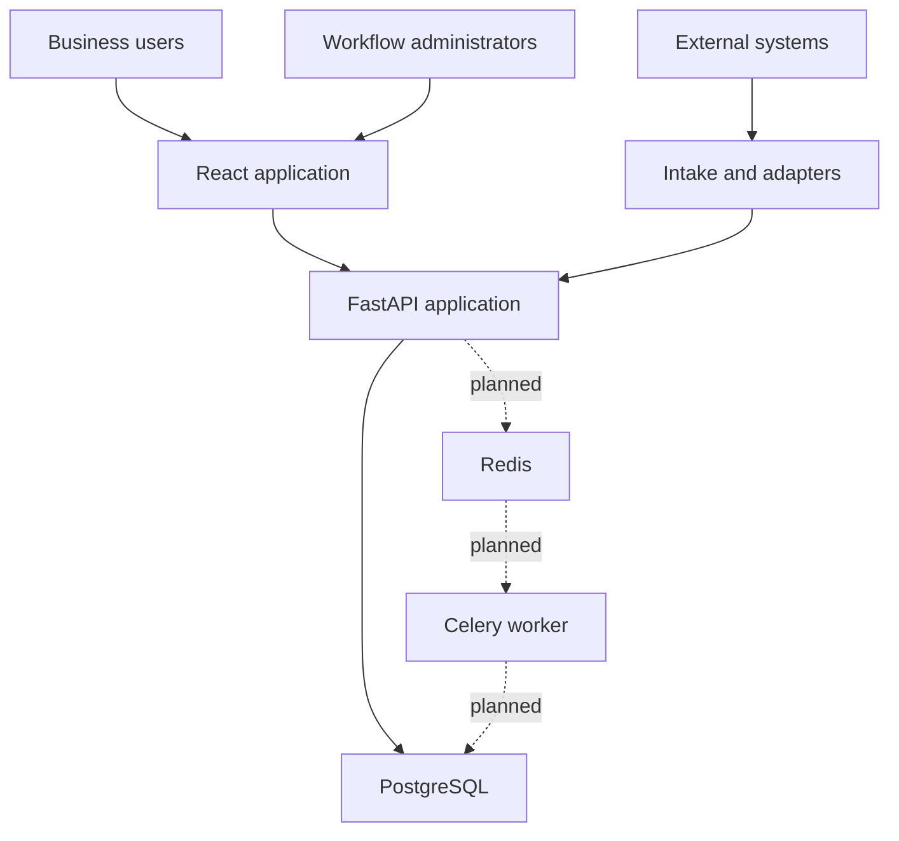
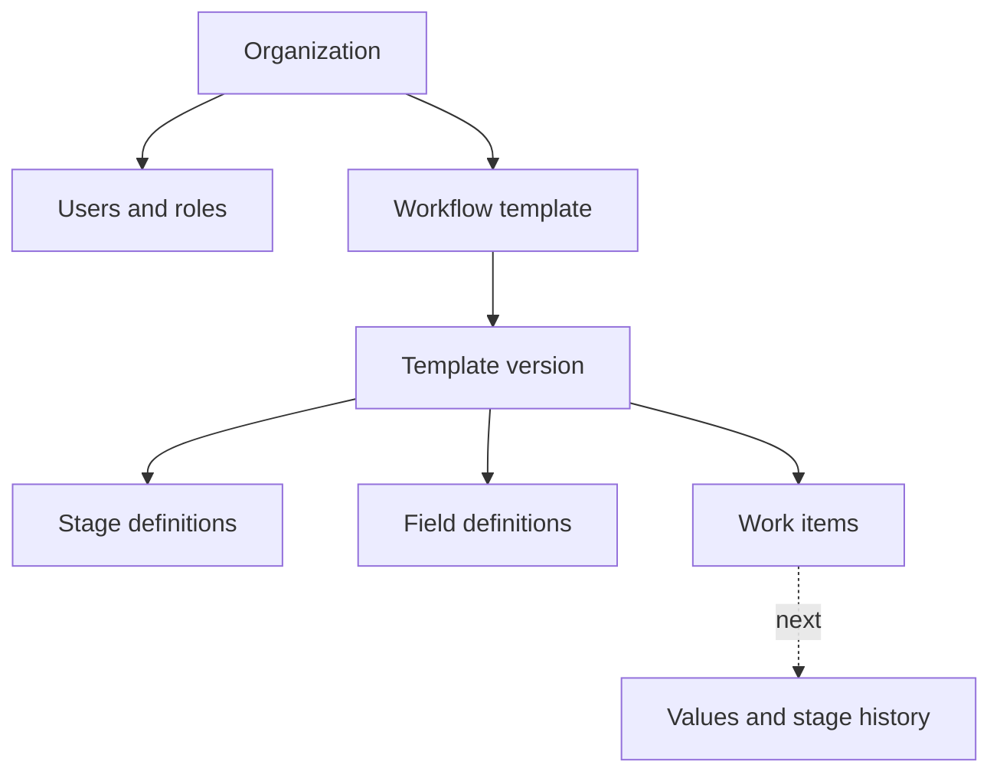

<div align="center">

# FlowLens

### Turn fragmented business processes into configurable, measurable workflows.

[](https://github.com/kay-freeman/flowlens/actions/workflows/ci.yml)


**Open source · Self-hosted · Configuration-driven · Built for operational clarity**

</div>

---

## The short version

Important workflows rarely live in one system.

Customer data may live in a CRM. Contracts may live in an electronic-signature platform. Approvals may happen in email or chat. Tasks may live in project-management software. Status reporting may still depend on spreadsheets.

Each tool can work while the overall process remains fragmented.

**FlowLens is the coordination layer between those systems.**

It is being built to give teams one place to define how work should move, assign accountability, control approvals and transitions, surface exceptions, preserve audit evidence, and measure performance.

> [!IMPORTANT]
> **Current build:** The application foundation and the first workflow-runtime capability are working. FlowLens currently includes an interactive React demonstration, a FastAPI backend, PostgreSQL persistence, migrations, automated CI, and database-backed APIs for organizations, users, roles, workflow templates, template versions, stages, fields, and operational work items.
>
> The frontend still displays synthetic demonstration data and is not yet connected to the persistent API.

---

## At a glance

| Area | What FlowLens does | Current state |
|---|---|---|
| Workflow design | Defines reusable templates, versions, stages, and fields | Implemented |
| Governance | Preserves published versions and rejects later configuration changes | Implemented |
| Administration | Manages organizations, users, roles, and role assignments | Implemented |
| Workflow runtime | Creates, lists, and retrieves persistent operational work items | Implemented |
| Runtime controls | Advances, pauses, completes, and cancels work items | Planned |
| Persistence | Stores implemented domains in PostgreSQL through SQLAlchemy | Implemented |
| API | Exposes validated operations through FastAPI and OpenAPI | Implemented |
| Quality | Runs migrations, backend tests, frontend lint, and builds in CI | Implemented |
| Integrations | Accepts CSV, REST, and webhook intake | Planned |
| Dashboard | Measures ownership, risk, exceptions, and cycle time | Demonstration UI |
| Background work | Processes queued and retryable jobs | Planned |

---

## The problem FlowLens is solving

Fragmented operations create predictable problems:

- Nobody knows who owns the next action.
- The same information gets entered into multiple systems.
- Approvals exist as messages instead of structured decisions.
- Exceptions disappear inside email threads or chat channels.
- Teams assemble status reports manually.
- Integration failures remain hidden in logs.
- Different departments report conflicting status.
- Risks become visible only after deadlines are missed.
- Historical evidence is overwritten or impossible to reconstruct.
- Process performance cannot be measured consistently.

FlowLens is designed to convert that fragmentation into a controlled operational workflow.



---

## What makes FlowLens different

### Configuration instead of hardcoding

Organizations define reusable templates, versioned stages, fields, roles, requirements, approvals, and rules without turning FlowLens into a one-workflow application.

### Coordination instead of replacement

FlowLens does not need to replace every CRM, billing platform, contract tool, or project-management system. It coordinates the work that moves between them.

### Evidence instead of informal status

Approvals, assignments, exceptions, transitions, and integration activity are designed to become structured records rather than scattered messages.

### Explainable controls

The first release prioritizes deterministic business rules and understandable risk signals over opaque automation.

### Historical integrity

Published workflow versions become immutable. Existing work retains the configuration that governed it, while future work can use a newer version.

---

## What works today

### Application foundation

- Interactive React and TypeScript demonstration interface
- FastAPI application with generated OpenAPI documentation
- PostgreSQL 17 running through Docker Compose
- SQLAlchemy persistence and database sessions
- Alembic migration history and consistency checks
- Environment-based configuration
- API health and database-readiness endpoints
- GitHub Actions continuous integration
- Passing frontend lint and production builds

### Administration

- Create, list, and retrieve organizations
- Create, list, and retrieve users
- Create, list, and retrieve roles
- Assign roles to users
- Enforce organization-scoped user emails and role codes
- Prevent cross-organization role assignments
- Return clear missing-record and conflict responses

### Workflow templates

- Create, list, and retrieve workflow templates
- Enforce organization-scoped template slugs
- Create sequential template versions
- Track draft, published, and retired states
- Record publishing timestamps and publishing users
- Activate a template when a version is published
- Automatically retire the previously published version
- Reject attempts to republish or modify a nondraft version

### Stage definitions

- Create, list, and retrieve stages within a template version
- Define stable stage codes
- Control stage sequence
- Set stage descriptions and SLAs
- Assign an optional default owner role
- Mark terminal and active stages
- Reject roles owned by another organization
- Prevent duplicate stage codes within a version

### Field definitions

- Create, list, and retrieve fields within a template version
- Define stable field keys and display labels
- Set field types and required status
- Track data provenance and source systems
- Store controlled JSON validation settings
- Control display order
- Mark sensitive fields
- Prevent duplicate field keys within a version

### Work items

- Create persistent work items from published template versions
- List work items within an organization
- Retrieve organization-scoped work-item details
- Automatically select the first active configured stage
- Require an active accountable owner from the same organization
- Start new work as `active` and `on_track`
- Preserve both current and original target timestamps
- Track optimistic-concurrency version numbers
- Reject draft or foreign template versions
- Reject configurations without an active starting stage
- Prevent cross-organization access to work items

### Quality proof

- **171 passing backend tests**
- Migration consistency verified through Alembic
- Backend tests executed automatically in GitHub Actions
- Frontend lint and production builds executed automatically
- Live API flows verified through interactive OpenAPI documentation
- Live work-item creation, listing, and retrieval verified against PostgreSQL

---

## Configuration lifecycle

Workflow configuration is intentionally versioned.



A draft version can receive stages and fields. Once published:

- The version records who published it.
- The version records when it was published.
- The parent workflow template becomes active.
- The previously published version becomes retired.
- New configuration changes to that version are rejected.
- New work items can use the published configuration.
- Existing work items retain their original template version.
- Historical interpretation remains stable.

---

## Northstar demonstration

FlowLens includes **Northstar Business Services**, a fictional company used to demonstrate a contract-to-launch workflow.

### The scenario

Northstar coordinates work across:

- Sales
- Legal
- Finance
- Implementation
- Service Delivery
- Operations

Its fictional systems include:

- Salesforce
- DocuSign
- Gmail
- Google Sheets
- Slack
- Jira
- NetSuite

Its current-state process depends on manual handoffs, spreadsheet reconciliation, scattered approvals, and informal exception management.

### What the scenario demonstrates

| FlowLens platform capability | Northstar example |
|---|---|
| Generic workflow template | Contract-to-launch |
| Versioned configuration | Sequential launch-process versions |
| Stage definitions | Intake, validation, review, readiness, approval, launch |
| Field definitions | Customer, contract, billing, and launch information |
| Persistent work item | Northstar Enterprise Customer Launch |
| Accountable ownership | Organization-scoped operational owner |
| User roles | Operations, Legal, Finance, and Implementation ownership |
| Structured approvals | Legal and Finance decisions |
| Exception management | Missing contract or billing blockers |
| Risk evaluation | Overdue ownership and incomplete requirements |
| Operational measurement | Launch cycle time and stage aging |
| Adapter framework | Synthetic Salesforce and NetSuite events |

Northstar is synthetic demonstration data. It is not hardcoded into the platform, and it does not represent a real company or real operational results.

---

## Architecture

FlowLens uses a modular-monolith architecture: strong domain boundaries without unnecessary distributed-system complexity.



### Current runtime

| Component | Technology | Status |
|---|---|---|
| Web application | React, TypeScript, Vite | Implemented |
| Client routing | React Router | Implemented |
| Backend API | FastAPI, Python 3.12 | Implemented |
| Validation | Pydantic | Implemented |
| Database | PostgreSQL 17 | Implemented |
| Persistence | SQLAlchemy | Implemented |
| Migrations | Alembic | Implemented |
| API documentation | OpenAPI and Swagger UI | Implemented |
| Backend testing | Pytest | Implemented |
| Continuous integration | GitHub Actions | Implemented |
| Queue and cache | Redis | Planned |
| Background processing | Celery | Planned |
| Server-state management | TanStack Query | Planned |
| Dashboard visualization | Recharts | Planned |
| Frontend testing | Vitest and Testing Library | Planned |
| End-to-end testing | Playwright | Planned |

---

## Domain map



| Domain | Core entities |
|---|---|
| Administration | Organization, User, Role, UserRole |
| Workflow configuration | WorkflowTemplate, WorkflowTemplateVersion, StageDefinition, FieldDefinition |
| Workflow runtime | WorkItem |
| Planned configuration | RequirementDefinition, ApprovalDefinition, RuleDefinition, MetricDefinition |
| Planned runtime | WorkItemFieldValue, StageHistory, Assignment, Approval, Requirement, Exception, RiskSnapshot |
| Planned integration and audit | WorkflowEvent, IntegrationEvent, ImportJob, ProcessingAttempt |

See the complete design in [`docs/data-model.md`](docs/data-model.md).

---

## API map

Interactive documentation is available at:

```text
http://localhost:8000/docs
```

### System

| Method | Endpoint | Purpose |
|---|---|---|
| `GET` | `/health` | Check API process health |
| `GET` | `/ready` | Check API and PostgreSQL readiness |

### Organizations

| Method | Endpoint | Purpose |
|---|---|---|
| `POST` | `/organizations` | Create an organization |
| `GET` | `/organizations` | List organizations |
| `GET` | `/organizations/{organization_id}` | Retrieve an organization |

### Users and roles

| Method | Endpoint | Purpose |
|---|---|---|
| `POST` | `/organizations/{organization_id}/users` | Create a user |
| `GET` | `/organizations/{organization_id}/users` | List users |
| `GET` | `/organizations/{organization_id}/users/{user_id}` | Retrieve a user |
| `POST` | `/organizations/{organization_id}/roles` | Create a role |
| `GET` | `/organizations/{organization_id}/roles` | List roles |
| `GET` | `/organizations/{organization_id}/roles/{role_id}` | Retrieve a role |
| `POST` | `/organizations/{organization_id}/users/{user_id}/roles` | Assign a role |
| `GET` | `/organizations/{organization_id}/users/{user_id}/roles` | List role assignments |

### Workflow templates and versions

| Method | Endpoint | Purpose |
|---|---|---|
| `POST` | `/organizations/{organization_id}/workflow-templates` | Create a template |
| `GET` | `/organizations/{organization_id}/workflow-templates` | List templates |
| `GET` | `/organizations/{organization_id}/workflow-templates/{template_id}` | Retrieve a template |
| `POST` | `/organizations/{organization_id}/workflow-templates/{template_id}/versions` | Create a draft version |
| `GET` | `/organizations/{organization_id}/workflow-templates/{template_id}/versions` | List versions |
| `GET` | `/organizations/{organization_id}/workflow-templates/{template_id}/versions/{version_id}` | Retrieve a version |
| `POST` | `/organizations/{organization_id}/workflow-templates/{template_id}/versions/{version_id}/publish` | Publish a draft version |

### Stage and field definitions

The following endpoints share this base path:

```text
/organizations/{organization_id}/workflow-templates/{template_id}/versions/{version_id}
```

| Method | Endpoint suffix | Purpose |
|---|---|---|
| `POST` | `/stages` | Create a stage definition |
| `GET` | `/stages` | List stages in sequence order |
| `GET` | `/stages/{stage_id}` | Retrieve a stage |
| `POST` | `/fields` | Create a field definition |
| `GET` | `/fields` | List fields in display order |
| `GET` | `/fields/{field_id}` | Retrieve a field |

### Work items

| Method | Endpoint | Purpose |
|---|---|---|
| `POST` | `/organizations/{organization_id}/work-items` | Create a work item from a published template version |
| `GET` | `/organizations/{organization_id}/work-items` | List work items |
| `GET` | `/organizations/{organization_id}/work-items/{work_item_id}` | Retrieve a work item |

---

## Quick start

### Prerequisites

- Git
- Docker with Docker Compose
- Python 3.12 or later
- Node.js 24 or later
- npm

### 1. Clone and configure

```bash
git clone https://github.com/kay-freeman/flowlens.git
cd flowlens
cp .env.example .env
```

The included values are for local development only. Do not reuse them in a public or production environment.

### 2. Start PostgreSQL

```bash
docker compose up -d postgres
docker compose ps
```

Wait for the PostgreSQL service to report a healthy status.

### 3. Prepare the API

```bash
python3 -m venv .venv
source .venv/bin/activate
python -m pip install -e "apps/api[dev]"

cd apps/api
alembic upgrade head
cd ../..
```

### 4. Run the API

```bash
uvicorn flowlens.main:app \
  --app-dir apps/api/src \
  --host 0.0.0.0 \
  --port 8000 \
  --reload
```

Open:

- API health: `http://localhost:8000/health`
- Database readiness: `http://localhost:8000/ready`
- Interactive API documentation: `http://localhost:8000/docs`

### 5. Run the frontend

In a second terminal:

```bash
cd apps/web
npm install
npm run dev -- --host 0.0.0.0
```

Vite will display the frontend address, typically on port `5173`.

> [!NOTE]
> The frontend is currently an interactive synthetic demonstration. The implemented API records are persistent, but the frontend has not yet been connected to them.

---

## Run the checks

### Backend tests

```bash
cd flowlens
source .venv/bin/activate
pytest apps/api/tests -v
```

### Migration consistency

```bash
cd flowlens/apps/api
source ../../.venv/bin/activate
alembic check
```

### Frontend quality checks

```bash
cd flowlens/apps/web
npm run lint
npm run build
```

---

## Roadmap

### Progress snapshot

| Phase | Status |
|---|---|
| 1. Business analysis and product definition | Complete |
| 2. Requirements and future-state design | Complete |
| 3. Application foundation | In progress |
| 4. Configurable workflow engine | In progress |
| 5. Intake and integrations | Planned |
| 6. User experience and reporting | Planned |
| 7. Validation and release | Planned |

<details>
<summary><strong>Phase 1: Business analysis and product definition</strong></summary>

- [x] Define the transformation case
- [x] Document the current state
- [x] Analyze the existing system landscape
- [x] Identify pain points and root causes
- [x] Identify stakeholders
- [x] Define measurable outcomes
- [x] Define guardrail measures
- [x] Establish the reusable product scope
- [x] Separate the platform from the demonstration scenario

</details>

<details>
<summary><strong>Phase 2: Requirements and future-state design</strong></summary>

- [x] Document functional requirements
- [x] Document business rules
- [x] Document reporting requirements
- [x] Document data requirements
- [x] Document nonfunctional requirements
- [x] Define acceptance criteria
- [x] Create the requirements traceability matrix
- [x] Design the future-state workflow
- [x] Define the platform data model
- [x] Define the application architecture
- [x] Define integration contracts

</details>

<details open>
<summary><strong>Phase 3: Application foundation</strong></summary>

- [x] Create the monorepo structure
- [x] Scaffold the FastAPI backend
- [x] Scaffold the React frontend
- [x] Configure PostgreSQL
- [x] Configure SQLAlchemy and Alembic
- [ ] Configure Redis and Celery
- [x] Create the PostgreSQL Docker Compose service
- [ ] Add remaining application services to Docker Compose
- [x] Add API and database health checks
- [x] Add environment configuration
- [x] Establish automated test workflows

</details>

<details open>
<summary><strong>Phase 4: Configurable workflow engine</strong></summary>

- [x] Implement organization API operations
- [x] Implement users and roles
- [x] Implement workflow templates
- [x] Implement template versioning
- [x] Implement stage and field definitions
- [x] Implement work items
- [ ] Implement configurable transitions
- [ ] Implement assignment rules
- [ ] Implement requirements
- [ ] Implement structured approvals
- [ ] Implement exceptions
- [ ] Implement workflow events
- [ ] Implement rule-based risk evaluation

</details>

<details>
<summary><strong>Phase 5: Intake and integrations</strong></summary>

- [ ] Implement manual work-item intake
- [ ] Implement CSV validation preview
- [ ] Implement confirmed CSV processing
- [ ] Implement REST API intake
- [ ] Implement generic webhook intake
- [ ] Implement idempotency
- [ ] Implement retry handling
- [ ] Implement visible integration failures
- [ ] Implement the adapter registry
- [ ] Add Northstar demonstration adapters

</details>

<details>
<summary><strong>Phase 6: User experience and reporting</strong></summary>

- [ ] Build the operational dashboard
- [ ] Build the work-item queue
- [ ] Build work-item details
- [ ] Build the approval queue
- [ ] Build the exception queue
- [ ] Build workflow-template administration
- [ ] Build integration monitoring
- [ ] Build audit-history views
- [ ] Add measurement calculations
- [ ] Add accessible empty, loading, and error states

</details>

<details>
<summary><strong>Phase 7: Validation and release</strong></summary>

- [ ] Complete backend unit tests
- [ ] Complete API integration tests
- [ ] Complete frontend tests
- [ ] Complete end-to-end tests
- [ ] Execute Northstar demonstration scenarios
- [ ] Complete UAT
- [ ] Validate Docker installation from a clean environment
- [ ] Add backup and recovery instructions
- [ ] Complete deployment documentation
- [ ] Publish the first usable release
- [ ] Update the portfolio with the completed system

</details>

---

## Release gate

FlowLens will not be considered usable because a screenshot or mockup exists.

The first usable release must allow someone to:

- [ ] Clone and configure the repository
- [ ] Start the complete application with documented commands
- [ ] Open the application in a browser
- [x] Use a persistent database
- [x] Create and version workflow templates through the API
- [x] Configure stages and fields through the API
- [ ] Load persistent configuration in the frontend
- [x] Create work items
- [x] Assign accountable ownership during work-item creation
- [ ] Complete requirements
- [ ] Record approvals
- [ ] Move work through valid stages
- [ ] Create and resolve exceptions
- [ ] Review workflow history
- [ ] Import records through CSV
- [ ] Submit records through the runtime API
- [ ] Process generic webhook events
- [ ] Review operational measurements
- [ ] Restart the application without losing data
- [ ] Follow the documentation without assistance from the original developer

---

## Documentation library

### Business analysis

- [Business Case](docs/business-case.md)
- [Current-State Analysis](docs/current-state.md)
- [Stakeholder Analysis](docs/stakeholders.md)
- [Success Measures](docs/success-measures.md)

### Requirements and traceability

- [Product Scope](docs/product-scope.md)
- [Requirements Specification](docs/requirements.md)
- [Acceptance Criteria](docs/acceptance-criteria.md)
- [Requirements Traceability Matrix](docs/traceability-matrix.md)

### Solution design

- [Future-State Design](docs/future-state.md)
- [Architecture](docs/architecture.md)
- [Data Model](docs/data-model.md)
- [Integration Contracts](docs/integration-contracts.md)

---

## Success measures

The Northstar demonstration is designed to model improvements such as:

| Outcome | Intended signal |
|---|---|
| Faster workflow completion | Reduced end-to-end cycle time |
| Clear accountability | Active work always has an owner and next action |
| Better handoffs | Increased first-pass acceptance |
| Stronger governance | Structured approval coverage |
| Earlier intervention | Risk detected before a missed deadline |
| Faster exception handling | Reduced time to resolution |
| Less manual reporting | Reduced preparation time |
| Safer integrations | Visible failures, retries, and duplicate protection |
| Better evidence | Complete workflow and decision history |

Because FlowLens is a portfolio project, displayed results will always be identified as synthetic, simulated, modeled, baseline, or target values. Synthetic outcomes will never be presented as real organizational results.

---

## Guardrails

Operational improvement must not weaken required controls.

FlowLens is designed so that:

- Required approvals cannot be bypassed.
- Critical unresolved exceptions can prevent completion.
- Duplicate external events do not create duplicate workflow actions.
- Failed integrations create visible operational exceptions.
- Human decisions cannot be changed without audit evidence.
- Restricted decision details remain protected.
- Workflow events are not silently discarded.
- Published workflow versions remain historically interpretable.

---

## Project boundaries

The first release will not claim to provide:

- Full multi-tenant SaaS isolation
- Enterprise single sign-on
- Production-certified third-party connectors
- High-availability or multi-region deployment
- A visual drag-and-drop workflow designer
- Arbitrary user-authored executable rules
- Automated migration of active work between template versions
- Machine-learning risk prediction
- Native mobile applications
- Replacement functionality for specialized business systems

These boundaries keep the initial release achievable while preserving a reusable foundation.

---

## Why this project matters

FlowLens is both a product implementation and a systems-analysis portfolio project.

It demonstrates:

- Business-process and current-state analysis
- Stakeholder and requirement discovery
- Future-state workflow design
- Requirements traceability
- Data modeling
- Solution architecture
- API and integration design
- Workflow governance
- Auditability and risk management
- Test strategy and automated validation
- Technical documentation
- Incremental product delivery

The project is meant to show not only the ability to build software, but the ability to determine **what should be built, why it should exist, how it should behave, and how success should be measured.**

---

## Data and privacy

All organizations, people, customer records, transactions, and integration events included in this repository are fictional and synthetic.

FlowLens must never contain:

- Real customer information
- Employer-owned data
- Proprietary documentation
- Production credentials
- Real access tokens
- Confidential integration payloads

---

## License

FlowLens is available under the [MIT License](LICENSE).

---

## Author

Created by [Kay Freeman](https://github.com/kay-freeman) as a portfolio project focused on systems analysis, business-systems transformation, workflow design, integration architecture, and operational improvement.
