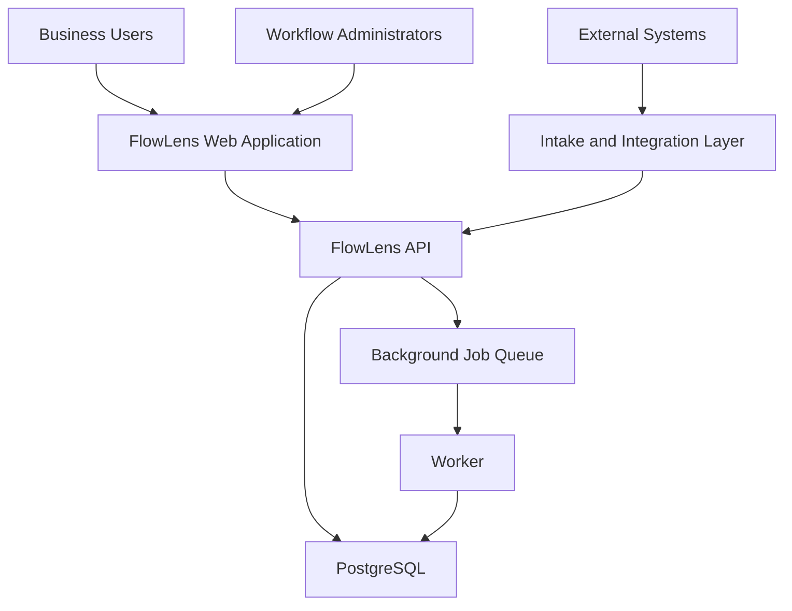
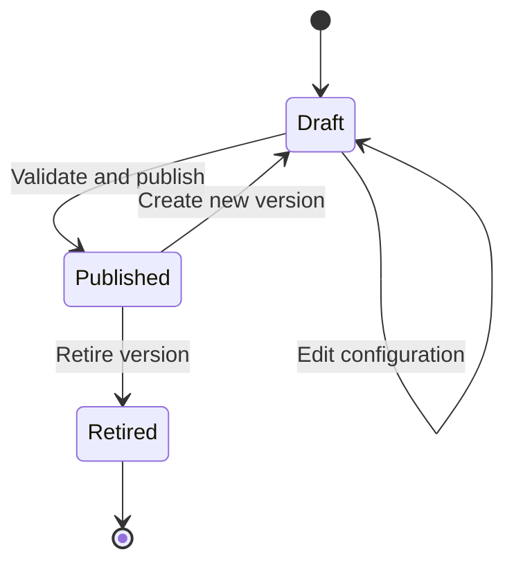
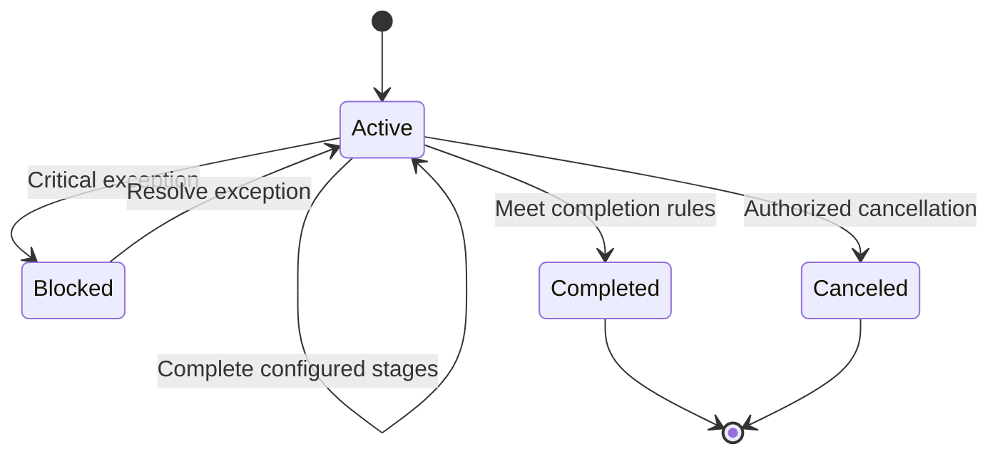
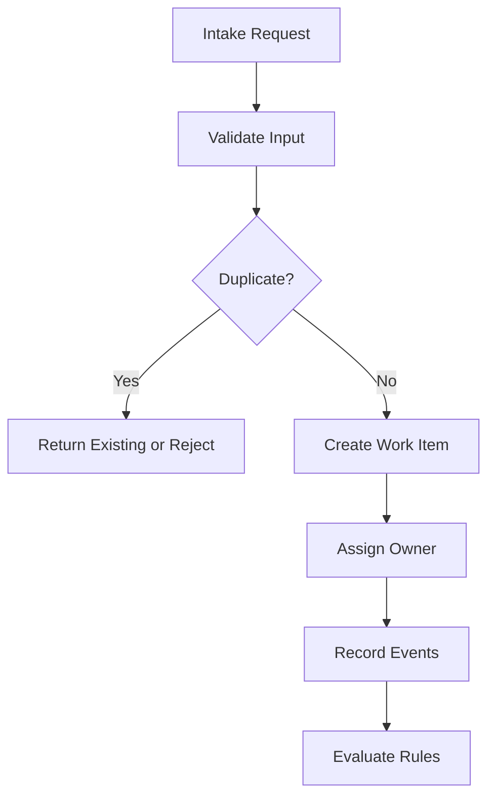
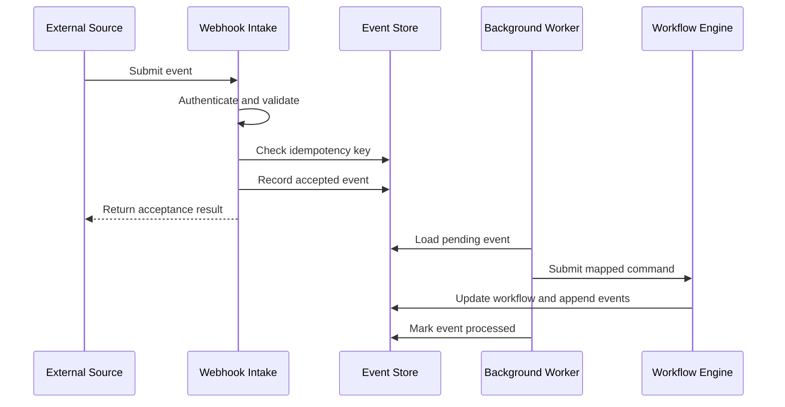
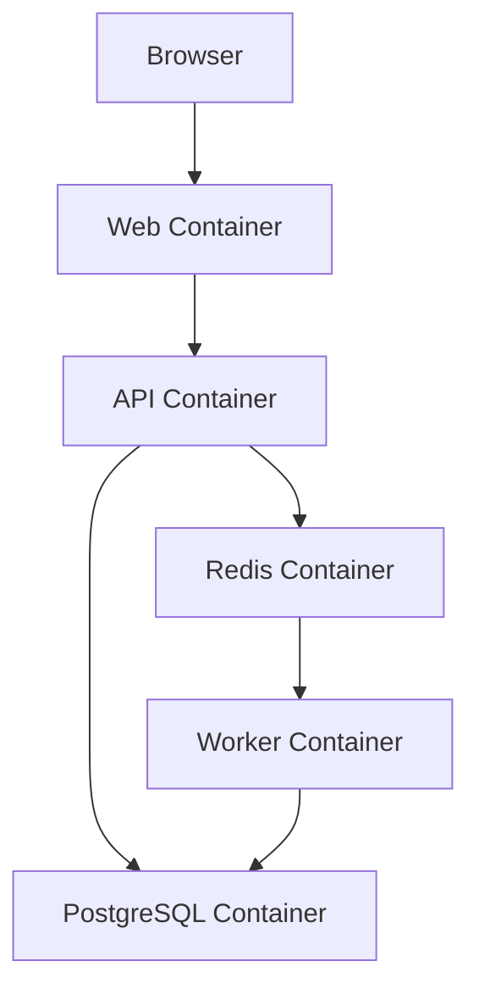

# FlowLens Architecture

## Purpose

This document defines the technical architecture for FlowLens, a configurable workflow-transformation platform.

FlowLens helps organizations replace fragmented, manually coordinated processes with measurable workflows while preserving the existing systems that remain useful.

The platform is designed to be:

- Configurable for different business workflows
- Deployable without proprietary services
- Usable through a browser
- Accessible through a documented API
- Auditable through structured workflow events
- Extendable through integration adapters
- Demonstrable with synthetic data
- Self-hostable with Docker Compose

The Northstar contract-to-launch scenario is included as a complete demonstration template. It validates the platform’s capabilities but does not define the platform’s underlying data model or architecture.

---

## Architectural Goals

### AG-01: Configurable Workflows

Administrators must be able to define workflow stages, fields, requirements, approvals, assignments, service-level targets, and business rules without changing application code.

### AG-02: Reusable Platform

Core application components must use generic concepts such as workflow templates, work items, assignments, approvals, exceptions, and events.

Customer-specific terminology must remain in configuration or demonstration packages.

### AG-03: Traceable Operations

Every important workflow action must generate an immutable event containing enough information to establish:

- What happened
- When it happened
- Who or what initiated it
- Which work item was affected
- What changed
- Why the change occurred when a reason is required

### AG-04: Integration Safety

External events must be validated, recorded, deduplicated, and processed predictably.

Failed integrations must create visible exceptions rather than remaining hidden in application logs.

### AG-05: Practical Self-Hosting

A user must be able to start FlowLens locally using documented Docker Compose commands and persistent storage.

### AG-06: Clear Product Boundaries

The initial release must provide a dependable workflow-management foundation without claiming to replace specialized systems such as Salesforce, DocuSign, Jira, or NetSuite.

### AG-07: Testable Business Rules

Workflow transitions, approvals, requirements, assignments, integrations, calculations, and guardrails must be testable independently of the user interface.

---

## System Context

FlowLens operates as a coordination and intelligence layer across an organization’s existing systems.

It does not require every source system to be replaced. Instead, FlowLens receives operational data, applies workflow rules, tracks responsibility, records decisions, and presents a unified view of progress and risk.



---

## Architecture Style

FlowLens uses a modular monolith for the initial release.

This approach provides:

- Clear domain boundaries
- One deployable backend application
- Simpler local installation
- Easier transactional consistency
- Lower operational overhead
- A practical path to future service extraction

The application will not begin as a distributed microservice system. Components that may eventually require independent scaling—such as integrations, background processing, or analytics—will remain logically separated inside the codebase.

---

## Technology Stack

| Layer | Technology | Purpose |
|---|---|---|
| Web application | React and TypeScript | Browser-based user experience |
| Frontend build system | Vite | Development server and production builds |
| Routing | React Router | Client-side navigation |
| Server-state management | TanStack Query | API requests, caching, and synchronization |
| Visualization | Recharts | Dashboard and operational metrics |
| API | FastAPI and Python | REST API and business operations |
| Data validation | Pydantic | Request, response, and configuration validation |
| Persistence | PostgreSQL | Durable workflow and configuration data |
| Object mapping | SQLAlchemy | Database access and domain persistence |
| Migrations | Alembic | Controlled schema evolution |
| Background processing | Celery | Asynchronous integration and metric processing |
| Queue and cache | Redis | Job transport and short-lived cached data |
| API testing | Pytest | Unit and integration testing |
| Frontend testing | Vitest and Testing Library | Component and interaction testing |
| End-to-end testing | Playwright | Browser-based workflow testing |
| Local deployment | Docker Compose | Reproducible self-hosted environment |
| Continuous integration | GitHub Actions | Automated test and quality checks |
| API documentation | OpenAPI | Interactive and machine-readable API reference |

---

## Major Components

### 1. Web Application

The FlowLens web application provides the primary interface for business users and administrators.

Initial views will include:

- Sign-in or demonstration access
- Operational dashboard
- Work-item list
- Work-item details
- Workflow stage history
- Assignment management
- Approval queue
- Exception queue
- Template catalog
- Workflow-template configuration
- Integration-event status
- Audit history

The frontend communicates with the backend only through the documented API.

Business rules must not exist exclusively in frontend code.

---

### 2. API Application

The API application is the authoritative entry point for workflow commands and queries.

Responsibilities include:

- Authentication and authorization
- Organization boundaries
- Workflow-template management
- Template-version publishing
- Work-item creation and updates
- Stage-transition validation
- Assignment management
- Requirement tracking
- Approval decisions
- Exception management
- Risk evaluation
- Dashboard queries
- CSV import coordination
- Webhook intake
- Event generation
- Audit retrieval

The API will publish OpenAPI documentation through FastAPI.

---

### 3. Configuration Engine

The configuration engine converts workflow-template definitions into enforceable runtime behavior.

It manages:

- Workflow stages
- Stage ordering
- Required fields
- Requirement definitions
- Approval definitions
- Assignment rules
- Entry conditions
- Exit conditions
- Service-level targets
- Risk rules
- Exception rules
- Metric definitions

A draft template can be edited. A published template version becomes immutable.

Existing work items remain associated with the template version under which they were created unless an explicit migration operation is introduced in a future release.

---

### 4. Workflow Engine

The workflow engine controls the lifecycle of work items.

Responsibilities include:

- Creating work items from published templates
- Establishing the initial stage
- Validating requested transitions
- Checking requirements
- Checking approvals
- Assigning accountable owners
- Recording stage-entry and stage-exit times
- Detecting overdue actions
- Creating exceptions
- Emitting workflow events
- Updating workflow status

The workflow engine must produce the same result whether a valid command originates from the web application, API, CSV import, or integration adapter.

---

### 5. Intake Layer

FlowLens supports multiple ways to create or update work items.

#### Manual Intake

Authorized users can create and update work items through the web application.

#### CSV Intake

Users can upload CSV files using a documented template.

The import process must:

1. Validate headers.
2. Validate each row.
3. Preview valid and invalid records.
4. Reject or quarantine invalid records.
5. prevent duplicate work items according to configured matching rules.
6. Record the import result.

#### REST API Intake

External clients can create and update work items through authenticated API endpoints.

Requests must use documented schemas and return structured validation errors.

#### Generic Webhook Intake

External systems can send events to a generic webhook endpoint.

Webhook processing must support:

- Source identification
- Event identifiers
- Correlation identifiers
- Schema validation
- Idempotency
- Processing status
- Retry handling
- Visible failures

---

### 6. Adapter Registry

The adapter registry converts external-system events into FlowLens commands.

An adapter is responsible for:

- Recognizing a supported source and event type
- Validating source-specific payloads
- Mapping external fields to FlowLens fields
- Identifying the related work item
- Producing a platform command
- Returning a structured processing result

The initial release may include demonstration adapters for the Northstar scenario. These adapters use synthetic payloads and do not claim production certification for third-party platforms.

Core workflow behavior must not depend on any specific adapter.

---

### 7. Event and Audit Layer

Every significant workflow operation creates a `WorkflowEvent`.

Examples include:

- `work_item_created`
- `field_updated`
- `owner_assigned`
- `owner_changed`
- `stage_entered`
- `stage_completed`
- `requirement_completed`
- `approval_requested`
- `approval_decided`
- `exception_created`
- `exception_assigned`
- `exception_resolved`
- `risk_detected`
- `integration_received`
- `integration_processed`
- `integration_failed`
- `work_item_completed`
- `work_item_canceled`

Events are append-only audit records.

Corrections must create additional events rather than rewriting historical evidence.

---

### 8. Background Worker

The background worker handles operations that should not delay interactive API requests.

Initial responsibilities include:

- Processing accepted integration events
- Retrying permitted integration failures
- Evaluating overdue assignments
- Evaluating service-level targets
- Calculating risk indicators
- Refreshing dashboard summaries
- Processing larger CSV imports
- Generating scheduled measurements

Background jobs must be idempotent whenever retrying could otherwise create duplicate workflow actions.

---

### 9. Reporting and Measurement Layer

The reporting layer calculates operational measures from stored workflow data and events.

It supports:

- Active work by stage
- Work by accountable owner
- On-track, at-risk, and blocked work
- Upcoming target dates
- Overdue assignments
- Open exceptions
- Approval status
- Cycle time
- Stage aging
- First-pass handoff acceptance
- Manual-touch measurements
- Integration-processing health
- Audit completeness

Reports must distinguish among:

- Synthetic demonstration results
- Current-state baselines
- Future-state targets
- Actual workflow results

The initial dashboard will prioritize operational visibility. More advanced analytics can be introduced after the core workflow engine is dependable.

---

## Logical Domain Modules

The backend will be organized into the following logical modules:

| Module | Responsibility |
|---|---|
| `organizations` | Organization settings and boundaries |
| `identity` | Users, roles, and authorization |
| `templates` | Workflow-template configuration and versioning |
| `work_items` | Runtime work-item records and field values |
| `workflow` | Stage transitions and lifecycle rules |
| `assignments` | Ownership and next actions |
| `approvals` | Structured approval requests and decisions |
| `requirements` | Required work and completion evidence |
| `exceptions` | Operational problems, ownership, and resolution |
| `events` | Audit and workflow-event history |
| `integrations` | Webhooks, adapters, idempotency, and retries |
| `imports` | CSV validation and import processing |
| `risk` | Rule-based risk evaluation |
| `metrics` | KPI calculation and dashboard summaries |
| `templates.northstar` | Bundled Northstar demonstration configuration |

Modules may share one backend deployment and database while maintaining explicit code boundaries.

---

## Data Architecture

PostgreSQL is the system of record for FlowLens.

The data model is divided into four categories.

### Platform Administration

- Organizations
- Users
- Roles
- User-role assignments

### Workflow Configuration

- Workflow templates
- Workflow-template versions
- Stage definitions
- Field definitions
- Requirement definitions
- Approval definitions
- Rule definitions
- Metric definitions

### Workflow Runtime

- Work items
- Field values
- External references
- Stage history
- Assignments
- Approvals
- Requirements
- Exceptions
- Risk snapshots

### Integration and Audit

- Workflow events
- Integration events
- Import jobs
- Processing attempts
- Correlation identifiers

Detailed entity definitions are maintained in `docs/data-model.md`.

---

## Organization Model

The initial release is designed for one organization per deployment.

Organization identifiers will still be included in the data model so that:

- Ownership boundaries remain explicit.
- Data-access rules can be tested.
- A future multi-organization version remains possible.
- Demonstration data cannot accidentally mix with another organization’s data.

FlowLens v1.0 will not claim full multi-tenant isolation.

---

## Authentication and Authorization

### Demonstration Mode

Demonstration mode provides predefined synthetic users and roles.

It is intended for:

- Portfolio demonstrations
- Local evaluation
- Automated testing
- Product walkthroughs

Demonstration mode must never be described as production authentication.

### Configured Authentication Mode

The self-hosted release will support application-managed user accounts or another clearly documented authentication approach chosen during implementation.

Passwords, if supported, must be hashed using an established password-hashing library.

### Authorization

Authorization is role-based.

Initial roles include:

- Platform Administrator
- Workflow Administrator
- Operations Manager
- Workflow Contributor
- Approver
- Auditor
- Read-Only Viewer

Authorization checks must occur in the backend even when the frontend hides unauthorized actions.

Restricted decisions and audit details must be returned only to authorized users.

---

## Template Lifecycle

Workflow templates follow a controlled lifecycle.



### Draft

A draft version can be edited and validated.

### Published

A published version can create work items and cannot be changed in place.

### Retired

A retired version cannot create new work items, but its existing records and history remain accessible.

---

## Work-Item Lifecycle

A work item is created from one published workflow-template version.

Its available stages and transition rules come from that version.



Workflow stages within `Active` are template-defined.

The Northstar template may define stages such as Intake, Validation, Review, Readiness, Approval, and Launch, while another organization may define an entirely different workflow.

---

## Work-Item Creation Flow

A work item can enter FlowLens through manual entry, CSV, REST API, or a webhook adapter.



All intake methods use the same application service for final work-item creation.

---

## Integration Processing Flow



If processing fails after permitted retries, FlowLens creates a visible, assigned exception.

---

## Idempotency Strategy

FlowLens must prevent duplicate external events from creating duplicate workflow actions.

Each integration event includes:

- Source system
- External event identifier
- Event type
- Correlation identifier
- Received timestamp
- Payload hash
- Processing status

The combination of source system and external event identifier must be unique within an organization.

Duplicate submissions return the previously recorded processing result when possible.

---

## Error Handling

Errors are divided into four categories.

| Category | Example | Result |
|---|---|---|
| Validation error | Missing required field | Reject request with field-level details |
| Business-rule error | Transition attempted before approval | Reject command with rule explanation |
| Recoverable integration error | Temporary service failure | Retry according to policy |
| Nonrecoverable processing error | Invalid external reference | Create visible exception |

Expected business and validation errors must not be returned as generic internal-server errors.

Application logs may contain technical detail, but user-facing workflow failures must also be visible inside FlowLens when action is required.

---

## Deployment Architecture

The initial self-hosted environment uses Docker Compose.



### Docker Compose Services

| Service | Responsibility |
|---|---|
| `web` | Serves the React application |
| `api` | Runs the FastAPI application |
| `worker` | Runs asynchronous jobs |
| `postgres` | Stores persistent platform data |
| `redis` | Provides job transport and temporary cache |

### Persistent Data

PostgreSQL data must use a named Docker volume.

Stopping containers must not erase application data.

Destructive data-reset commands must be documented separately and clearly labeled.

### Health Checks

The deployment must provide health checks for:

- API availability
- PostgreSQL connectivity
- Redis connectivity
- Worker availability when applicable

The API should expose a lightweight health endpoint such as:

```text
GET /health
```

---

## Installation Experience

The intended installation flow is:

```bash
git clone https://github.com/kay-freeman/flowlens.git
cd flowlens
cp .env.example .env
docker compose up --build
```

After startup, the user should be able to:

1. Open the documented local URL.
2. Enter demonstration mode or create an administrator.
3. Load the Northstar sample template.
4. Create or import work items.
5. Move work through configured stages.
6. Assign owners.
7. request and record approvals.
8. Create and resolve exceptions.
9. Review dashboard measures.
10. Inspect the audit history.

Database migrations and demonstration-data loading must be automated or clearly documented.

---

## Repository Structure

The planned repository structure is:

```text
flowlens/
├── .devcontainer/
├── .github/
│   └── workflows/
├── apps/
│   ├── api/
│   │   ├── alembic/
│   │   ├── src/
│   │   │   └── flowlens/
│   │   │       ├── approvals/
│   │   │       ├── assignments/
│   │   │       ├── events/
│   │   │       ├── exceptions/
│   │   │       ├── identity/
│   │   │       ├── imports/
│   │   │       ├── integrations/
│   │   │       ├── metrics/
│   │   │       ├── organizations/
│   │   │       ├── requirements/
│   │   │       ├── risk/
│   │   │       ├── templates/
│   │   │       ├── work_items/
│   │   │       └── workflow/
│   │   └── tests/
│   └── web/
│       ├── src/
│       │   ├── components/
│       │   ├── features/
│       │   ├── pages/
│       │   └── services/
│       └── tests/
├── packages/
│   └── templates/
│       └── northstar-contract-to-launch/
├── docs/
├── infrastructure/
├── .env.example
├── docker-compose.yml
├── LICENSE
└── README.md
```

This structure may be refined during implementation, but the separation between platform code and demonstration configuration must remain.

---

## Northstar Demonstration Package

The Northstar scenario will be distributed as a bundled template package.

It will contain:

- Workflow-template configuration
- Stage definitions
- Field definitions
- Approval definitions
- Requirement definitions
- Assignment rules
- Risk rules
- Metric definitions
- Synthetic users
- Synthetic work items
- Synthetic integration events
- Demonstration scenarios

The package must not contain real employer, customer, or proprietary data.

Northstar-specific terms must not be embedded in reusable workflow-engine logic.

---

## API Design Principles

The API will follow these principles:

- Resource-oriented routes
- JSON request and response bodies
- Consistent error structures
- Explicit organization scope
- Documented pagination
- UTC timestamps in ISO 8601 format
- Stable identifiers
- Idempotency support where duplicate commands are possible
- OpenAPI documentation
- Authorization at the endpoint and service layers

Potential initial resource groups include:

```text
/api/v1/organizations
/api/v1/users
/api/v1/workflow-templates
/api/v1/workflow-template-versions
/api/v1/work-items
/api/v1/assignments
/api/v1/approvals
/api/v1/exceptions
/api/v1/events
/api/v1/imports
/api/v1/integration-events
/api/v1/metrics
```

Exact endpoint design will be finalized before implementation of each module.

---

## Configuration Format

Bundled templates should use a portable, version-controlled configuration format such as YAML or JSON.

Configuration must be validated before publishing or importing.

A template package should be able to describe:

- Template metadata
- Stages
- Fields
- Requirements
- Approvals
- Roles
- Assignment rules
- Transition rules
- Risk rules
- Metric definitions

The database remains authoritative after a template is imported.

Configuration files provide portability and version control; they are not read from disk for every runtime decision.

---

## Observability

The initial release will provide structured application logging.

Logs should include:

- Timestamp
- Log level
- Service
- Request or job identifier
- Correlation identifier when available
- Organization identifier
- Work-item identifier when applicable
- Event type
- Outcome

Sensitive values must not be written to logs.

Operational workflow exceptions belong in the application database and user interface, not only in technical logs.

---

## Security Controls

The architecture must support the following minimum controls:

- Server-side authorization
- Password hashing when local accounts are used
- Environment-based secret configuration
- Input validation
- Restricted audit access
- Protection against duplicate external events
- Safe database migrations
- Dependency scanning through GitHub
- No secrets committed to the repository
- No production or proprietary demonstration data
- Audit events for privileged actions
- Secure defaults in deployment documentation

Production deployments should place FlowLens behind HTTPS using a reverse proxy or managed hosting environment.

Docker Compose alone does not provide a complete internet-facing security boundary.

---

## Testing Strategy

### Unit Tests

Unit tests will cover:

- Template validation
- Transition rules
- Assignment rules
- Approval rules
- Requirement rules
- Risk evaluation
- Metric calculations
- Adapter mappings
- Idempotency behavior

### API Integration Tests

Integration tests will cover:

- Database persistence
- API validation
- Authorization
- Template publishing
- Work-item lifecycle
- Approval decisions
- Exception handling
- CSV imports
- Webhook processing

### Frontend Tests

Frontend tests will cover:

- Form behavior
- Validation messages
- Work-item views
- Dashboard states
- Approval actions
- Exception actions
- Permission-aware controls

### End-to-End Tests

End-to-end tests will cover:

- Starting with a clean deployment
- Loading the Northstar template
- Creating a work item
- Completing workflow stages
- Recording an approval
- Handling an exception
- Viewing audit history
- Importing work through CSV
- Processing a duplicate webhook safely
- Confirming dashboard updates

---

## Continuous Integration

GitHub Actions will run automated checks for pull requests and pushes to the main branch.

The workflow should eventually include:

- Backend formatting and linting
- Backend unit and integration tests
- Frontend formatting and linting
- Frontend unit tests
- Production frontend build
- Docker image build validation
- Database migration validation
- End-to-end tests when practical
- Dependency and security checks

A failed required check must prevent an implementation change from being treated as release-ready.

---

## Scalability Approach

The initial architecture prioritizes clarity and dependable operation over premature scale.

Early scaling options include:

- Increasing API workers
- Increasing background workers
- Moving dashboard calculations to asynchronous jobs
- Adding appropriate database indexes
- Caching expensive read models
- Separating integration processing if volume requires it

FlowLens v1.0 will not claim high-availability, global-scale, or multi-region operation.

---

## Availability and Recovery

The self-hosted documentation must explain:

- How persistent data is stored
- How to back up PostgreSQL
- How to restore PostgreSQL
- How to restart services
- How to apply migrations
- How to inspect service health

The initial release may provide documented manual backup and restore procedures rather than an automated disaster-recovery system.

---

## Key Architectural Decisions

| Decision | Rationale |
|---|---|
| Modular monolith | Provides clear boundaries without unnecessary distributed-system complexity |
| PostgreSQL system of record | Supports relational integrity, transactions, and reporting |
| Published template versions are immutable | Protects historical workflow interpretation |
| Workflow events are append-only | Preserves auditability |
| Northstar is configuration | Keeps the platform reusable |
| Shared command path for all intake methods | Prevents inconsistent business behavior |
| Background jobs are idempotent | Makes retry processing safer |
| Docker Compose is the initial deployment target | Provides a practical self-hosting experience |
| Single organization per deployment | Reduces early complexity while preserving clear ownership boundaries |
| Specific integrations begin as adapters or simulations | Avoids overstating production integration readiness |

---

## Known Initial Limitations

The initial release may not include:

- Full multi-tenant SaaS isolation
- Enterprise single sign-on
- Production-certified Salesforce, DocuSign, Jira, Slack, or NetSuite connectors
- High-availability deployment automation
- Multi-region operation
- A visual drag-and-drop workflow designer
- Arbitrary user-authored executable scripts
- Automated workflow migration between published versions
- Advanced forecasting or machine-learning risk models
- Mobile applications

These limitations do not prevent FlowLens from being a usable, configurable, self-hosted workflow platform.

They define honest boundaries for the first release.

---

## Architecture Success Criteria

The architecture will be considered successfully implemented when:

- A new user can start FlowLens using documented Docker Compose instructions.
- Application data persists across container restarts.
- A workflow administrator can import or configure a workflow template.
- A published template version can create work items.
- Manual, CSV, API, and generic webhook intake use the same business rules.
- Work items can move through configurable stages.
- Required approvals and requirements block invalid transitions.
- Every active work item can have an accountable owner and next action.
- Exceptions are visible, assigned, and measurable.
- Duplicate integration events do not create duplicate workflow actions.
- Failed integration events create visible exceptions.
- Workflow history is auditable.
- Dashboard measures are calculated from stored records and events.
- The Northstar scenario operates as a bundled demonstration template.
- Automated tests verify critical rules and guardrails.
- The repository contains no real customer, employer, or proprietary data.