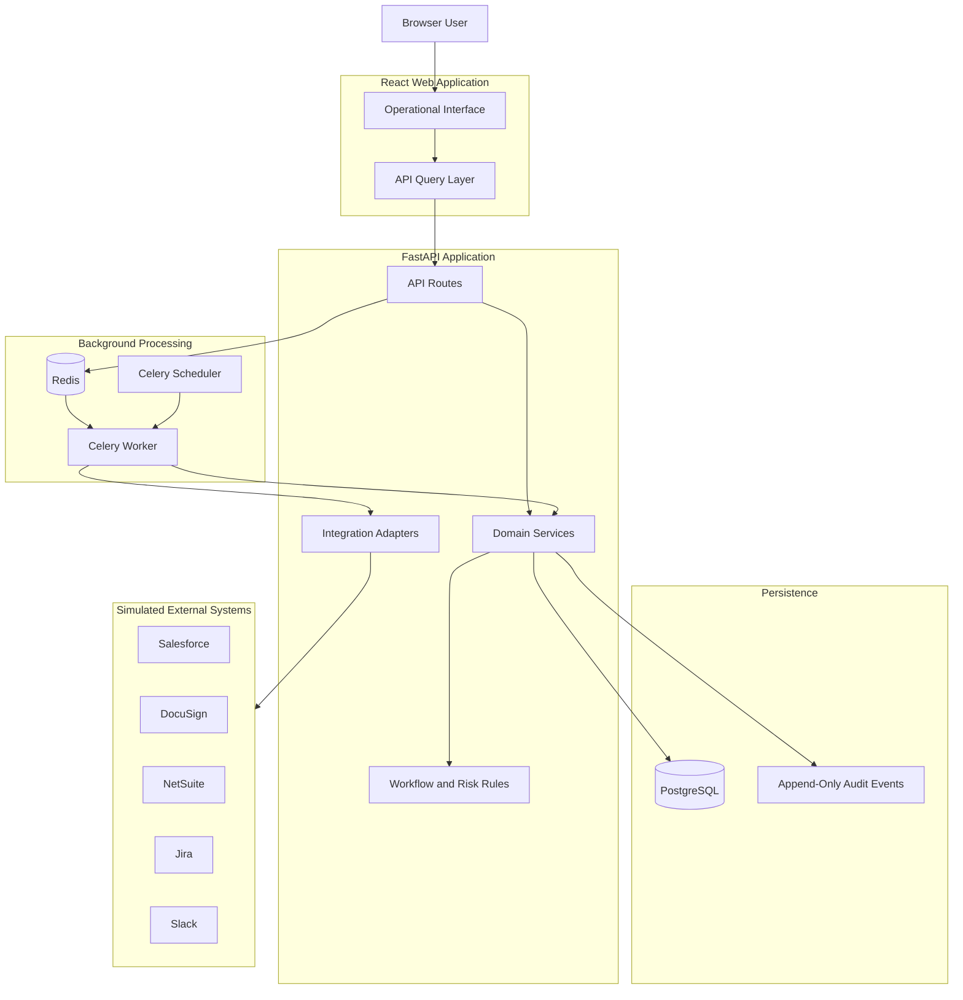
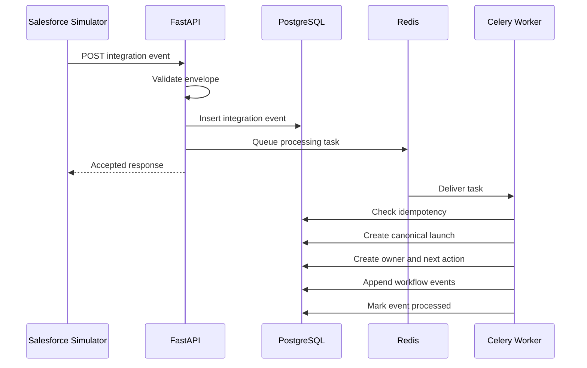
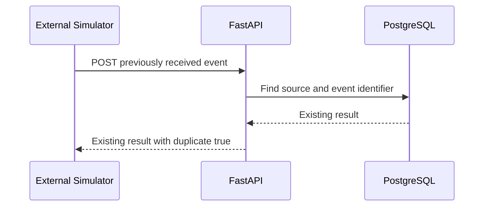
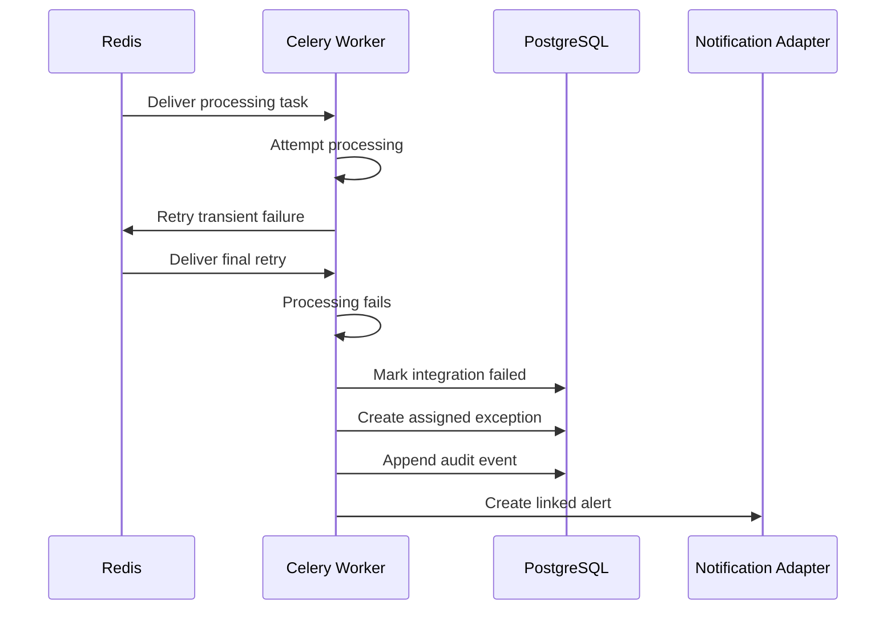

# FlowLens Architecture

## Document Purpose

This document defines the proposed application architecture, technology stack, system boundaries, runtime flows, deployment model, and major technical decisions for FlowLens.

The architecture supports the documented future-state workflow while remaining achievable as a portfolio project.

## Architecture Objectives

The FlowLens architecture must:

1. Separate user-interface, business-rule, integration, and persistence responsibilities.
2. Support explicit and testable workflow transitions.
3. Process integration events idempotently.
4. Preserve append-only audit history.
5. Make failures and exceptions visible.
6. Support asynchronous processing and retry behavior.
7. Generate reproducible operational metrics.
8. Run consistently in GitHub Codespaces and local Docker environments.
9. Avoid real credentials and proprietary data.
10. Remain understandable to technical and nontechnical reviewers.

## Selected Technology Stack

| Layer | Technology | Purpose |
|---|---|---|
| Frontend | React with TypeScript | Interactive operational interface |
| Frontend build tool | Vite | Development server and production build |
| Frontend routing | React Router | Application navigation |
| Server-state management | TanStack Query | API requests, caching, and refresh behavior |
| Dashboard visualization | Recharts | Operational and transformation charts |
| Backend API | FastAPI with Python | Workflow, approval, exception, reporting, and integration APIs |
| Validation | Pydantic | Request, response, and event-contract validation |
| ORM | SQLAlchemy | Relational data access |
| Database migrations | Alembic | Version-controlled schema changes |
| Primary database | PostgreSQL | Canonical workflow, audit, and metric data |
| Message broker | Redis | Background task transport |
| Background processing | Celery | Integration processing, retries, and scheduled evaluations |
| Backend testing | Pytest | Unit and API testing |
| Frontend testing | Vitest and Testing Library | Component and interface testing |
| End-to-end testing | Playwright | Browser-based workflow verification |
| Containers | Docker and Docker Compose | Reproducible development environment |
| Continuous integration | GitHub Actions | Automated quality and test checks |
| API documentation | OpenAPI through FastAPI | Interactive and machine-readable API contract |

## Why This Stack

### React and TypeScript

FlowLens requires a rich operational interface containing dashboards, filters, work queues, timelines, approvals, exceptions, and system maps.

TypeScript supports explicit front-end contracts and reduces accidental data-shape inconsistencies.

### Vite

Vite provides a focused React development environment without requiring the project to adopt a full server-rendering framework.

FlowLens is primarily an authenticated operational application rather than a content-driven website.

### FastAPI and Python

FastAPI provides:

- Typed API contracts
- Pydantic validation
- Automatic OpenAPI documentation
- Strong support for asynchronous request handling
- Straightforward Pytest integration
- Clear separation between domain logic and HTTP transport

Python also complements the TypeScript projects already represented in the portfolio.

### PostgreSQL

FlowLens data is highly relational.

Launches, stages, assignments, approvals, requirements, exceptions, users, external references, and audit events require:

- Foreign-key integrity
- Unique constraints
- Transactional updates
- Structured querying
- Historical analysis

PostgreSQL is therefore a stronger fit than a document-only database.

### Redis and Celery

External events, retries, overdue detection, notifications, and risk recalculation should not depend entirely on a synchronous web request.

Redis and Celery allow FlowLens to demonstrate:

- Background processing
- Retry policies
- Scheduled evaluation
- Failure handling
- Worker separation

PostgreSQL remains the authoritative persistence layer. Redis is not the system of record.

## High-Level Architecture



## Architectural Layers

## Presentation Layer

The React application is responsible for:

- Application navigation
- Dashboard presentation
- Launch lists and filters
- Launch details
- Work queues
- Approval actions
- Exception actions
- Audit timelines
- System-landscape visualization
- Accessible interaction and responsive layout

The presentation layer must not independently decide whether a workflow transition, approval, or override is valid.

Business decisions remain in the API domain layer.

## API Layer

FastAPI routes are responsible for:

- HTTP request parsing
- Authentication-context handling
- Request validation
- Authorization checks
- Calling domain services
- Serializing responses
- Returning stable error codes
- Exposing OpenAPI documentation

Routes should remain thin and should not contain major business-rule implementations.

## Domain-Service Layer

Domain services coordinate business behavior.

Planned services include:

| Service | Responsibility |
|---|---|
| Launch Service | Create and manage canonical launches |
| Workflow Service | Evaluate and perform stage transitions |
| Assignment Service | Create, assign, reassign, and complete actions |
| Approval Service | Request and record specialist decisions |
| Requirement Service | Apply and evaluate workflow requirements |
| Exception Service | Create, assign, and resolve exceptions |
| Risk Service | Calculate and explain risk |
| Audit Service | Append durable workflow events |
| Integration Service | Validate and track external events |
| Metrics Service | Calculate documented operational measures |
| Notification Service | Generate linked simulated notifications |

## Rule Layer

Rules are implemented as explicit, testable functions or policy objects.

The rule layer determines:

- Stage-entry eligibility
- Stage-exit eligibility
- Required approvals
- Required workflow requirements
- Default assignments
- Due dates
- Risk status
- Blocking conditions
- Override permissions
- Notification triggers

Rule results should return:

- Pass or fail
- Stable rule identifier
- Human-readable explanation
- Related record identifiers
- Severity when applicable

## Persistence Layer

SQLAlchemy repositories provide structured access to PostgreSQL.

Persistence responsibilities include:

- Database transactions
- Query construction
- Entity persistence
- Foreign-key relationships
- Unique constraints
- Optimistic concurrency
- Pagination
- Reporting queries

Domain services should not depend directly on HTTP or browser behavior.

## Integration-Adapter Layer

Each simulated external system receives an adapter with a common interface.

Planned adapters include:

- Salesforce adapter
- DocuSign adapter
- NetSuite adapter
- Jira adapter
- Slack notification adapter

Adapters translate between external contracts and internal domain actions.

An adapter failure must not silently disappear.

## Background Worker Layer

Celery workers handle:

- Integration-event processing
- Retryable adapter calls
- Risk recalculation
- Overdue-assignment detection
- Notification dispatch
- Metric refresh
- Long-running synthetic demonstration tasks

Workers call the same domain services used by synchronous API routes.

Business rules should not be duplicated inside task definitions.

## Scheduler Layer

The Celery scheduler initiates periodic work such as:

- Overdue-assignment evaluation
- Approaching-date risk evaluation
- Pending-approval reminders
- Metric snapshot generation
- Stale-integration detection

Scheduled work must remain safe to run more than once.

## Planned Repository Structure

```text
flowlens/
├── .devcontainer/
│   └── devcontainer.json
├── .github/
│   └── workflows/
│       └── tests.yml
├── apps/
│   ├── api/
│   │   ├── alembic/
│   │   ├── app/
│   │   │   ├── api/
│   │   │   ├── core/
│   │   │   ├── domain/
│   │   │   ├── integrations/
│   │   │   ├── models/
│   │   │   ├── repositories/
│   │   │   ├── schemas/
│   │   │   ├── services/
│   │   │   ├── tasks/
│   │   │   └── main.py
│   │   ├── tests/
│   │   ├── alembic.ini
│   │   └── pyproject.toml
│   └── web/
│       ├── public/
│       ├── src/
│       │   ├── api/
│       │   ├── components/
│       │   ├── features/
│       │   ├── hooks/
│       │   ├── layouts/
│       │   ├── pages/
│       │   ├── routes/
│       │   ├── styles/
│       │   └── main.tsx
│       ├── package.json
│       └── vite.config.ts
├── docs/
├── infrastructure/
│   └── docker-compose.yml
├── scripts/
├── .env.example
├── .gitignore
├── LICENSE
└── README.md
```

## Runtime Flow: Launch Creation



## Runtime Flow: Duplicate Event



No workflow operation is repeated.

## Runtime Flow: Permanent Integration Failure



## Transaction Boundaries

A workflow operation that changes multiple related records should use one database transaction when practical.

For example, a successful launch-creation transaction should include:

- Canonical launch
- Initial stage history
- Accountable owner
- Initial assignment
- External references
- Workflow audit events
- Integration processing result

If the transaction fails, partial workflow state should not remain committed.

## Audit Architecture

Workflow events are append-only application records.

The audit service must:

- Generate unique event identifiers.
- Preserve UTC occurrence time.
- Record the actor or source.
- Preserve correlation identifiers.
- Store relevant previous and new state.
- Require reasons for controlled actions.
- Prevent normal edit and delete operations.
- Avoid storing credentials or unnecessary sensitive data.

Current state and historical events serve different purposes.

The current state supports operational use. The event history explains how that state was reached.

## Idempotency Architecture

Inbound idempotency is enforced through a database uniqueness constraint on:

```text
source_system + external_event_id
```

Outbound actions use stable request identifiers.

Idempotent services should:

1. Check whether the operation already completed.
2. Return the existing result when appropriate.
3. Avoid duplicate assignments, approvals, exceptions, notifications, and audit events.
4. Preserve the original correlation identifier.

## Risk Architecture

Risk status is calculated from explicit rules.

Inputs may include:

- Current stage
- Target launch date
- Stage age
- Pending approvals
- Overdue assignments
- Open exceptions
- Integration failures
- Remaining required work
- Customer-requested pause

A risk calculation produces:

- Risk status
- Triggered rule identifiers
- Human-readable explanations
- Related record identifiers
- Calculation timestamp

Historical risk snapshots support trend analysis.

## Metrics Architecture

The Metrics Service calculates outcomes from canonical timestamps and workflow events.

Metrics must not depend on manually entered summary values when the underlying event data exists.

The service supports:

- Current operational totals
- Historical trends
- Target comparison
- Synthetic before-and-after modeling
- Reproducible calculations
- Documented exclusions

## Authentication and Authorization Strategy

The portfolio release will use synthetic demo identities and roles.

The interface may allow selection among clearly labeled demo personas for testing role-specific experiences.

This is not represented as production authentication.

The architecture supports future integration with a real identity provider through:

- Authenticated user context
- Role assignments
- Route authorization
- Service-level permission checks
- Restricted response fields
- Audited protected actions

Authorization must be enforced in the backend, not only hidden in the interface.

## API Design Principles

FlowLens APIs use:

- Versioned routes
- JSON request and response bodies
- Pydantic validation
- Stable identifiers
- Controlled enumerations
- ISO 8601 UTC timestamps
- Pagination for lists
- Structured error responses
- Correlation identifiers
- OpenAPI documentation

Planned route prefix:

```text
/api/v1
```

## Error Response Format

```json
{
  "error": {
    "code": "STAGE_EXIT_BLOCKED",
    "message": "The launch cannot leave Financial Readiness.",
    "details": [
      {
        "requirement": "FINANCIAL_APPROVAL",
        "issue": "Required approval is still pending."
      }
    ]
  },
  "correlation_id": "5c98382c-63af-4928-81a1-81225fc14c87"
}
```

## Development Ports

| Service | Port |
|---|---:|
| React web application | 5173 |
| FastAPI application | 8000 |
| PostgreSQL | 5432 |
| Redis | 6379 |

Codespaces may expose the web and API ports through forwarded URLs.

## Environment Configuration

Configuration values will be documented in `.env.example`.

Expected configuration includes:

- Database URL
- Redis URL
- API environment
- Web API base URL
- Log level
- Retry limits
- Synthetic-data mode
- Demo persona mode

Real credentials must never be committed.

## Container Strategy

Docker Compose will provide:

- PostgreSQL
- Redis
- FastAPI
- Celery worker
- Celery scheduler
- React development server when appropriate

The `.devcontainer` configuration will make the environment reproducible in GitHub Codespaces.

## Testing Strategy

### Backend Unit Tests

Verify:

- Workflow rules
- Risk rules
- Approval behavior
- Exception behavior
- Idempotency logic
- Metric formulas

### Backend Integration Tests

Verify:

- API validation
- PostgreSQL persistence
- Transaction behavior
- Integration-event lifecycle
- Retry outcomes
- Audit creation

### Frontend Component Tests

Verify:

- Status presentation
- Filters
- Work queues
- Approval controls
- Exception controls
- Accessibility behavior

### End-to-End Tests

Verify complete user journeys such as:

- Create a launch
- Complete a valid stage
- Reject an invalid transition
- Record an approval
- Resolve an exception
- Detect a blocked launch
- Complete operational handoff
- View dashboard updates

## Continuous Integration

GitHub Actions will eventually run:

- Backend formatting and linting
- Backend type checks
- Backend tests
- Frontend formatting and linting
- Frontend type checks
- Frontend tests
- Production frontend build
- Selected end-to-end tests
- Privacy and secret checks when practical

## Architecture Decision Summary

| Decision | Selected Approach | Reason |
|---|---|---|
| Repository model | Monorepo | Keeps application, contracts, infrastructure, and documentation together |
| Frontend | React and TypeScript | Supports rich operational interfaces |
| Frontend tooling | Vite | Focused and fast application build environment |
| Backend | FastAPI and Python | Strong validation, documentation, and testability |
| Database | PostgreSQL | Relational integrity and event-based reporting |
| Background processing | Celery and Redis | Retryable and scheduled workflow operations |
| ORM | SQLAlchemy | Explicit relational persistence |
| Migrations | Alembic | Version-controlled schema changes |
| Integration strategy | Simulated adapters | Demonstrates contracts without real credentials |
| Authentication | Demo personas initially | Enables role testing without misrepresenting production security |
| Audit model | Append-only events | Preserves decision and workflow history |
| Deployment | Containerized development first | Reproducibility before production claims |

## Known Architectural Risks

| Risk | Impact | Mitigation |
|---|---|---|
| Project scope becomes too large | Delivery slows or becomes incomplete | Build vertical workflow slices and prioritize Must requirements |
| Workflow rules become scattered | Behavior becomes difficult to explain | Centralize rules and stable rule identifiers |
| Frontend duplicates backend decisions | Inconsistent behavior | Keep authorization and business rules in API services |
| Background tasks create partial state | Workflow inconsistency | Use transactions and idempotent service operations |
| Redis is treated as authoritative | Data loss or inconsistency | Keep PostgreSQL as system of record |
| Demo authentication is misunderstood | Security capability is overstated | Label demo personas and document production limitations |
| Metrics become manually curated | Results are not reproducible | Calculate measures from events |
| Simulated integrations feel superficial | Portfolio value is reduced | Implement full validation, lifecycle, retry, and failure behavior |

## Delivery Strategy

FlowLens will be built through vertical slices.

Each slice should include:

1. Relevant data model
2. API behavior
3. Business rules
4. Audit events
5. Interface behavior
6. Automated tests
7. Documentation updates

The first vertical slice will create and display a canonical launch from a valid synthetic Salesforce event.

## Architecture References

- [React Documentation](https://react.dev/)
- [Vite Documentation](https://vite.dev/guide/)
- [FastAPI Documentation](https://fastapi.tiangolo.com/)
- [SQLAlchemy Documentation](https://docs.sqlalchemy.org/)
- [PostgreSQL Documentation](https://www.postgresql.org/docs/)
- [Celery Documentation](https://docs.celeryq.dev/)
- [Redis Documentation](https://redis.io/docs/latest/)
- [Docker Documentation](https://docs.docker.com/)

## Architecture Conclusion

The FlowLens architecture combines an interactive systems-transformation interface with a testable workflow and integration backend.

It is intentionally structured to demonstrate analysis, architecture, application development, integration reliability, operational visibility, testing, and measurable delivery without depending on proprietary systems or production data.