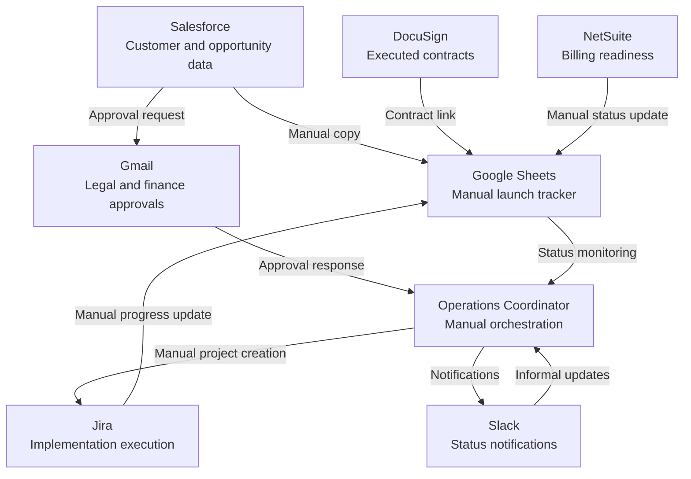
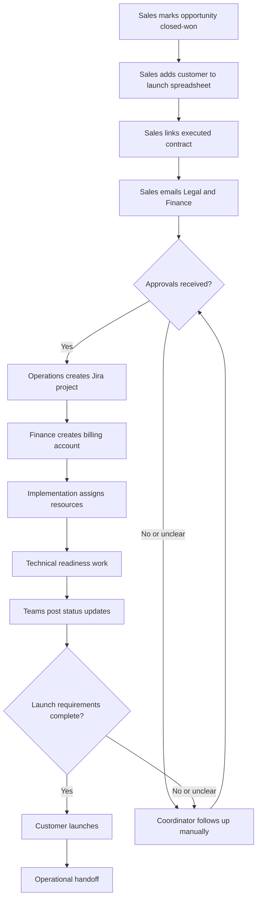

# FlowLens Current-State Analysis

## Document Purpose

This document maps Northstar Business Services’ existing contract-to-launch environment.

The goal is to understand how work, data, decisions, and ownership move through the organization before proposing changes.

## Analysis Principles

The current state is evaluated using four questions:

1. Which system owns each type of information?
2. How does information move between systems?
3. Where do people make decisions or perform manual work?
4. Where can work become delayed, duplicated, inconsistent, or invisible?

## Current System Landscape

## System Responsibilities

| System | Intended Responsibility | Current Role | Limitation |
|---|---|---|---|
| Salesforce | Customer and opportunity system of record | Starts the process when an opportunity becomes closed-won | Does not coordinate downstream launch work |
| DocuSign | Contract system of record | Stores executed customer agreements | Contract status and requirements are manually transferred |
| Gmail | Communication | Captures Legal and Finance review conversations | Decisions are difficult to report on or audit |
| Google Sheets | Flexible operational tracking | Acts as the unofficial workflow hub | Requires manual maintenance and has weak controls |
| Slack | Internal communication | Communicates updates and urgent issues | Messages do not create durable workflow records |
| Jira | Implementation execution | Tracks technical and implementation tasks | Projects are created manually and may contain duplicated data |
| NetSuite | Financial system of record | Tracks billing-account readiness | Billing status is manually copied into the launch tracker |
| Flow coordinators | Cross-functional coordination | Monitor systems, request updates, and move work forward | Too much process knowledge depends on individuals |

## Current Contract-to-Launch Workflow

## Current Data Movement

| Data | Source of Truth | Additional Locations | Transfer Method | Risk |
|---|---|---|---|---|
| Customer identity | Salesforce | Google Sheets, Jira, NetSuite | Manual copy | Values may be incomplete or inconsistent |
| Opportunity details | Salesforce | Google Sheets, email | Manual copy | Updates may not propagate |
| Executed contract | DocuSign | Google Sheets, email | Manual link sharing | Teams may use an outdated or incorrect link |
| Legal approval | Legal reviewer | Gmail, spreadsheet notes | Email and manual update | Approval may be invisible or ambiguous |
| Financial approval | Finance reviewer | Gmail, spreadsheet notes | Email and manual update | Approval may not be reflected in launch status |
| Billing readiness | NetSuite | Google Sheets, Slack | Manual status update | Launch tracker may be stale |
| Implementation status | Jira | Google Sheets, Slack | Manual status update | Conflicting status values may exist |
| Target launch date | Google Sheets | Jira, Slack, email | Manual copy | Date changes may not reach every team |
| Launch blockers | Multiple systems | Google Sheets, Slack, email | Manual interpretation | No consistent blocker record exists |
| Final launch decision | Operations | Google Sheets, Slack | Human judgment | Decision basis is not fully auditable |

## Manual Touchpoints

The current process contains at least 14 common manual touchpoints:

1. Mark the opportunity closed-won.
2. Add the customer to the spreadsheet.
3. Copy customer information.
4. Locate and link the contract.
5. Email Legal.
6. Email Finance.
7. Interpret approval responses.
8. Update approval status in the spreadsheet.
9. Create the Jira project.
10. Re-enter customer and contract information in Jira.
11. Update billing readiness.
12. Copy implementation progress into the spreadsheet.
13. Post status changes in Slack.
14. Confirm launch readiness and communicate the handoff.

Some manual decisions are appropriate. The problem is not that humans participate. The problem is that administrative repetition, status reconciliation, and follow-up depend on humans.

## Pain-Point Register

| ID | Pain Point | Root Cause | Business Effect | Initial Priority |
|---|---|---|---|---|
| PP-01 | Customer data is entered repeatedly | Systems are not connected through a canonical workflow record | Rework and inconsistent data | High |
| PP-02 | No complete launch view exists | Every system represents only part of the process | Poor visibility and unreliable forecasting | Critical |
| PP-03 | Status values conflict | Departments use different status definitions | Confusion about actual progress | High |
| PP-04 | Approvals remain in email | Approval decisions are not structured workflow events | Delays and weak auditability | Critical |
| PP-05 | Ownership becomes unclear between stages | Handoffs do not create explicit assignments | Work stalls without detection | Critical |
| PP-06 | Jira projects are created manually | No event-driven project creation process exists | Delayed starts and duplicate entry | Medium |
| PP-07 | Spreadsheet data becomes stale | Updates depend on coordinators gathering information | Leadership reports are unreliable | High |
| PP-08 | Blockers are tracked inconsistently | No shared exception model exists | Risks are discovered late | Critical |
| PP-09 | Slack updates are not durable records | Communication and workflow tracking are mixed together | Decisions and context are lost | Medium |
| PP-10 | Launch decisions are difficult to reconstruct | Evidence is distributed across tools | Compliance and learning are limited | High |
| PP-11 | Process performance is measured manually | Workflow events are not captured centrally | Reporting requires hours of preparation | High |
| PP-12 | Process knowledge depends on individuals | Rules and follow-up logic are not encoded or documented | Scaling requires additional coordinators | Critical |

## Root-Cause Themes

### Fragmented Workflow State

The organization has multiple reliable systems of record, but no reliable record of the overall launch process.

### Unstructured Decisions

Important decisions occur in human communication channels without becoming structured data.

### Manual Reconciliation

Coordinators must compare systems and determine which information is current.

### Implicit Ownership

Responsibility is understood through experience and conversation rather than explicit workflow assignments.

### Reactive Exception Management

The process tracks normal progress more consistently than failures, blockers, and missing information.

### Reporting Without Event History

The spreadsheet captures the latest interpreted status but not the complete history that produced it.

## What Must Be Preserved

The future state must preserve:

- Salesforce ownership of customer and opportunity data
- DocuSign ownership of executed contracts
- NetSuite ownership of financial records
- Jira’s strength as an implementation execution tool
- Slack’s value for timely communication
- Departmental authority over specialist decisions
- Human review for material legal, financial, and launch decisions
- Flexibility for legitimate exceptions

## Transformation Constraints

- FlowLens must coordinate existing systems rather than pretend to replace them.
- Every automated status must have an explainable source.
- A failed integration must create a visible exception.
- Human approvals must identify the decision-maker and timestamp.
- Workflow ownership must be explicit at every active stage.
- Historical events must not be overwritten by current status.
- Synthetic data must be used throughout the project.
- External integrations must initially be simulated.
- The design must remain understandable without proprietary tools or data.

## Current-State Conclusion

Northstar does not primarily have a tooling shortage.

It has an orchestration, visibility, and process-governance problem.

The existing systems perform their individual responsibilities reasonably well. The failure occurs between those systems, where data, ownership, decisions, and exceptions depend on manual coordination.

FlowLens should therefore become a coordination and intelligence layer across the existing environment rather than another disconnected replacement system.