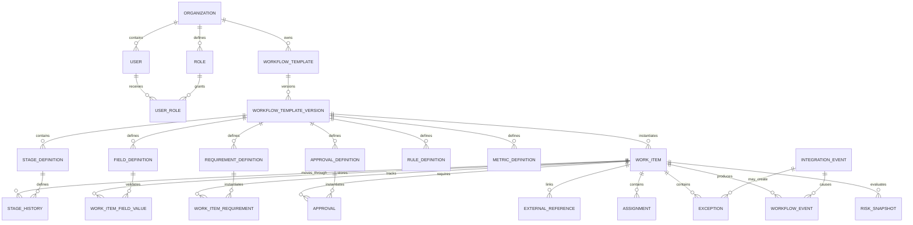

# FlowLens Canonical Data Model

## Document Purpose

This document defines the reusable FlowLens platform data model.

The model supports configurable workflow templates and generic work items while preserving the Northstar contract-to-launch process as a demonstration template.

## Data-Model Objectives

The FlowLens data model must:

1. Support one organization per initial deployment.
2. Separate workflow configuration from workflow execution.
3. Allow workflow templates to be versioned.
4. Represent any supported business process through generic work items.
5. Preserve external system ownership.
6. Track data provenance.
7. Make ownership and next actions explicit.
8. Capture structured approvals and requirements.
9. Treat exceptions as first-class records.
10. Preserve append-only audit history.
11. Process external events idempotently.
12. Support explainable risk and metrics.
13. Use Northstar only as synthetic demonstration data.

## Conceptual Model



## Configuration and Execution Separation

FlowLens separates two categories of data.

### Configuration Data

Configuration describes how a workflow should operate:

- Organization
- Workflow template
- Workflow-template version
- Stage definitions
- Field definitions
- Requirement definitions
- Approval definitions
- Rule definitions
- Metric definitions
- Roles

### Execution Data

Execution data records actual workflow activity:

- Work items
- Field values
- Assignments
- Approvals
- Requirements
- Exceptions
- Stage history
- Workflow events
- Integration events
- External references
- Risk snapshots

Published configuration versions are immutable. Existing work items remain associated with the version under which they were created unless an explicit migration is performed.

# Organization and Identity Entities

## Organization

An `Organization` represents the company or operating environment using the FlowLens deployment.

The initial release supports one active organization per deployment.

| Field | Type | Required | Description |
|---|---|---:|---|
| `id` | UUID | Yes | Organization identifier |
| `slug` | String | Yes | Unique machine-readable organization key |
| `name` | String | Yes | Display name |
| `default_timezone` | String | Yes | IANA timezone |
| `status` | OrganizationStatus | Yes | Organization lifecycle status |
| `demo_mode` | Boolean | Yes | Whether the organization contains demonstration data |
| `created_at` | Timestamp | Yes | UTC creation time |
| `updated_at` | Timestamp | Yes | UTC update time |

### Organization Constraints

- Only one organization may be active in the initial release.
- `slug` must be unique.
- Demonstration mode must be visibly identifiable.
- Organization deletion must not silently remove audit history.

## User

A `User` represents a FlowLens user.

| Field | Type | Required | Description |
|---|---|---:|---|
| `id` | UUID | Yes | User identifier |
| `organization_id` | UUID | Yes | Related organization |
| `email` | String | Yes | Organization-unique email |
| `display_name` | String | Yes | Display name |
| `department` | String | No | Configured department |
| `identity_source` | IdentitySource | Yes | Demo, local, or external identity |
| `external_subject` | String | No | Identity-provider subject |
| `active` | Boolean | Yes | Whether the user may sign in or receive work |
| `created_at` | Timestamp | Yes | UTC creation time |
| `updated_at` | Timestamp | Yes | UTC update time |

## Role

A `Role` defines an authorization or workflow responsibility.

| Field | Type | Required | Description |
|---|---|---:|---|
| `id` | UUID | Yes | Role identifier |
| `organization_id` | UUID | Yes | Related organization |
| `code` | String | Yes | Stable role code |
| `name` | String | Yes | Human-readable role name |
| `description` | String | Yes | Role purpose |
| `permissions` | JSON | Yes | Controlled permission set |
| `active` | Boolean | Yes | Whether the role may be assigned |

The combination of `organization_id` and `code` must be unique.

## User Role

A `UserRole` creates a many-to-many relationship between users and roles.

| Field | Type | Required | Description |
|---|---|---:|---|
| `id` | UUID | Yes | User-role identifier |
| `user_id` | UUID | Yes | Related user |
| `role_id` | UUID | Yes | Related role |
| `assigned_at` | Timestamp | Yes | UTC assignment time |
| `assigned_by_user_id` | UUID | No | User who granted the role |

The combination of `user_id` and `role_id` must be unique.

# Workflow Configuration Entities

## Workflow Template

A `WorkflowTemplate` represents a reusable business process.

| Field | Type | Required | Description |
|---|---|---:|---|
| `id` | UUID | Yes | Template identifier |
| `organization_id` | UUID | Yes | Owning organization |
| `slug` | String | Yes | Stable machine-readable template key |
| `name` | String | Yes | Workflow name |
| `work_item_label` | String | Yes | Singular label, such as Launch or Request |
| `work_item_label_plural` | String | Yes | Plural display label |
| `description` | String | Yes | Workflow purpose |
| `status` | TemplateStatus | Yes | Draft, active, or archived |
| `created_at` | Timestamp | Yes | UTC creation time |
| `updated_at` | Timestamp | Yes | UTC update time |

### Northstar Example

| Field | Value |
|---|---|
| `slug` | `contract-to-launch` |
| `name` | Contract-to-Launch |
| `work_item_label` | Launch |
| `work_item_label_plural` | Launches |

## Workflow Template Version

A `WorkflowTemplateVersion` preserves one version of a workflow configuration.

| Field | Type | Required | Description |
|---|---|---:|---|
| `id` | UUID | Yes | Version identifier |
| `workflow_template_id` | UUID | Yes | Related template |
| `version_number` | Integer | Yes | Sequential version |
| `status` | VersionStatus | Yes | Draft, published, or retired |
| `change_summary` | String | Yes | Reason for the version |
| `published_at` | Timestamp | No | UTC publication time |
| `published_by_user_id` | UUID | No | Publishing user |
| `created_at` | Timestamp | Yes | UTC creation time |

### Version Constraints

- The combination of template and version number must be unique.
- Only draft versions may be edited.
- Published versions are immutable.
- New work items use the active published version.
- Existing work items retain their original version.
- Version migration requires an explicit and audited operation.

## Stage Definition

A `StageDefinition` defines one stage in a template version.

| Field | Type | Required | Description |
|---|---|---:|---|
| `id` | UUID | Yes | Stage-definition identifier |
| `template_version_id` | UUID | Yes | Related template version |
| `code` | String | Yes | Stable stage code |
| `name` | String | Yes | Human-readable name |
| `sequence` | Integer | Yes | Default stage order |
| `description` | String | Yes | Stage purpose |
| `default_owner_role_id` | UUID | No | Default accountable role |
| `sla_minutes` | Integer | No | Configured stage SLA |
| `terminal` | Boolean | Yes | Whether the stage ends the workflow |
| `active` | Boolean | Yes | Whether the stage is used |

The combination of template version and stage code must be unique.

## Field Definition

A `FieldDefinition` defines configurable information collected for a work item.

| Field | Type | Required | Description |
|---|---|---:|---|
| `id` | UUID | Yes | Field-definition identifier |
| `template_version_id` | UUID | Yes | Related template version |
| `key` | String | Yes | Stable field key |
| `label` | String | Yes | User-facing label |
| `field_type` | FieldType | Yes | Text, number, date, choice, boolean, or URL |
| `required` | Boolean | Yes | Whether a value is required |
| `source_type` | ProvenanceType | Yes | Expected source |
| `source_system` | String | No | Authoritative source when external |
| `validation_config` | JSON | No | Controlled validation options |
| `display_order` | Integer | Yes | User-interface order |
| `sensitive` | Boolean | Yes | Whether access restrictions apply |

Arbitrary executable validation code is not stored.

## Requirement Definition

A `RequirementDefinition` defines reusable completion evidence.

| Field | Type | Required | Description |
|---|---|---:|---|
| `id` | UUID | Yes | Definition identifier |
| `template_version_id` | UUID | Yes | Related template version |
| `stage_definition_id` | UUID | Yes | Applicable stage |
| `code` | String | Yes | Stable requirement code |
| `name` | String | Yes | Human-readable name |
| `description` | String | Yes | Requirement purpose |
| `required_by_default` | Boolean | Yes | Default applicability |
| `completion_type` | CompletionType | Yes | Required completion evidence |
| `default_owner_role_id` | UUID | No | Default responsible role |

## Approval Definition

An `ApprovalDefinition` configures a required decision.

| Field | Type | Required | Description |
|---|---|---:|---|
| `id` | UUID | Yes | Definition identifier |
| `template_version_id` | UUID | Yes | Related template version |
| `stage_definition_id` | UUID | Yes | Applicable stage |
| `code` | String | Yes | Stable approval code |
| `name` | String | Yes | Human-readable name |
| `approver_role_id` | UUID | Yes | Required decision role |
| `required_by_default` | Boolean | Yes | Default applicability |
| `allow_conditions` | Boolean | Yes | Whether conditional approval is supported |
| `separation_of_duties` | Boolean | Yes | Whether self-approval is prohibited |
| `due_offset_minutes` | Integer | No | Default decision SLA |

## Rule Definition

A `RuleDefinition` represents one controlled workflow rule.

| Field | Type | Required | Description |
|---|---|---:|---|
| `id` | UUID | Yes | Rule identifier |
| `template_version_id` | UUID | Yes | Related template version |
| `stage_definition_id` | UUID | No | Applicable stage |
| `code` | String | Yes | Stable rule code |
| `name` | String | Yes | Human-readable name |
| `rule_type` | RuleType | Yes | Supported controlled rule type |
| `configuration` | JSON | Yes | Validated rule parameters |
| `effect` | RuleEffect | Yes | Block, require, assign, flag risk, or notify |
| `severity` | Severity | No | Severity when applicable |
| `active` | Boolean | Yes | Whether the rule is evaluated |

### Initial Supported Rule Types

- `REQUIRED_FIELD_PRESENT`
- `REQUIREMENT_COMPLETED`
- `APPROVAL_COMPLETED`
- `NO_OPEN_EXCEPTION`
- `ASSIGNMENT_COMPLETED`
- `DATE_THRESHOLD`
- `EXTERNAL_STATUS_EQUALS`
- `USER_HAS_ROLE`
- `PREVIOUS_STAGE_COMPLETED`

Rule configurations are validated data, not arbitrary executable code.

## Metric Definition

A `MetricDefinition` describes a reproducible process measure.

| Field | Type | Required | Description |
|---|---|---:|---|
| `id` | UUID | Yes | Metric identifier |
| `template_version_id` | UUID | Yes | Related template version |
| `code` | String | Yes | Stable metric code |
| `name` | String | Yes | Human-readable name |
| `description` | String | Yes | Metric purpose |
| `calculation_type` | MetricCalculationType | Yes | Supported calculation |
| `configuration` | JSON | Yes | Validated calculation parameters |
| `target_value` | Decimal | No | Optional target |
| `target_operator` | String | No | Comparison operator |
| `unit` | String | Yes | Days, percent, count, minutes, or other unit |
| `active` | Boolean | Yes | Whether the metric is calculated |

# Workflow Execution Entities

## Work Item

A `WorkItem` is one running instance of a workflow-template version.

| Field | Type | Required | Description |
|---|---|---:|---|
| `id` | UUID | Yes | Work-item identifier |
| `organization_id` | UUID | Yes | Owning organization |
| `template_version_id` | UUID | Yes | Configuration version |
| `display_name` | String | Yes | Human-readable item name |
| `status` | WorkItemStatus | Yes | Overall lifecycle status |
| `current_stage_definition_id` | UUID | Yes | Current configured stage |
| `risk_status` | RiskStatus | Yes | Calculated risk state |
| `accountable_owner_id` | UUID | Yes | User accountable for the outcome |
| `target_at` | Timestamp | No | Current target completion time |
| `original_target_at` | Timestamp | No | Original target completion time |
| `paused_at` | Timestamp | No | Active pause start |
| `pause_reason` | String | No | Pause reason |
| `completed_at` | Timestamp | No | Completion time |
| `canceled_at` | Timestamp | No | Cancellation time |
| `cancellation_reason` | String | No | Cancellation reason |
| `created_at` | Timestamp | Yes | UTC creation time |
| `updated_at` | Timestamp | Yes | UTC update time |
| `version` | Integer | Yes | Optimistic concurrency version |

### Work-Item Constraints

- Every active work item has an accountable owner.
- The current stage belongs to the associated template version.
- Completed and canceled items retain history.
- Risk status is calculated from explainable rules.
- Template version does not change silently.
- `version` prevents unnoticed concurrent updates.

## Work-Item Field Value

A `WorkItemFieldValue` stores one configured value.

| Field | Type | Required | Description |
|---|---|---:|---|
| `id` | UUID | Yes | Value identifier |
| `work_item_id` | UUID | Yes | Related work item |
| `field_definition_id` | UUID | Yes | Related definition |
| `value` | JSON | Yes | Type-validated value |
| `provenance_type` | ProvenanceType | Yes | Origin classification |
| `source_system` | String | No | Source when external |
| `source_reference` | String | No | Source record or event |
| `set_by_user_id` | UUID | No | User when manually entered |
| `set_at` | Timestamp | Yes | UTC value time |
| `updated_at` | Timestamp | Yes | UTC update time |

The combination of work item and field definition must be unique.

## External Reference

An `ExternalReference` links a work item to another system.

| Field | Type | Required | Description |
|---|---|---:|---|
| `id` | UUID | Yes | Reference identifier |
| `work_item_id` | UUID | Yes | Related work item |
| `system` | String | Yes | External system |
| `resource_type` | String | Yes | External resource type |
| `external_id` | String | Yes | External identifier |
| `display_label` | String | No | Human-readable label |
| `reference_url` | String | No | Approved external link |
| `last_synchronized_at` | Timestamp | No | Last successful synchronization |
| `created_at` | Timestamp | Yes | UTC creation time |
| `updated_at` | Timestamp | Yes | UTC update time |

## Stage History

A `StageHistory` record represents one period in one configured stage.

| Field | Type | Required | Description |
|---|---|---:|---|
| `id` | UUID | Yes | History identifier |
| `work_item_id` | UUID | Yes | Related work item |
| `stage_definition_id` | UUID | Yes | Configured stage |
| `entered_at` | Timestamp | Yes | Stage-entry time |
| `exited_at` | Timestamp | No | Stage-exit time |
| `entered_by_user_id` | UUID | No | User responsible for entry |
| `actor_source` | ActorSource | Yes | User, system, or integration |
| `exit_reason` | String | No | Reason for exit |
| `correlation_id` | UUID | Yes | Related operation |

A work item may have only one open stage-history record.

## Assignment

An `Assignment` represents an explicit action.

| Field | Type | Required | Description |
|---|---|---:|---|
| `id` | UUID | Yes | Assignment identifier |
| `work_item_id` | UUID | Yes | Related work item |
| `stage_definition_id` | UUID | Yes | Related stage |
| `title` | String | Yes | Action title |
| `description` | String | No | Action instructions |
| `owner_user_id` | UUID | No | Assigned user |
| `owner_role_id` | UUID | No | Assigned role |
| `status` | AssignmentStatus | Yes | Action status |
| `priority` | Priority | Yes | Action priority |
| `due_at` | Timestamp | No | Due time |
| `started_at` | Timestamp | No | Work-start time |
| `completed_at` | Timestamp | No | Completion time |
| `completion_evidence` | String | No | Evidence or explanation |
| `created_at` | Timestamp | Yes | UTC creation time |
| `updated_at` | Timestamp | Yes | UTC update time |

At least one owner user or owner role is required.

## Approval

An `Approval` is an instantiated configured decision.

| Field | Type | Required | Description |
|---|---|---:|---|
| `id` | UUID | Yes | Approval identifier |
| `work_item_id` | UUID | Yes | Related work item |
| `approval_definition_id` | UUID | Yes | Related definition |
| `status` | ApprovalStatus | Yes | Decision state |
| `requested_to_user_id` | UUID | No | Assigned decision-maker |
| `requested_to_role_id` | UUID | No | Assigned decision role |
| `requested_at` | Timestamp | Yes | Request time |
| `due_at` | Timestamp | No | Decision due time |
| `decided_by_user_id` | UUID | No | Decision-maker |
| `decided_at` | Timestamp | No | Decision time |
| `decision_reason` | String | No | Reason when required |
| `conditions` | String | No | Approval conditions |
| `conditions_satisfied_at` | Timestamp | No | Conditions-completed time |
| `created_at` | Timestamp | Yes | UTC creation time |
| `updated_at` | Timestamp | Yes | UTC update time |

## Work-Item Requirement

A `WorkItemRequirement` applies a configured requirement to one work item.

| Field | Type | Required | Description |
|---|---|---:|---|
| `id` | UUID | Yes | Requirement identifier |
| `work_item_id` | UUID | Yes | Related work item |
| `requirement_definition_id` | UUID | Yes | Related definition |
| `status` | RequirementStatus | Yes | Completion state |
| `required` | Boolean | Yes | Whether it blocks progress |
| `assigned_to_user_id` | UUID | No | Responsible user |
| `due_at` | Timestamp | No | Due time |
| `completed_at` | Timestamp | No | Completion time |
| `completed_by_user_id` | UUID | No | Completing user |
| `evidence` | String | No | Completion evidence |
| `waived_at` | Timestamp | No | Waiver time |
| `waived_by_user_id` | UUID | No | Authorized user |
| `waiver_reason` | String | No | Required waiver reason |
| `created_at` | Timestamp | Yes | UTC creation time |
| `updated_at` | Timestamp | Yes | UTC update time |

## Exception

An `Exception` represents a workflow blocker, failure, conflict, or policy deviation.

| Field | Type | Required | Description |
|---|---|---:|---|
| `id` | UUID | Yes | Exception identifier |
| `work_item_id` | UUID | Yes | Related work item |
| `stage_definition_id` | UUID | No | Related stage |
| `integration_event_id` | UUID | No | Related integration event |
| `exception_type` | String | Yes | Configured or platform category |
| `severity` | Severity | Yes | Exception severity |
| `status` | ExceptionStatus | Yes | Exception lifecycle |
| `title` | String | Yes | Concise title |
| `description` | String | Yes | Detailed information |
| `owner_user_id` | UUID | No | Assigned user |
| `owner_role_id` | UUID | No | Assigned role |
| `due_at` | Timestamp | No | Resolution target |
| `resolution` | String | No | Resolution evidence |
| `resolved_by_user_id` | UUID | No | Resolving user |
| `resolved_at` | Timestamp | No | Resolution time |
| `created_at` | Timestamp | Yes | UTC creation time |
| `updated_at` | Timestamp | Yes | UTC update time |

Critical open exceptions block completion.

## Workflow Event

A `WorkflowEvent` provides append-only audit history.

| Field | Type | Required | Description |
|---|---|---:|---|
| `id` | UUID | Yes | Event identifier |
| `organization_id` | UUID | Yes | Related organization |
| `work_item_id` | UUID | No | Related work item |
| `event_type` | String | Yes | Controlled event type |
| `occurred_at` | Timestamp | Yes | Business-event time |
| `actor_user_id` | UUID | No | User actor |
| `actor_source` | ActorSource | Yes | Event source |
| `source_system` | String | No | External source |
| `correlation_id` | UUID | Yes | Related operation |
| `previous_state` | JSON | No | Relevant previous state |
| `new_state` | JSON | No | Relevant new state |
| `reason` | String | No | Required reason |
| `metadata` | JSON | No | Additional safe context |
| `created_at` | Timestamp | Yes | Persistence time |

Workflow events are append-only and unavailable through normal update or delete operations.

## Integration Event

An `IntegrationEvent` tracks generic inbound or outbound integration processing.

| Field | Type | Required | Description |
|---|---|---:|---|
| `id` | UUID | Yes | Integration-event identifier |
| `organization_id` | UUID | Yes | Related organization |
| `external_event_id` | String | Yes | Source event identifier |
| `source_system` | String | Yes | Generic or configured source |
| `event_type` | String | Yes | Event type |
| `direction` | IntegrationDirection | Yes | Inbound or outbound |
| `status` | IntegrationStatus | Yes | Processing state |
| `correlation_id` | UUID | Yes | Related operation |
| `payload_hash` | String | Yes | Payload-integrity hash |
| `payload` | JSON | Yes | Validated payload |
| `attempt_count` | Integer | Yes | Processing attempts |
| `last_error_code` | String | No | Stable error code |
| `last_error_message` | String | No | Sanitized error |
| `received_at` | Timestamp | Yes | Receipt time |
| `processed_at` | Timestamp | No | Success time |
| `failed_at` | Timestamp | No | Permanent-failure time |
| `created_at` | Timestamp | Yes | Creation time |
| `updated_at` | Timestamp | Yes | Update time |

The combination of organization, source system, and external event identifier must be unique.

## Risk Snapshot

A `RiskSnapshot` records a point-in-time explainable risk calculation.

| Field | Type | Required | Description |
|---|---|---:|---|
| `id` | UUID | Yes | Snapshot identifier |
| `work_item_id` | UUID | Yes | Related work item |
| `risk_status` | RiskStatus | Yes | Calculated state |
| `calculated_at` | Timestamp | Yes | Calculation time |
| `rule_results` | JSON | Yes | Triggered rules and explanations |
| `triggering_event_id` | UUID | No | Event causing recalculation |
| `created_at` | Timestamp | Yes | Persistence time |

# Controlled Enumerations

## OrganizationStatus

- `ACTIVE`
- `SUSPENDED`
- `ARCHIVED`

## TemplateStatus

- `DRAFT`
- `ACTIVE`
- `ARCHIVED`

## VersionStatus

- `DRAFT`
- `PUBLISHED`
- `RETIRED`

## WorkItemStatus

- `ACTIVE`
- `PAUSED`
- `COMPLETED`
- `CANCELED`

## RiskStatus

- `ON_TRACK`
- `AT_RISK`
- `BLOCKED`
- `PAUSED`

## ApprovalStatus

- `PENDING`
- `APPROVED`
- `APPROVED_WITH_CONDITIONS`
- `REJECTED`
- `MORE_INFORMATION_REQUIRED`
- `CANCELED`

## AssignmentStatus

- `OPEN`
- `IN_PROGRESS`
- `COMPLETED`
- `CANCELED`

## RequirementStatus

- `NOT_STARTED`
- `IN_PROGRESS`
- `COMPLETED`
- `WAIVED`
- `NOT_APPLICABLE`

## ExceptionStatus

- `OPEN`
- `ASSIGNED`
- `INVESTIGATING`
- `WAITING`
- `RESOLVED`
- `CLOSED`

## Severity

- `LOW`
- `MEDIUM`
- `HIGH`
- `CRITICAL`

## IntegrationStatus

- `RECEIVED`
- `PROCESSING`
- `PROCESSED`
- `RETRYING`
- `FAILED`
- `REJECTED`

## IntegrationDirection

- `INBOUND`
- `OUTBOUND`

## ActorSource

- `USER`
- `FLOWLENS`
- `EXTERNAL_SYSTEM`
- `IMPORT`

## ProvenanceType

- `EXTERNAL`
- `USER_ENTERED`
- `CALCULATED`
- `DERIVED`
- `IMPORTED`

## FieldType

- `TEXT`
- `LONG_TEXT`
- `NUMBER`
- `DATE`
- `DATETIME`
- `BOOLEAN`
- `SINGLE_CHOICE`
- `MULTI_CHOICE`
- `URL`

## RuleEffect

- `BLOCK`
- `REQUIRE`
- `ASSIGN`
- `FLAG_RISK`
- `NOTIFY`

## Priority

- `LOW`
- `MEDIUM`
- `HIGH`
- `URGENT`

# Northstar Demonstration Configuration

Northstar concepts map to the generic model as follows:

| Northstar Concept | Generic Entity |
|---|---|
| Northstar Business Services | Organization |
| Contract-to-Launch | WorkflowTemplate |
| Contract-to-Launch version 1 | WorkflowTemplateVersion |
| Customer launch | WorkItem |
| Customer and opportunity fields | FieldDefinition and WorkItemFieldValue |
| Launch stage | StageDefinition and StageHistory |
| Legal approval | ApprovalDefinition and Approval |
| Billing readiness | RequirementDefinition and WorkItemRequirement |
| Launch action | Assignment |
| Launch blocker | Exception |
| Launch risk | RiskSnapshot |
| Salesforce or Jira record | ExternalReference |
| Launch timeline | WorkflowEvent |
| External webhook | IntegrationEvent |
| Launch KPI | MetricDefinition |

## Example Generic Work Item

```json
{
  "id": "8de17aa4-8475-4d91-8db1-42673e9dd541",
  "organization_id": "2c77cf87-84ad-4686-b750-f057496d54bb",
  "template_version_id": "7b5bcb29-d33f-44f8-9f5a-0345adb7fb57",
  "display_name": "Summit Ridge Partners",
  "status": "ACTIVE",
  "current_stage": "FINANCIAL_READINESS",
  "risk_status": "AT_RISK",
  "accountable_owner_id": "ef190b5d-3f47-43ee-ae64-8c723554f871",
  "target_at": "2026-09-14T14:00:00Z",
  "original_target_at": "2026-09-12T14:00:00Z",
  "created_at": "2026-08-20T16:32:00Z",
  "updated_at": "2026-08-25T18:04:00Z",
  "version": 7
}
```

Every value is fictional.

# Data Integrity Strategy

The database must enforce integrity through:

- Primary keys
- Foreign keys
- Unique constraints
- Required fields
- Controlled enumerations
- UTC timestamps
- Transaction boundaries
- Optimistic concurrency
- Idempotency constraints
- Immutable published configuration
- Append-only audit events

Application validation supplements database constraints for cross-record rules.

# Configuration Versioning Strategy

When a workflow designer changes a published template:

1. FlowLens creates a new draft version.
2. The designer edits the draft.
3. The draft is validated.
4. An authorized user publishes the new version.
5. New work items use the new version.
6. Existing work items remain on their original version.
7. Optional migration requires a documented and audited operation.

This prevents active work from changing behavior unexpectedly.

# Data Provenance Strategy

Every configurable field value identifies whether it was:

- Received externally
- Entered by a user
- Calculated by FlowLens
- Derived from other values
- Imported through CSV or another controlled import

Externally owned values preserve their source system and source reference.

# Identifier Strategy

- FlowLens records use UUID identifiers.
- External identifiers remain strings.
- Correlation identifiers connect related operations.
- Idempotency uses organization, source system, and external event identifier.
- Display names never replace durable identifiers.
- Configuration codes remain stable across display-name changes.

# Timestamp Strategy

- All stored timestamps use UTC.
- APIs use ISO 8601.
- Interfaces may localize display using the organization timezone.
- Event occurrence time and persistence time remain separate.
- Business-time calculations use documented calendar rules.

# Retention and Deletion

For the initial release:

- Workflow events are not deleted through normal application behavior.
- Published workflow versions remain available while referenced.
- Completed and canceled work items retain history.
- Demo data can be reset through a documented administrative operation.
- Integration payload pruning may be added later.
- Backup and restoration behavior must be documented.
- No portfolio documentation claims compliance with a specific legal-retention standard.

# Requirements-to-Entity Mapping

| Capability | Primary Entities |
|---|---|
| Organization configuration | Organization, User, Role, UserRole |
| Workflow configuration | WorkflowTemplate, WorkflowTemplateVersion |
| Configurable stages | StageDefinition |
| Configurable fields | FieldDefinition, WorkItemFieldValue |
| Configurable rules | RuleDefinition |
| Process measures | MetricDefinition |
| Work-item execution | WorkItem, StageHistory |
| Ownership and actions | WorkItem, Assignment |
| Structured decisions | ApprovalDefinition, Approval |
| Completion evidence | RequirementDefinition, WorkItemRequirement |
| Exception management | Exception |
| Risk calculation | RiskSnapshot |
| Audit history | WorkflowEvent |
| Generic integrations | IntegrationEvent, ExternalReference |

# Data-Model Conclusion

The revised model separates reusable platform capabilities from the Northstar demonstration.

FlowLens can now support different organizations and workflow types without hardcoding customer launches into the core application.

Northstar remains a complete demonstration template, while configuration versioning, generic work items, configurable fields, controlled rules, persistent execution data, and append-only history provide the foundation for a genuinely reusable product.