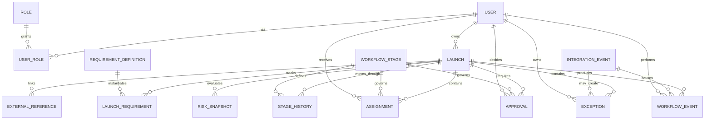

# FlowLens Canonical Data Model

## Document Purpose

This document defines the canonical data model required to support the FlowLens future-state workflow.

The model translates business concepts such as launches, ownership, approvals, exceptions, requirements, integrations, and audit history into structured entities with defined relationships and validation rules.

## Data-Model Objectives

The FlowLens data model must:

1. Create one canonical launch record.
2. Preserve external system ownership.
3. Track data provenance.
4. Support explainable workflow state.
5. Make ownership and next actions explicit.
6. Capture structured approvals.
7. Treat exceptions as first-class records.
8. Preserve append-only audit history.
9. Process external events idempotently.
10. Support reproducible operational metrics.
11. Use only synthetic data.

## Entity Relationship Model



## Core Entities

## Launch

The `Launch` entity is the canonical record for one contract-to-launch workflow.

FlowLens owns the workflow record but does not become authoritative for externally owned customer, contract, billing, or implementation data.

| Field | Type | Required | Description |
|---|---|---:|---|
| `id` | UUID | Yes | FlowLens launch identifier |
| `source_opportunity_id` | String | Yes | Salesforce opportunity identifier |
| `customer_external_id` | String | Yes | Salesforce customer identifier |
| `customer_display_name` | String | Yes | Cached customer name for operational display |
| `status` | LaunchStatus | Yes | Overall launch lifecycle status |
| `current_stage_id` | UUID | Yes | Current FlowLens workflow stage |
| `risk_status` | RiskStatus | Yes | Current calculated risk state |
| `accountable_owner_id` | UUID | Yes | User responsible for the overall launch outcome |
| `target_launch_at` | Timestamp | Yes | Current target launch date and time |
| `original_target_launch_at` | Timestamp | Yes | Initial target launch date and time |
| `actual_launch_at` | Timestamp | No | Confirmed customer launch time |
| `paused_at` | Timestamp | No | Time an authorized pause began |
| `pause_reason` | String | No | Reason for the active or most recent pause |
| `canceled_at` | Timestamp | No | Time the launch was canceled |
| `cancellation_reason` | String | No | Required reason for cancellation |
| `completed_at` | Timestamp | No | Time operational handoff completed |
| `created_at` | Timestamp | Yes | UTC record-creation time |
| `updated_at` | Timestamp | Yes | UTC last-updated time |
| `version` | Integer | Yes | Optimistic concurrency version |

### Launch Constraints

- `source_opportunity_id` must be unique for active launches.
- An active launch must have an accountable owner.
- `actual_launch_at` cannot precede `created_at`.
- `completed_at` cannot precede `actual_launch_at`.
- A canceled launch cannot return to an active state without an authorized and audited recovery action.
- Current stage must reference an active workflow-stage definition.
- Current risk status must be derived from documented rules.

## External Reference

The `ExternalReference` entity links a launch to a record owned by another system.

| Field | Type | Required | Description |
|---|---|---:|---|
| `id` | UUID | Yes | FlowLens external-reference identifier |
| `launch_id` | UUID | Yes | Related launch |
| `system` | ExternalSystem | Yes | Authoritative external system |
| `resource_type` | String | Yes | Type of external record |
| `external_id` | String | Yes | Identifier in the external system |
| `display_label` | String | No | Human-readable reference label |
| `reference_url` | String | No | Link to the simulated external record |
| `source_updated_at` | Timestamp | No | Last-known source-system update time |
| `last_synchronized_at` | Timestamp | No | Last successful FlowLens synchronization |
| `created_at` | Timestamp | Yes | UTC record-creation time |
| `updated_at` | Timestamp | Yes | UTC last-updated time |

### External Reference Constraints

- The combination of `system`, `resource_type`, and `external_id` must be unique for a launch.
- FlowLens must not represent itself as authoritative for the external record.
- External links must use approved URL formats.
- Sensitive external payloads should not be copied unnecessarily.

## Workflow Stage

The `WorkflowStage` entity defines a controlled stage in the contract-to-launch process.

| Field | Type | Required | Description |
|---|---|---:|---|
| `id` | UUID | Yes | Stage identifier |
| `code` | String | Yes | Stable machine-readable stage code |
| `name` | String | Yes | Human-readable stage name |
| `sequence` | Integer | Yes | Default stage order |
| `description` | String | Yes | Stage purpose |
| `accountable_role_code` | String | Yes | Default accountable role |
| `active` | Boolean | Yes | Whether the stage may be used |
| `created_at` | Timestamp | Yes | UTC record-creation time |
| `updated_at` | Timestamp | Yes | UTC last-updated time |

### Initial Stage Codes

| Sequence | Code | Name |
|---:|---|---|
| 1 | `HANDOFF_REVIEW` | Handoff Review |
| 2 | `CONTRACT_VERIFICATION` | Contract Verification |
| 3 | `FINANCIAL_READINESS` | Financial Readiness |
| 4 | `IMPLEMENTATION_PLANNING` | Implementation Planning |
| 5 | `TECHNICAL_READINESS` | Technical Readiness |
| 6 | `LAUNCH_APPROVAL` | Launch Approval |
| 7 | `CUSTOMER_LAUNCH` | Customer Launch |
| 8 | `OPERATIONAL_HANDOFF` | Operational Handoff |
| 9 | `COMPLETED` | Completed |

## Stage History

The `StageHistory` entity records every valid stage transition.

| Field | Type | Required | Description |
|---|---|---:|---|
| `id` | UUID | Yes | Stage-history identifier |
| `launch_id` | UUID | Yes | Related launch |
| `stage_id` | UUID | Yes | Workflow stage |
| `entered_at` | Timestamp | Yes | UTC stage-entry time |
| `exited_at` | Timestamp | No | UTC stage-exit time |
| `entered_by_user_id` | UUID | No | User responsible for entry |
| `entered_by_source` | ActorSource | Yes | User or system source |
| `exit_reason` | String | No | Reason for stage completion or departure |
| `correlation_id` | UUID | Yes | Related workflow-operation identifier |

### Stage History Constraints

- A launch may have only one open stage-history record at a time.
- `exited_at` cannot precede `entered_at`.
- Stage-history records cannot be deleted through normal application functionality.
- Re-entering a stage creates a new history record rather than reopening an old record.

## Assignment

The `Assignment` entity represents an explicit action owned by a user or role.

| Field | Type | Required | Description |
|---|---|---:|---|
| `id` | UUID | Yes | Assignment identifier |
| `launch_id` | UUID | Yes | Related launch |
| `stage_id` | UUID | Yes | Related workflow stage |
| `assignment_type` | AssignmentType | Yes | Controlled action type |
| `title` | String | Yes | Concise action title |
| `description` | String | No | Detailed action instructions |
| `owner_user_id` | UUID | No | Assigned user |
| `owner_role_code` | String | No | Assigned role when no user is selected |
| `status` | AssignmentStatus | Yes | Current action status |
| `priority` | Priority | Yes | Work priority |
| `due_at` | Timestamp | No | UTC due time |
| `started_at` | Timestamp | No | UTC work-start time |
| `completed_at` | Timestamp | No | UTC completion time |
| `completion_evidence` | String | No | Evidence or explanation |
| `created_at` | Timestamp | Yes | UTC record-creation time |
| `updated_at` | Timestamp | Yes | UTC last-updated time |

### Assignment Constraints

- At least one of `owner_user_id` or `owner_role_code` must exist.
- Completed assignments require `completed_at`.
- Canceled assignments require a reason recorded through a workflow event.
- Overdue status is calculated rather than manually selected.
- Reassignment must create an audit event.

## Approval

The `Approval` entity represents one required specialist or operational decision.

| Field | Type | Required | Description |
|---|---|---:|---|
| `id` | UUID | Yes | Approval identifier |
| `launch_id` | UUID | Yes | Related launch |
| `stage_id` | UUID | Yes | Workflow stage where approval is required |
| `approval_type` | ApprovalType | Yes | Type of decision |
| `status` | ApprovalStatus | Yes | Current approval state |
| `requested_to_user_id` | UUID | No | Assigned decision-maker |
| `requested_to_role_code` | String | No | Assigned decision role |
| `requested_at` | Timestamp | Yes | UTC request time |
| `due_at` | Timestamp | No | UTC decision due time |
| `decided_by_user_id` | UUID | No | User who made the decision |
| `decided_at` | Timestamp | No | UTC decision time |
| `decision_reason` | String | No | Reason for rejection or other decision |
| `conditions` | String | No | Conditions attached to approval |
| `conditions_satisfied_at` | Timestamp | No | Time conditions were completed |
| `created_at` | Timestamp | Yes | UTC record-creation time |
| `updated_at` | Timestamp | Yes | UTC last-updated time |

### Approval Constraints

- At least one assigned user or role is required.
- Pending approvals cannot contain a decision-maker or decision time.
- Rejected decisions require a reason.
- More-information-required decisions require a reason.
- Approved-with-conditions decisions require conditions.
- Approval decisions cannot be inferred from task completion or elapsed time.
- Changing a decision requires a new audit event.
- Separation-of-duty rules may prevent self-approval.

## Requirement Definition

The `RequirementDefinition` entity defines a reusable workflow requirement.

| Field | Type | Required | Description |
|---|---|---:|---|
| `id` | UUID | Yes | Requirement-definition identifier |
| `code` | String | Yes | Stable requirement code |
| `name` | String | Yes | Human-readable name |
| `description` | String | Yes | Requirement purpose |
| `stage_id` | UUID | Yes | Stage where the requirement applies |
| `required_by_default` | Boolean | Yes | Default requirement behavior |
| `completion_type` | CompletionType | Yes | Evidence or decision required |
| `active` | Boolean | Yes | Whether new launches may use it |
| `created_at` | Timestamp | Yes | UTC record-creation time |
| `updated_at` | Timestamp | Yes | UTC last-updated time |

## Launch Requirement

The `LaunchRequirement` entity applies a requirement definition to a specific launch.

| Field | Type | Required | Description |
|---|---|---:|---|
| `id` | UUID | Yes | Launch-requirement identifier |
| `launch_id` | UUID | Yes | Related launch |
| `requirement_definition_id` | UUID | Yes | Related reusable definition |
| `status` | RequirementStatus | Yes | Current completion state |
| `required` | Boolean | Yes | Whether required for this launch |
| `assigned_to_user_id` | UUID | No | Responsible user |
| `due_at` | Timestamp | No | UTC due time |
| `completed_at` | Timestamp | No | UTC completion time |
| `completed_by_user_id` | UUID | No | User who completed it |
| `evidence` | String | No | Evidence or reference |
| `waived_at` | Timestamp | No | UTC waiver time |
| `waived_by_user_id` | UUID | No | Authorized user |
| `waiver_reason` | String | No | Required waiver reason |
| `created_at` | Timestamp | Yes | UTC record-creation time |
| `updated_at` | Timestamp | Yes | UTC last-updated time |

### Launch Requirement Constraints

- The same definition may be applied only once per launch.
- Required incomplete requirements may block stage exit.
- Waivers require authorization and a reason.
- Completion or waiver creates a workflow event.

## Exception

The `Exception` entity represents a workflow blocker, failure, conflict, or policy exception.

| Field | Type | Required | Description |
|---|---|---:|---|
| `id` | UUID | Yes | Exception identifier |
| `launch_id` | UUID | Yes | Related launch |
| `stage_id` | UUID | No | Related workflow stage |
| `integration_event_id` | UUID | No | Related failed integration event |
| `exception_type` | ExceptionType | Yes | Controlled exception category |
| `severity` | Severity | Yes | Low, medium, high, or critical |
| `status` | ExceptionStatus | Yes | Current exception lifecycle state |
| `title` | String | Yes | Concise exception title |
| `description` | String | Yes | Detailed exception information |
| `owner_user_id` | UUID | No | Assigned user |
| `owner_role_code` | String | No | Assigned role |
| `due_at` | Timestamp | No | UTC resolution target |
| `resolution` | String | No | Resolution evidence or explanation |
| `resolved_by_user_id` | UUID | No | User who resolved it |
| `resolved_at` | Timestamp | No | UTC resolution time |
| `created_at` | Timestamp | Yes | UTC record-creation time |
| `updated_at` | Timestamp | Yes | UTC last-updated time |

### Exception Constraints

- Every open exception must have an assigned user or role.
- Resolved exceptions require a resolution, actor, and timestamp.
- Critical open exceptions block launch approval and completion.
- Integration failures must remain linked to their integration event.
- Closing an exception creates a workflow event.

## Workflow Event

The `WorkflowEvent` entity provides the append-only audit history.

| Field | Type | Required | Description |
|---|---|---:|---|
| `id` | UUID | Yes | Workflow-event identifier |
| `launch_id` | UUID | Yes | Related launch |
| `event_type` | WorkflowEventType | Yes | Controlled event category |
| `occurred_at` | Timestamp | Yes | UTC event time |
| `actor_user_id` | UUID | No | User who caused the event |
| `actor_source` | ActorSource | Yes | User, FlowLens, or external system |
| `source_system` | ExternalSystem | No | External source when applicable |
| `correlation_id` | UUID | Yes | Groups related workflow activity |
| `previous_state` | JSON | No | Relevant state before the event |
| `new_state` | JSON | No | Relevant state after the event |
| `reason` | String | No | Required reason when applicable |
| `metadata` | JSON | No | Additional non-sensitive context |
| `created_at` | Timestamp | Yes | UTC persistence time |

### Workflow Event Constraints

- Events are append-only.
- Events cannot be edited or deleted through normal application functionality.
- Every event requires a correlation identifier.
- User actions require an actor identifier.
- Externally caused events require a source system.
- Event metadata must not contain credentials or unnecessary sensitive information.

## Integration Event

The `IntegrationEvent` entity tracks the lifecycle of a simulated external event.

| Field | Type | Required | Description |
|---|---|---:|---|
| `id` | UUID | Yes | FlowLens integration-event identifier |
| `external_event_id` | String | Yes | Source-system event identifier |
| `source_system` | ExternalSystem | Yes | Simulated source |
| `event_type` | String | Yes | Source event type |
| `status` | IntegrationStatus | Yes | Processing lifecycle state |
| `correlation_id` | UUID | Yes | Related operation identifier |
| `payload_hash` | String | Yes | Hash used for integrity comparison |
| `payload` | JSON | Yes | Synthetic validated event payload |
| `attempt_count` | Integer | Yes | Number of processing attempts |
| `last_error_code` | String | No | Latest stable error code |
| `last_error_message` | String | No | Sanitized error description |
| `received_at` | Timestamp | Yes | UTC receipt time |
| `processing_started_at` | Timestamp | No | UTC processing-start time |
| `processed_at` | Timestamp | No | UTC success time |
| `failed_at` | Timestamp | No | UTC permanent-failure time |
| `created_at` | Timestamp | Yes | UTC record-creation time |
| `updated_at` | Timestamp | Yes | UTC last-updated time |

### Integration Event Constraints

- `external_event_id` and `source_system` must be unique together.
- Attempt count cannot be negative.
- Processed events cannot be processed again.
- Failed events require a sanitized error code and message.
- Permanently failed events must create an assigned exception.
- Payloads must contain only synthetic data.

## Risk Snapshot

The `RiskSnapshot` entity records a point-in-time risk calculation.

| Field | Type | Required | Description |
|---|---|---:|---|
| `id` | UUID | Yes | Risk-snapshot identifier |
| `launch_id` | UUID | Yes | Related launch |
| `risk_status` | RiskStatus | Yes | Calculated state |
| `calculated_at` | Timestamp | Yes | UTC calculation time |
| `rule_results` | JSON | Yes | Explainable rule outcomes |
| `triggering_event_id` | UUID | No | Workflow event causing recalculation |
| `created_at` | Timestamp | Yes | UTC persistence time |

### Risk Snapshot Constraints

- Risk status must be calculated from documented rules.
- Rule results must identify each contributing condition.
- Previous snapshots remain available for historical analysis.
- A manual risk override requires authorization and an audit event.

## User

The `User` entity represents a synthetic FlowLens user.

| Field | Type | Required | Description |
|---|---|---:|---|
| `id` | UUID | Yes | User identifier |
| `email` | String | Yes | Unique synthetic email |
| `display_name` | String | Yes | Synthetic display name |
| `department` | Department | Yes | Organizational department |
| `active` | Boolean | Yes | Whether assignments may be received |
| `created_at` | Timestamp | Yes | UTC record-creation time |
| `updated_at` | Timestamp | Yes | UTC last-updated time |

## Role

The `Role` entity defines an authorization role.

| Field | Type | Required | Description |
|---|---|---:|---|
| `id` | UUID | Yes | Role identifier |
| `code` | String | Yes | Stable role code |
| `name` | String | Yes | Human-readable role name |
| `description` | String | Yes | Role purpose |
| `active` | Boolean | Yes | Whether the role may be assigned |

## User Role

The `UserRole` entity creates a many-to-many relationship between users and roles.

| Field | Type | Required | Description |
|---|---|---:|---|
| `id` | UUID | Yes | User-role identifier |
| `user_id` | UUID | Yes | Related user |
| `role_id` | UUID | Yes | Related role |
| `assigned_at` | Timestamp | Yes | UTC assignment time |
| `assigned_by_user_id` | UUID | No | User who granted the role |

The combination of `user_id` and `role_id` must be unique.

## Controlled Enumerations

### LaunchStatus

- `ACTIVE`
- `PAUSED`
- `COMPLETED`
- `CANCELED`

### RiskStatus

- `ON_TRACK`
- `AT_RISK`
- `BLOCKED`
- `PAUSED`

### ApprovalType

- `LEGAL`
- `FINANCIAL`
- `TECHNICAL`
- `LAUNCH`
- `OPERATIONAL_HANDOFF`

### ApprovalStatus

- `PENDING`
- `APPROVED`
- `APPROVED_WITH_CONDITIONS`
- `REJECTED`
- `MORE_INFORMATION_REQUIRED`
- `CANCELED`

### AssignmentStatus

- `OPEN`
- `IN_PROGRESS`
- `COMPLETED`
- `CANCELED`

### RequirementStatus

- `NOT_STARTED`
- `IN_PROGRESS`
- `COMPLETED`
- `WAIVED`
- `NOT_APPLICABLE`

### ExceptionStatus

- `OPEN`
- `ASSIGNED`
- `INVESTIGATING`
- `WAITING`
- `RESOLVED`
- `CLOSED`

### Severity

- `LOW`
- `MEDIUM`
- `HIGH`
- `CRITICAL`

### IntegrationStatus

- `RECEIVED`
- `PROCESSING`
- `PROCESSED`
- `RETRYING`
- `FAILED`
- `REJECTED`

### ExternalSystem

- `SALESFORCE`
- `DOCUSIGN`
- `NETSUITE`
- `JIRA`
- `SLACK`

### ActorSource

- `USER`
- `FLOWLENS`
- `EXTERNAL_SYSTEM`

### Priority

- `LOW`
- `MEDIUM`
- `HIGH`
- `URGENT`

## Data Provenance

FlowLens must identify where important data originated.

| Provenance Type | Meaning |
|---|---|
| External | Received from a simulated system of record |
| User Entered | Entered directly by an authorized FlowLens user |
| Calculated | Produced through a documented FlowLens rule |
| Derived | Constructed from one or more existing values |
| Imported | Added through a controlled synthetic-data import |

Calculated and derived values must identify the rule or inputs responsible when appropriate.

## Identifier Strategy

FlowLens-generated records use UUID identifiers.

External system identifiers remain strings because source systems may use different identifier formats.

Important identifier rules include:

- FlowLens identifiers are immutable.
- External identifiers preserve their source representation.
- Correlation identifiers connect related processing and workflow events.
- Idempotency uses source-system and external-event identifiers.
- Display labels must not replace durable identifiers.

## Timestamp Strategy

- All timestamps are stored in UTC.
- API responses use ISO 8601 timestamps.
- User interfaces may display localized time.
- Audit records preserve the original occurrence time.
- Processing time and event occurrence time remain separate when necessary.
- Business-day calculations use a documented calendar and timezone.

## Data Retention and Deletion

For the initial portfolio release:

- Synthetic launch and audit data remains available for demonstration.
- Audit events are not deleted through normal application functionality.
- Canceled launches retain their history.
- External-event payloads may be pruned in a future release while retaining identifiers, hashes, results, and audit evidence.
- Test-data reset procedures must be documented.
- No retention policy may imply legal compliance for a real organization.

## Data Integrity Rules

The database must enforce integrity where practical through:

- Primary keys
- Foreign keys
- Unique constraints
- Required fields
- Controlled enumerations
- Timestamp validation
- Transaction boundaries
- Optimistic concurrency
- Idempotency constraints

Application validation must supplement database constraints for cross-record business rules.

## Example Canonical Launch

```json
{
  "id": "8de17aa4-8475-4d91-8db1-42673e9dd541",
  "source_opportunity_id": "OPP-10482",
  "customer_external_id": "ACC-2981",
  "customer_display_name": "Summit Ridge Partners",
  "status": "ACTIVE",
  "current_stage": "FINANCIAL_READINESS",
  "risk_status": "AT_RISK",
  "accountable_owner_id": "ef190b5d-3f47-43ee-ae64-8c723554f871",
  "target_launch_at": "2026-09-14T14:00:00Z",
  "original_target_launch_at": "2026-09-12T14:00:00Z",
  "actual_launch_at": null,
  "created_at": "2026-08-20T16:32:00Z",
  "updated_at": "2026-08-25T18:04:00Z",
  "version": 7
}
```

This record and every value in it are fictional.

## Requirements-to-Entity Mapping

| Requirement Area | Primary Entities |
|---|---|
| Canonical launch management | Launch, ExternalReference |
| Workflow stages | WorkflowStage, StageHistory |
| Ownership and next actions | Launch, Assignment, User |
| Structured approvals | Approval, User, Role |
| Workflow requirements | RequirementDefinition, LaunchRequirement |
| Exception management | Exception, Assignment |
| Risk calculation | RiskSnapshot, Exception, Assignment, Approval |
| Audit history | WorkflowEvent |
| Integration reliability | IntegrationEvent, ExternalReference |
| Access control | User, Role, UserRole |
| Metrics | WorkflowEvent, StageHistory, RiskSnapshot, Launch |

## Data-Model Conclusion

The FlowLens data model creates a durable workflow layer without claiming ownership of data that belongs to existing systems.

The model makes workflow state, ownership, approvals, requirements, exceptions, risk, integration activity, and historical events explicit and measurable.

This structure provides the foundation for future API contracts, database implementation, automated tests, dashboards, and traceable operational reporting.