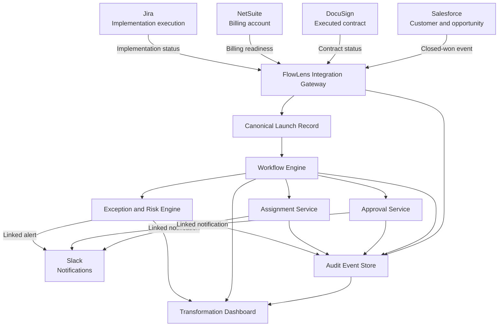
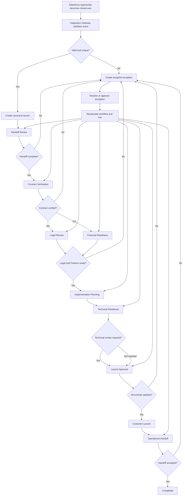
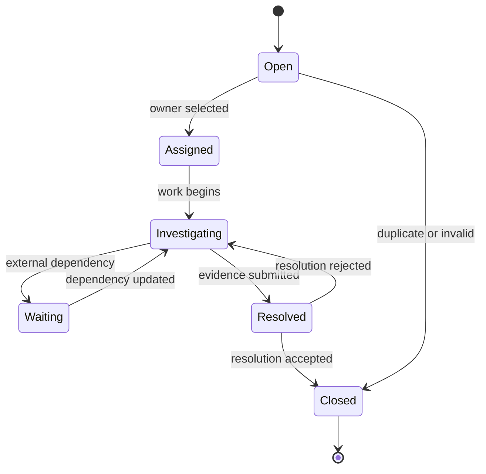

# FlowLens Future-State Design

## Document Purpose

This document defines the proposed future-state contract-to-launch process for Northstar Business Services.

The design preserves the organization’s trusted systems of record while introducing FlowLens as the orchestration, visibility, exception-management, and measurement layer across them.

## Future-State Objective

The future state must provide one reliable answer to the following questions:

- Where is each launch in the process?
- Who owns the current outcome?
- What must happen next?
- Which decisions are complete?
- What is blocked or at risk?
- Which external system owns each data element?
- Why did the workflow reach its current state?
- How is the redesigned process performing?

## Design Strategy

FlowLens will not replace Salesforce, DocuSign, Jira, NetSuite, Slack, or specialist decision-making.

FlowLens will coordinate them.

The future state separates responsibilities into three categories:

### Systems of Record

Existing systems continue to own their authoritative business data.

### System of Orchestration

FlowLens owns the end-to-end workflow state, ownership, approvals, exceptions, risk, audit history, and process measures.

### Systems of Engagement

FlowLens and Slack provide stakeholders with operational views, work queues, alerts, and actions.

## Future System Landscape

## System Boundaries

### FlowLens Owns

FlowLens is authoritative for:

- Canonical launch identifier
- End-to-end workflow stage
- Accountable launch owner
- Next actions and assignments
- Approval requests and decisions
- Workflow requirements
- Exceptions and blockers
- Calculated risk status
- Workflow event history
- Cross-system correlation identifiers
- Process-performance measures
- Transformation-dashboard results

### Salesforce Owns

Salesforce remains authoritative for:

- Customer identity
- Opportunity identity
- Sales ownership
- Commercial opportunity data
- Closed-won status
- Original target information supplied by Sales

### DocuSign Owns

DocuSign remains authoritative for:

- Executed contract
- Signature status
- Contract document reference
- Contract completion date

FlowLens stores references and relevant workflow metadata rather than contract-document contents.

### NetSuite Owns

NetSuite remains authoritative for:

- Billing-account identifier
- Billing-account status
- Financial account readiness
- Financial system records

FlowLens stores readiness status and references rather than financial transactions.

### Jira Owns

Jira remains authoritative for:

- Implementation project
- Technical and implementation tasks
- Execution-team work details
- Jira task completion

FlowLens stores summarized execution status, dependencies, and references required for end-to-end orchestration.

### Slack Owns

Slack remains a communication channel.

Slack does not become authoritative for:

- Approval decisions
- Workflow ownership
- Launch status
- Exception resolution
- Audit history

Every FlowLens notification links to a durable workflow record.

## Future-State Workflow

## Workflow Stages

### Stage 1: Handoff Review

**Purpose:** Confirm that Sales supplied the minimum information required to begin the launch process.

**Required information:**

- Salesforce customer identifier
- Salesforce opportunity identifier
- Customer name
- Sales owner
- Contract reference
- Target launch date
- Product or service scope
- Primary customer contact
- Known launch dependencies

**Accountable owner:** Operations Coordinator

**Exit criteria:**

- Required fields are complete.
- The source opportunity is unique.
- A valid contract reference exists.
- Missing-information exceptions are resolved.
- The handoff is accepted.

### Stage 2: Contract Verification

**Purpose:** Confirm that an executed agreement exists and identify contractual requirements that affect the launch.

**Accountable owner:** Legal Reviewer

**Exit criteria:**

- DocuSign reference is valid.
- Signature status is complete.
- Required contract metadata is available.
- Legal review is requested.
- Material contract exceptions are documented.

Once the contract is verified, Legal Review and Financial Readiness may proceed in parallel.

### Stage 3: Financial Readiness

**Purpose:** Confirm that required financial and billing setup is complete.

**Accountable owner:** Finance Analyst

**Parallel work:**

- Legal approval may remain active.
- Finance creates or confirms the NetSuite billing account.
- Operations monitors both readiness workstreams.

**Exit criteria:**

- Financial approval is complete.
- Billing-account reference exists.
- Billing readiness is confirmed.
- Legal approval is complete.
- Approval conditions are satisfied or explicitly tracked.
- Critical exceptions are resolved.

### Stage 4: Implementation Planning

**Purpose:** Create the structured implementation plan and assign delivery resources.

**Accountable owner:** Implementation Manager

**FlowLens actions:**

- Create or link the Jira implementation project.
- Provide canonical customer and contract references.
- Assign implementation ownership.
- Establish milestones and target dates.
- Identify technical-review requirements.

**Exit criteria:**

- Implementation owner is assigned.
- Jira project is linked.
- Required milestones exist.
- Dependencies are documented.
- Technical-review requirements are identified.

### Stage 5: Technical Readiness

**Purpose:** Validate integrations, configuration, migrations, dependencies, and other technical requirements.

**Accountable owner:** Technical Lead when technical review is required

**Exit criteria:**

- Technical requirements are complete.
- Required technical approval is recorded.
- Known risks are documented.
- Critical technical exceptions are resolved.
- Remaining accepted conditions are visible.

If technical review is not required, FlowLens records the applicable rule and allows the workflow to proceed without inventing an approval.

### Stage 6: Launch Approval

**Purpose:** Verify that all required controls and readiness conditions have been satisfied.

**Accountable owner:** Operations Director or authorized launch approver

**Required evidence:**

- Legal approval
- Financial approval
- Technical approval when applicable
- Billing readiness
- Implementation readiness
- No unresolved critical exceptions
- Explicit accountable owner
- Confirmed target date
- Complete audit evidence

**Exit criteria:**

- All required approvals are complete.
- All blocking requirements are complete.
- Critical exceptions are resolved.
- Conditional approvals remain visible.
- Launch approval is recorded.

### Stage 7: Customer Launch

**Purpose:** Execute the approved launch and record the effective launch event.

**Accountable owner:** Implementation Manager

**Exit criteria:**

- Launch execution is confirmed.
- Actual launch timestamp is recorded.
- Outstanding noncritical items are assigned.
- Operational handoff package is created.

### Stage 8: Operational Handoff

**Purpose:** Transfer the launched customer to the responsible service-delivery team.

**Accountable owner:** Service Delivery Manager

**Required handoff information:**

- Customer and launch identifiers
- Effective launch date
- Service scope
- Configuration summary
- Known conditions and accepted risks
- Outstanding actions
- Responsible operational owner
- Relevant external-system references

**Exit criteria:**

- Service Delivery accepts the handoff.
- Incomplete handoffs are returned with structured reasons.
- Outstanding actions have owners and due dates.
- Operational ownership is confirmed.

### Stage 9: Completed

**Purpose:** Close the contract-to-launch workflow while preserving its complete history.

A completed launch remains available for:

- Audit review
- Performance measurement
- Trend analysis
- Process improvement
- Exception analysis
- Future reference

## Parallel Work Design

The future state reduces unnecessary sequential waiting.

After contract verification:

- Legal completes its structured review.
- Finance completes billing readiness.
- Operations monitors both workstreams.
- FlowLens prevents advancement until both required outcomes are complete.
- Either workstream can create exceptions without hiding the other’s progress.

This preserves control while reducing avoidable idle time.

## Automated Responsibilities

FlowLens automates repeatable coordination work.

The platform may automatically:

- Validate incoming handoff data
- Detect duplicate events
- Create canonical launch records
- Populate approved source data
- Apply stage-entry and stage-exit rules
- Create assignments
- Route approval requests
- Create or simulate Jira projects
- Calculate due dates
- Detect overdue work
- Detect missing information
- Detect status conflicts
- Calculate risk
- Create exceptions
- Send linked notifications
- Record audit events
- Calculate operational measures
- Generate dashboard views

## Human Responsibilities

FlowLens does not replace accountable judgment.

Authorized people remain responsible for:

- Correcting inaccurate source data
- Legal decisions
- Financial decisions
- Technical-readiness decisions
- Exception investigation
- Exception resolution
- Accepted-risk decisions
- Workflow overrides
- Final launch approval
- Operational handoff acceptance
- Process-policy changes

## Exception Workflow

## Exception Behavior

When an exception occurs:

1. FlowLens creates a structured exception.
2. The exception receives a type and severity.
3. One accountable owner is assigned.
4. The affected launch and workflow stage are linked.
5. Launch risk is recalculated.
6. High and critical exceptions generate notifications.
7. Critical exceptions block approval and completion.
8. Resolution requires evidence or an explanation.
9. Resolution creates an audit event.
10. The workflow is reevaluated after resolution.

## Risk Model

A launch may have one of four calculated risk states:

| Risk State | Meaning |
|---|---|
| On Track | No known condition currently threatens the target outcome |
| At Risk | One or more conditions may threaten the target outcome |
| Blocked | A required condition prevents progress |
| Paused | Progress is intentionally suspended through an authorized decision |

Risk may be influenced by:

- Overdue assignments
- Pending approvals near their due dates
- Missing required information
- Unresolved exceptions
- Integration failures
- Status conflicts
- Insufficient time remaining for incomplete stages
- Rejected approvals
- Customer-requested pauses

Every calculated risk state must remain explainable.

## Override Design

FlowLens supports controlled exceptions to normal workflow rules.

An override requires:

- An authorized role
- The affected rule
- The previous state
- The requested state
- A required reason
- The actor
- A timestamp
- An audit event

Overrides cannot:

- Delete historical events
- Create inferred specialist approval
- Hide unresolved critical exceptions
- Remove required evidence
- bypass privacy requirements

## Future-State Data Movement

| Data | Authoritative Source | FlowLens Behavior | Manual Re-entry Expected |
|---|---|---|---|
| Customer identity | Salesforce | Receive and reference | No |
| Opportunity data | Salesforce | Receive and reference | No |
| Executed contract | DocuSign | Store reference and status | No |
| Legal decision | FlowLens approval event | Capture structured decision | No |
| Financial decision | FlowLens approval event | Capture structured decision | No |
| Billing readiness | NetSuite | Receive summarized status | No |
| Implementation project | Jira | Create or link and monitor | No |
| Workflow ownership | FlowLens | Assign and audit | No |
| Exceptions | FlowLens | Create, assign, and resolve | No |
| Risk status | FlowLens | Calculate and explain | No |
| Launch decision | FlowLens | Capture structured approval | No |
| Communication | Slack | Send linked notification | No workflow data stored only in Slack |

## Current-State and Future-State Comparison

| Area | Current State | Future State |
|---|---|---|
| Workflow record | Shared spreadsheet | Canonical FlowLens launch |
| Data movement | Manual copying | Simulated event-driven synchronization |
| Ownership | Implicit and conversational | Explicit and audited |
| Approvals | Email threads | Structured approval records |
| Status definitions | Department-specific | Controlled workflow stages |
| Exceptions | Notes, messages, and follow-up | Structured assigned records |
| Risk detection | Reactive | Rules-based and explainable |
| Notifications | Informal updates | Links to durable records |
| Audit history | Distributed and incomplete | Chronological event history |
| Reporting | Manual spreadsheet preparation | Event-derived dashboard |
| External systems | Disconnected participation | Coordinated systems of record |
| Human decisions | Difficult to reconstruct | Preserved with actor, time, and reason |

## Manual-Touch Reduction

The future state targets five or fewer necessary manual data-entry touchpoints per launch.

Expected human interaction remains for:

1. Original Sales opportunity data
2. Missing-information correction
3. Specialist decisions
4. Exception investigation and resolution
5. Final launch and handoff confirmation

The project does not classify meaningful review, judgment, or approval as waste.

## Future-State Success Conditions

The future-state design is successful when:

- Every launch has one canonical record.
- Every active launch has an accountable owner.
- Every active stage has an explicit next action.
- Required approvals are structured and auditable.
- Existing systems retain clear data ownership.
- Duplicate events do not create duplicate actions.
- Failed integrations create visible exceptions.
- Critical exceptions prevent launch completion.
- Risk status is calculated and explainable.
- Historical events are preserved.
- Dashboard results can be reproduced from event history.
- Synthetic results are never represented as actual company outcomes.

## Future-State Conclusion

FlowLens transforms Northstar’s contract-to-launch process without treating every existing system or human decision as a problem.

The future state preserves reliable systems of record and specialist authority while replacing fragmented coordination with explicit workflow state, ownership, approvals, exceptions, audit history, and measurable process performance.