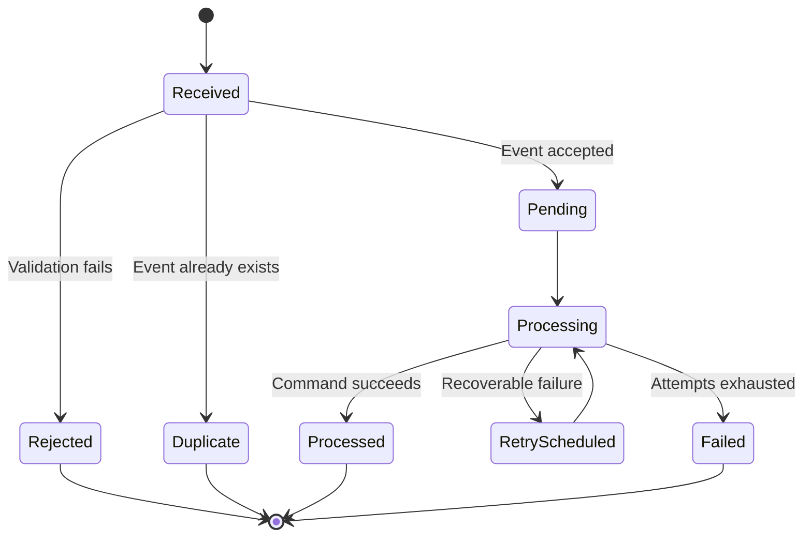

# FlowLens Integration Contracts

## Purpose

This document defines how data enters and leaves FlowLens.

FlowLens supports four primary intake methods:

1. Manual entry through the web application
2. CSV import
3. REST API requests
4. Generic webhook events

All intake methods must use the same validation, deduplication, workflow, assignment, approval, exception, and audit rules.

The Northstar integrations described later in this document are demonstration adapters. They show how external systems can interact with FlowLens without making those systems mandatory platform dependencies.

---

## Integration Principles

### IP-01: One Business-Rule Path

A work item must follow the same business rules regardless of whether it was created through:

- The web application
- A CSV import
- The REST API
- A generic webhook
- A source-specific adapter

No intake method may bypass required validation, assignment, approval, or audit behavior.

### IP-02: External Systems Remain External

FlowLens coordinates work across existing systems. It does not claim ownership of data that remains authoritative elsewhere.

Each external field mapping must identify:

- The source system
- The source record type
- The external record identifier
- The FlowLens destination field
- The synchronization direction
- The conflict-handling rule

### IP-03: Every Accepted Change Is Traceable

An accepted external command must create one or more workflow events.

The audit history must identify:

- The initiating user or source system
- The intake method
- The external event identifier when applicable
- The correlation identifier
- The affected work item
- The resulting change
- The processing outcome

### IP-04: Duplicate Events Are Safe

Submitting the same external event more than once must not create duplicate workflow actions.

### IP-05: Failures Are Visible

A failed integration that requires attention must create a visible FlowLens exception.

Application logs alone are not sufficient operational visibility.

### IP-06: Contracts Are Versioned

API and event contracts must include an explicit version.

Breaking contract changes require a new version or a documented migration path.

---

## Supported Intake Methods

| Intake Method | Primary User | Initial Release |
|---|---|---|
| Manual web entry | Business user | Supported |
| CSV import | Operations user or administrator | Supported |
| REST API | External application or technical user | Supported |
| Generic webhook | External event source | Supported |
| Source-specific adapter | Demonstration or future integration | Adapter framework supported |
| Direct database write | None | Not supported |

Direct database writes are prohibited because they bypass validation, workflow rules, and audit-event creation.

---

# Manual Web Entry

## Purpose

Manual entry allows authorized users to create and update work items through the FlowLens browser interface.

Manual entry is appropriate when:

- No upstream integration exists.
- A process begins with human review.
- A small number of records must be entered.
- An exception requires a controlled correction.
- A user is evaluating FlowLens.

## Create Work Item

The form is generated from the selected published workflow-template version.

The user must provide:

- Workflow template
- Required initial fields
- Optional initial fields
- Initial owner when not determined automatically
- Target date when required
- External reference when applicable

## Validation

The interface may provide immediate validation feedback, but the backend remains authoritative.

The API must validate:

- Template status
- Field definitions
- Required values
- Data types
- Allowed values
- Length restrictions
- Date restrictions
- Uniqueness rules
- Assignment eligibility
- Organization access

## Result

A successful manual submission must:

1. Create the work item.
2. Create its initial field values.
3. Assign the initial workflow stage.
4. Apply the configured assignment rule.
5. Create initial requirements and approvals when applicable.
6. Record a `work_item_created` event.
7. Record additional generated events.
8. Return the created work item.

## Example Internal Request

```json
{
  "workflow_template_version_id": "wtv_01JFLOWLENS01",
  "title": "Northstar launch for Redwood Realty",
  "target_date": "2026-09-15",
  "owner_id": "usr_01KAYOPS01",
  "fields": {
    "customer_name": "Redwood Realty",
    "contract_status": "signed",
    "billing_model": "annual",
    "implementation_tier": "standard"
  },
  "external_references": [
    {
      "system": "salesforce",
      "record_type": "opportunity",
      "external_id": "OPP-DEMO-1042"
    }
  ]
}
```

---

# CSV Import Contract

## Purpose

CSV import provides a usable bulk-intake option without requiring an external integration.

Users must be able to:

1. Download or view the expected CSV structure.
2. Upload a file.
3. Validate the file before processing.
4. Review valid and invalid rows.
5. Confirm the import.
6. View the final import result.

## File Requirements

The initial CSV implementation must support:

- UTF-8 encoding
- A header row
- Comma-separated values
- One work item per row
- A documented maximum file size
- A documented maximum row count
- ISO 8601 dates where possible
- Empty optional values
- Escaped commas and quotation marks

## Reserved Columns

The following columns are reserved by FlowLens:

| Column | Required | Purpose |
|---|---:|---|
| `external_id` | Conditional | Identifies the record in the source dataset |
| `title` | Yes | Human-readable work-item title |
| `target_date` | Conditional | Target completion date |
| `owner_email` | No | Requested initial owner |
| `source_system` | No | Name of the originating system |
| `source_record_type` | No | External record type |
| `source_record_url` | No | Link to the source record |

Template-specific fields use their configured field keys as column names.

Example:

```csv
external_id,title,target_date,owner_email,customer_name,contract_status,billing_model
DEMO-1001,Redwood Realty Launch,2026-09-15,coordinator@example.com,Redwood Realty,signed,annual
DEMO-1002,Lakeview Group Launch,2026-09-22,coordinator@example.com,Lakeview Group,pending,monthly
```

## Import Lifecycle

An import job uses the following statuses:

- `uploaded`
- `validating`
- `validation_failed`
- `ready`
- `processing`
- `completed`
- `completed_with_errors`
- `failed`
- `canceled`

## Validation Preview

Before confirmed processing, FlowLens must show:

- Total rows
- Valid rows
- Invalid rows
- Duplicate rows
- Warnings
- Row-level validation messages

No work items are created during preview validation.

## Row Validation

Each row must be checked for:

- Required reserved columns
- Required template fields
- Valid data types
- Valid allowed values
- Date formatting
- Recognized owner
- Duplicate values inside the file
- Duplicate external references already in FlowLens
- Template-specific rules

## Duplicate Handling

The import request must specify a duplicate strategy:

| Strategy | Behavior |
|---|---|
| `reject` | Reject rows matching existing records |
| `skip` | Ignore matching rows and report them |
| `update` | Update approved fields on matching records |

`update` must not bypass normal workflow restrictions.

An import must never silently create duplicate work items.

## Import Result

The completed import result must include:

```json
{
  "import_id": "imp_01JFLOWLENS01",
  "status": "completed_with_errors",
  "summary": {
    "rows_received": 100,
    "rows_created": 91,
    "rows_updated": 3,
    "rows_skipped": 2,
    "rows_failed": 4
  },
  "error_report_available": true
}
```

## Audit Requirements

The import process must record:

- Uploading user
- Workflow-template version
- Original filename
- File hash
- Upload timestamp
- Confirmation timestamp
- Duplicate strategy
- Processing outcome
- Work items created or updated
- Row-level errors

Sensitive uploaded files must not be written into application logs.

---

# REST API Contract

## API Base Path

The initial API base path is:

```text
/api/v1
```

## Content Type

Requests and responses use:

```text
Content-Type: application/json
```

CSV upload endpoints additionally support:

```text
multipart/form-data
```

## Timestamp Format

API timestamps use ISO 8601 and UTC.

Example:

```text
2026-08-02T19:30:00Z
```

## Identifiers

FlowLens identifiers are opaque strings.

Clients must not infer record type, creation order, or business meaning from an identifier.

## Authentication

Protected API endpoints require an authenticated session or API credential.

The final credential implementation will be documented before public deployment.

Credentials must be:

- Scoped to one organization
- Stored securely
- Revocable
- Excluded from logs
- Excluded from the repository

## Authorization

Authentication does not automatically authorize every operation.

The API must verify:

- Organization access
- Assigned role
- Resource-level access
- Restricted-field access
- Approval authority
- Administrative authority

## Standard Response Structure

Single-resource responses should return the requested resource directly or inside a consistently documented envelope.

Example:

```json
{
  "data": {
    "id": "wrk_01JFLOWLENS01",
    "title": "Redwood Realty Launch",
    "status": "active",
    "current_stage": "validation"
  }
}
```

## Paginated Response Structure

```json
{
  "data": [],
  "pagination": {
    "page": 1,
    "page_size": 25,
    "total_items": 0,
    "total_pages": 0
  }
}
```

## Standard Error Structure

```json
{
  "error": {
    "code": "WORKFLOW_RULE_VIOLATION",
    "message": "The work item cannot enter the approval stage.",
    "details": [
      {
        "field": "requirements",
        "reason": "Two required items remain incomplete."
      }
    ],
    "request_id": "req_01JFLOWLENS01"
  }
}
```

## Error Codes

Initial error codes include:

| Code | Meaning |
|---|---|
| `AUTHENTICATION_REQUIRED` | No valid authentication was provided |
| `PERMISSION_DENIED` | The user cannot perform the operation |
| `RESOURCE_NOT_FOUND` | The requested resource does not exist |
| `VALIDATION_ERROR` | One or more values are invalid |
| `DUPLICATE_RESOURCE` | A uniqueness rule was violated |
| `IDEMPOTENCY_CONFLICT` | An idempotency key was reused with different data |
| `WORKFLOW_RULE_VIOLATION` | A configured business rule blocked the command |
| `APPROVAL_REQUIRED` | A required approval has not been granted |
| `REQUIREMENT_INCOMPLETE` | Required work remains incomplete |
| `CRITICAL_EXCEPTION_OPEN` | A critical exception prevents the action |
| `TEMPLATE_NOT_PUBLISHED` | The requested template version cannot create work |
| `INTEGRATION_PROCESSING_FAILED` | An accepted integration could not be processed |
| `INTERNAL_ERROR` | An unexpected server error occurred |

## HTTP Status Codes

| Status | Use |
|---:|---|
| `200` | Successful retrieval or update |
| `201` | Resource created |
| `202` | Request accepted for asynchronous processing |
| `204` | Successful operation with no response body |
| `400` | Malformed request |
| `401` | Authentication required |
| `403` | Permission denied |
| `404` | Resource not found |
| `409` | Duplicate, conflict, or incompatible state |
| `422` | Structured validation failure |
| `429` | Rate limit exceeded |
| `500` | Unexpected internal failure |
| `503` | Required service unavailable |

---

## Create Work Item Endpoint

```text
POST /api/v1/work-items
```

Example request:

```json
{
  "workflow_template_version_id": "wtv_01JFLOWLENS01",
  "title": "Redwood Realty Launch",
  "target_date": "2026-09-15",
  "fields": {
    "customer_name": "Redwood Realty",
    "contract_status": "signed"
  },
  "external_references": [
    {
      "system": "salesforce",
      "record_type": "opportunity",
      "external_id": "OPP-DEMO-1042"
    }
  ]
}
```

Example successful response:

```json
{
  "data": {
    "id": "wrk_01JFLOWLENS01",
    "workflow_template_version_id": "wtv_01JFLOWLENS01",
    "title": "Redwood Realty Launch",
    "status": "active",
    "current_stage": {
      "key": "intake",
      "name": "Intake"
    },
    "target_date": "2026-09-15",
    "created_at": "2026-08-02T19:30:00Z"
  }
}
```

## Update Work-Item Fields

```text
PATCH /api/v1/work-items/{work_item_id}
```

Example:

```json
{
  "fields": {
    "contract_status": "signed",
    "billing_model": "annual"
  },
  "reason": "Updated after contract verification."
}
```

## Request Stage Transition

```text
POST /api/v1/work-items/{work_item_id}/transitions
```

Example:

```json
{
  "target_stage_key": "approval",
  "reason": "All readiness requirements have been completed."
}
```

## Assign Work

```text
POST /api/v1/work-items/{work_item_id}/assignments
```

Example:

```json
{
  "assignment_type": "accountable_owner",
  "user_id": "usr_01KAYOPS01",
  "due_at": "2026-08-05T17:00:00Z",
  "reason": "Assigned by workflow manager."
}
```

## Record Approval Decision

```text
POST /api/v1/approvals/{approval_id}/decisions
```

Example:

```json
{
  "decision": "approved",
  "conditions": "Proceed after billing account confirmation.",
  "reason": "Financial review completed."
}
```

## Create Exception

```text
POST /api/v1/work-items/{work_item_id}/exceptions
```

Example:

```json
{
  "exception_type": "missing_required_information",
  "severity": "high",
  "summary": "Signed contract is missing the billing contact.",
  "assigned_to": "usr_01KAYOPS01"
}
```

---

# Idempotent API Requests

## Purpose

Operations that may be retried must support an idempotency key.

The client supplies:

```text
Idempotency-Key: unique-client-generated-value
```

Idempotency should initially be supported for:

- Work-item creation
- Approval decisions
- Exception creation
- Integration-event submission
- Import confirmation

## Behavior

When the same key and same request are submitted again, FlowLens returns the original result.

When the same key is reused with different request data, FlowLens returns:

```text
409 Conflict
```

Example error:

```json
{
  "error": {
    "code": "IDEMPOTENCY_CONFLICT",
    "message": "The idempotency key was previously used with a different request.",
    "request_id": "req_01JFLOWLENS02"
  }
}
```

---

# Generic Webhook Contract

## Endpoint

```text
POST /api/v1/webhooks/{source_key}
```

Example:

```text
POST /api/v1/webhooks/demo-crm
```

## Required Headers

```text
Content-Type: application/json
X-FlowLens-Event-Id: evt-external-10042
X-FlowLens-Event-Type: customer.updated
X-FlowLens-Contract-Version: 1
X-FlowLens-Timestamp: 2026-08-02T19:30:00Z
X-FlowLens-Signature: configured-signature-value
```

The exact signature algorithm will be finalized during implementation and documented before external use.

## Generic Event Envelope

```json
{
  "event_id": "evt-external-10042",
  "event_type": "customer.updated",
  "contract_version": 1,
  "occurred_at": "2026-08-02T19:29:42Z",
  "source": {
    "system": "demo-crm",
    "environment": "sandbox"
  },
  "subject": {
    "record_type": "customer",
    "external_id": "CUS-1042"
  },
  "correlation_id": "corr-launch-1042",
  "data": {
    "customer_name": "Redwood Realty",
    "status": "active"
  },
  "metadata": {
    "submitted_by": "demo-integration"
  }
}
```

## Required Envelope Fields

| Field | Required | Description |
|---|---:|---|
| `event_id` | Yes | Unique identifier assigned by the source |
| `event_type` | Yes | Source event type |
| `contract_version` | Yes | Schema version |
| `occurred_at` | Yes | Time the source event occurred |
| `source.system` | Yes | Registered source identifier |
| `source.environment` | Yes | Source environment |
| `subject.record_type` | Yes | Type of source record |
| `subject.external_id` | Yes | Source record identifier |
| `correlation_id` | Conditional | Links related events and work |
| `data` | Yes | Event-specific payload |
| `metadata` | No | Non-authoritative supplemental context |

## Accepted Response

Valid webhook events should be accepted for asynchronous processing.

```json
{
  "data": {
    "integration_event_id": "int_01JFLOWLENS01",
    "status": "accepted",
    "duplicate": false,
    "received_at": "2026-08-02T19:30:01Z"
  }
}
```

Recommended status:

```text
202 Accepted
```

## Duplicate Response

```json
{
  "data": {
    "integration_event_id": "int_01JFLOWLENS01",
    "status": "processed",
    "duplicate": true,
    "received_at": "2026-08-02T19:30:01Z"
  }
}
```

A duplicate event must not generate a second workflow action.

---

# Integration-Event Lifecycle

Integration events use these statuses:

- `received`
- `validated`
- `rejected`
- `pending`
- `processing`
- `processed`
- `retry_scheduled`
- `failed`
- `duplicate`



---

# Webhook Validation

FlowLens validates webhook submissions in this order:

1. Confirm the source is registered and active.
2. Verify authentication or signature.
3. Confirm the contract version is supported.
4. Validate required headers.
5. Validate the event envelope.
6. Check timestamp tolerance.
7. Check the event identifier for duplicates.
8. Store the event.
9. Return an acceptance or rejection result.
10. Process accepted events asynchronously.

Invalid events must not create or modify work items.

---

# Event Deduplication

The following combination must be unique within an organization:

```text
source system + source environment + external event identifier
```

FlowLens also stores a payload hash.

If the same identifier arrives with a different payload, FlowLens must:

- Reject the conflicting request
- Preserve the original event
- Record the conflict
- Create an integration exception when investigation is required

---

# Retry Policy

Only recoverable failures may be retried automatically.

Examples of recoverable failures:

- Temporary database connectivity problem
- Temporary dependency outage
- Worker interruption
- Transient network failure

Examples of nonrecoverable failures:

- Unsupported contract version
- Missing external identifier
- Invalid field mapping
- Unknown workflow template
- Unauthorized source
- Ambiguous work-item match
- Business-rule rejection requiring human action

The initial retry policy should use bounded exponential backoff.

Example schedule:

| Attempt | Delay |
|---:|---:|
| 1 | Immediate |
| 2 | 1 minute |
| 3 | 5 minutes |
| 4 | 15 minutes |
| 5 | 1 hour |

After the final unsuccessful attempt, the integration event is marked `failed` and a visible exception is created.

---

# Integration Exceptions

A failed event requiring intervention must create an exception containing:

- Integration-event identifier
- Source system
- Event type
- External record identifier
- Correlation identifier
- Failure category
- User-readable summary
- Technical reference
- Attempt count
- First failure time
- Most recent failure time
- Assigned owner or owning role
- Severity
- Resolution status

Restricted technical details may be stored separately from the user-readable summary.

Resolving an exception does not erase the failed event.

---

# Adapter Contract

## Purpose

Adapters map source-specific events into generic FlowLens commands.

An adapter must implement these conceptual operations:

```text
recognize
validate
match
map
execute
report
```

## Adapter Input

An adapter receives:

- Organization context
- Registered source
- Integration event
- Source configuration
- Mapping configuration

## Adapter Output

An adapter produces one of the following results:

- Create work item
- Update work-item fields
- Add external reference
- Complete requirement
- Request transition
- Create exception
- Record informational event
- Ignore event with documented reason
- Reject event with documented reason

Example mapped command:

```json
{
  "command": "update_work_item_fields",
  "work_item_match": {
    "external_reference": {
      "system": "demo-crm",
      "record_type": "opportunity",
      "external_id": "OPP-DEMO-1042"
    }
  },
  "changes": {
    "contract_status": "signed"
  },
  "provenance": {
    "integration_event_id": "int_01JFLOWLENS01",
    "source_system": "demo-crm"
  }
}
```

## Matching Rules

Adapters may match a work item using:

1. FlowLens work-item identifier
2. Registered external reference
3. Configured unique business key
4. Correlation identifier

An adapter must not select a work item when the match is ambiguous.

Ambiguous matches create an exception.

---

# External References

A work item may reference records in external systems.

Each external reference includes:

| Field | Description |
|---|---|
| `system` | Registered external system |
| `record_type` | Source record type |
| `external_id` | Source record identifier |
| `external_url` | Optional source-record URL |
| `is_primary` | Whether this is the primary reference for that system |
| `created_at` | Reference creation time |
| `created_by` | User or integration that added it |

External references must not expose credentials or secret query parameters.

---

# Outbound Notifications

The initial FlowLens release may provide limited outbound notifications.

Potential notification events include:

- Assignment created
- Assignment overdue
- Approval requested
- Approval decided
- Exception assigned
- Exception escalated
- Target date approaching
- Work item marked at risk
- Work item completed

The first implementation may use:

- In-application notifications
- Demonstration webhook output
- Demonstration Slack payloads
- Logged notification previews

Production-grade email, Slack, or other delivery may be added later.

FlowLens documentation must clearly distinguish simulated delivery from verified production delivery.

---

# Outbound Webhook Contract

A future or initial limited outbound webhook can use this structure:

```json
{
  "event_id": "evt_01JFLOWLENS01",
  "event_type": "exception.created",
  "contract_version": 1,
  "occurred_at": "2026-08-02T19:35:00Z",
  "organization_id": "org_01JFLOWLENS01",
  "work_item": {
    "id": "wrk_01JFLOWLENS01",
    "title": "Redwood Realty Launch"
  },
  "data": {
    "exception_id": "exc_01JFLOWLENS01",
    "severity": "high",
    "summary": "Required billing information is missing."
  },
  "correlation_id": "corr-launch-1042"
}
```

Outbound delivery must eventually support:

- Signed requests
- Delivery attempts
- Response status
- Retry policy
- Idempotent receiving guidance
- Disabling failing destinations
- Visible delivery failures

---

# Northstar Demonstration Adapters

## Scope

Northstar Business Services is a fictional organization used to demonstrate FlowLens.

Its adapters and payloads:

- Use synthetic data
- Demonstrate the adapter framework
- Do not use real credentials
- Do not call production services
- Do not claim vendor certification
- Can be replaced by adapters for other workflows

---

## Demonstration Salesforce Adapter

### Purpose

Simulates receiving customer and opportunity data from Salesforce.

### Example Event

```json
{
  "event_id": "sf-demo-1001",
  "event_type": "opportunity.closed_won",
  "contract_version": 1,
  "occurred_at": "2026-08-02T14:00:00Z",
  "source": {
    "system": "salesforce-demo",
    "environment": "synthetic"
  },
  "subject": {
    "record_type": "opportunity",
    "external_id": "OPP-DEMO-1042"
  },
  "correlation_id": "corr-launch-1042",
  "data": {
    "account_id": "ACC-DEMO-501",
    "account_name": "Redwood Realty",
    "opportunity_owner": "alex.sales@example.com",
    "contract_value": 48000,
    "target_launch_date": "2026-09-15"
  }
}
```

### Expected Mapping

The adapter should:

- Create or identify a launch work item.
- Add Salesforce external references.
- Populate configured customer fields.
- Set the target date.
- Apply the initial assignment rule.
- Record the source event.

---

## Demonstration DocuSign Adapter

### Purpose

Simulates contract-signature updates.

### Example Event

```json
{
  "event_id": "ds-demo-1001",
  "event_type": "envelope.completed",
  "contract_version": 1,
  "occurred_at": "2026-08-02T15:10:00Z",
  "source": {
    "system": "docusign-demo",
    "environment": "synthetic"
  },
  "subject": {
    "record_type": "envelope",
    "external_id": "ENV-DEMO-883"
  },
  "correlation_id": "corr-launch-1042",
  "data": {
    "opportunity_id": "OPP-DEMO-1042",
    "status": "completed",
    "completed_at": "2026-08-02T15:09:40Z"
  }
}
```

### Expected Mapping

The adapter should:

- Match the related work item.
- Add the DocuSign external reference.
- Update the configured contract status.
- Complete the signed-contract requirement when valid.
- Record the resulting workflow events.
- Reevaluate stage readiness.

---

## Demonstration NetSuite Adapter

### Purpose

Simulates billing-account readiness.

### Example Event

```json
{
  "event_id": "ns-demo-1001",
  "event_type": "billing_account.ready",
  "contract_version": 1,
  "occurred_at": "2026-08-03T09:00:00Z",
  "source": {
    "system": "netsuite-demo",
    "environment": "synthetic"
  },
  "subject": {
    "record_type": "billing_account",
    "external_id": "BILL-DEMO-551"
  },
  "correlation_id": "corr-launch-1042",
  "data": {
    "account_status": "ready",
    "billing_start_date": "2026-09-15",
    "finance_approved": true
  }
}
```

### Expected Mapping

The adapter should:

- Match the related work item.
- Add the NetSuite external reference.
- Update billing readiness.
- Complete the applicable finance requirement.
- Record the event source.
- Reevaluate workflow readiness.

---

## Demonstration Jira Adapter

### Purpose

Simulates implementation-task status without making Jira the FlowLens system of record.

### Example Event

```json
{
  "event_id": "jira-demo-1001",
  "event_type": "issue.status_changed",
  "contract_version": 1,
  "occurred_at": "2026-08-05T16:20:00Z",
  "source": {
    "system": "jira-demo",
    "environment": "synthetic"
  },
  "subject": {
    "record_type": "issue",
    "external_id": "IMP-DEMO-204"
  },
  "correlation_id": "corr-launch-1042",
  "data": {
    "previous_status": "In Progress",
    "current_status": "Done",
    "technical_readiness": "ready"
  }
}
```

### Expected Mapping

The adapter should:

- Match the related work item.
- Update technical readiness.
- Complete the configured technical requirement.
- Preserve the Jira reference.
- Reevaluate stage readiness.

---

## Demonstration Slack Notification Adapter

### Purpose

Generates a synthetic Slack-compatible message preview for assignments and exceptions.

Example payload:

```json
{
  "channel": "#northstar-operations-demo",
  "text": "FlowLens detected a high-severity exception.",
  "blocks": [
    {
      "type": "section",
      "text": {
        "type": "mrkdwn",
        "text": "*Redwood Realty Launch*\nBilling information is incomplete."
      }
    }
  ]
}
```

The initial demonstration may display or log this payload without sending it to Slack.

It must be labeled as a simulated notification unless actual delivery is configured and tested.

---

# Conflict Resolution

## Source Authority

Each mapped field must define its source authority.

Example:

| Field | Authoritative Source | FlowLens Behavior |
|---|---|---|
| Customer name | CRM | Accept CRM updates |
| Contract status | Contract system | Accept signed-status updates |
| Accountable owner | FlowLens | Reject unauthorized external ownership changes |
| Approval decision | FlowLens | Require structured FlowLens decision |
| Billing readiness | Finance system | Accept validated finance events |
| Workflow stage | FlowLens | Change only through workflow engine |

## Conflicting Values

When a non-authoritative source supplies a conflicting value, FlowLens must:

1. Preserve the incoming event.
2. Avoid silently overwriting authoritative data.
3. Record the conflict.
4. Create an exception when human review is required.

---

# Integration Security

Integration controls must include:

- Registered sources
- Revocable credentials
- Secret storage outside the repository
- Signature or token verification
- Timestamp validation
- Payload-size limits
- Schema validation
- Rate limiting
- Idempotency
- Restricted source permissions
- Sensitive-data filtering
- Audit logging

The sample repository must contain only placeholder credentials.

Example environment variables may be documented in `.env.example`, but real secret values must never be committed.

---

# Integration Monitoring

Administrators must be able to review:

- Events received
- Events processed
- Events rejected
- Duplicate events
- Retry attempts
- Failed events
- Average processing time
- Events by source
- Exceptions by source
- Most recent successful processing time

The integration dashboard must distinguish between:

- Demonstration events
- Test events
- Actual configured events

---

# Data Retention

The initial deployment documentation must state how long FlowLens retains:

- Integration-event metadata
- Integration payloads
- Import files
- Import error reports
- Workflow events
- Technical logs

Raw payloads may contain sensitive business data and may require a shorter retention period than audit metadata.

Retention settings should eventually be configurable.

---

# Testing Requirements

Automated tests must cover:

- Manual and API work-item creation using identical rules
- Valid CSV import
- Invalid CSV headers
- Row-level CSV validation
- Duplicate rows within one file
- Duplicate external records
- REST API validation errors
- API authorization
- Idempotent API commands
- Valid generic webhook
- Invalid webhook signature
- Unsupported contract version
- Duplicate webhook event
- Conflicting duplicate payload
- Successful adapter mapping
- Ambiguous work-item matching
- Recoverable retry behavior
- Exhausted retry behavior
- Visible exception creation
- Northstar demonstration adapters
- Audit-event generation

---

# Acceptance Criteria

The initial integration layer is complete when:

- Users can create work items manually.
- Users can validate and process a CSV import.
- External clients can use documented REST endpoints.
- Registered sources can submit generic webhook events.
- Duplicate events do not create duplicate workflow actions.
- Invalid events do not modify workflow records.
- All accepted changes create auditable events.
- Recoverable failures follow the configured retry policy.
- Exhausted or nonrecoverable failures create visible exceptions.
- Adapters remain separate from the generic workflow engine.
- Northstar adapters operate using synthetic payloads.
- API contracts appear in generated OpenAPI documentation.
- No real integration secrets or proprietary payloads exist in the repository.

---

# Known Initial Limitations

The first release may not include:

- Production-certified third-party connectors
- OAuth installation flows for every external system
- Automatic schema discovery
- Arbitrary user-authored integration code
- Guaranteed delivery to every outbound destination
- High-volume streaming infrastructure
- Enterprise integration-platform features
- Complex bidirectional synchronization

FlowLens will still provide usable integration capabilities through manual entry, CSV, REST API, generic webhooks, and a documented adapter framework.