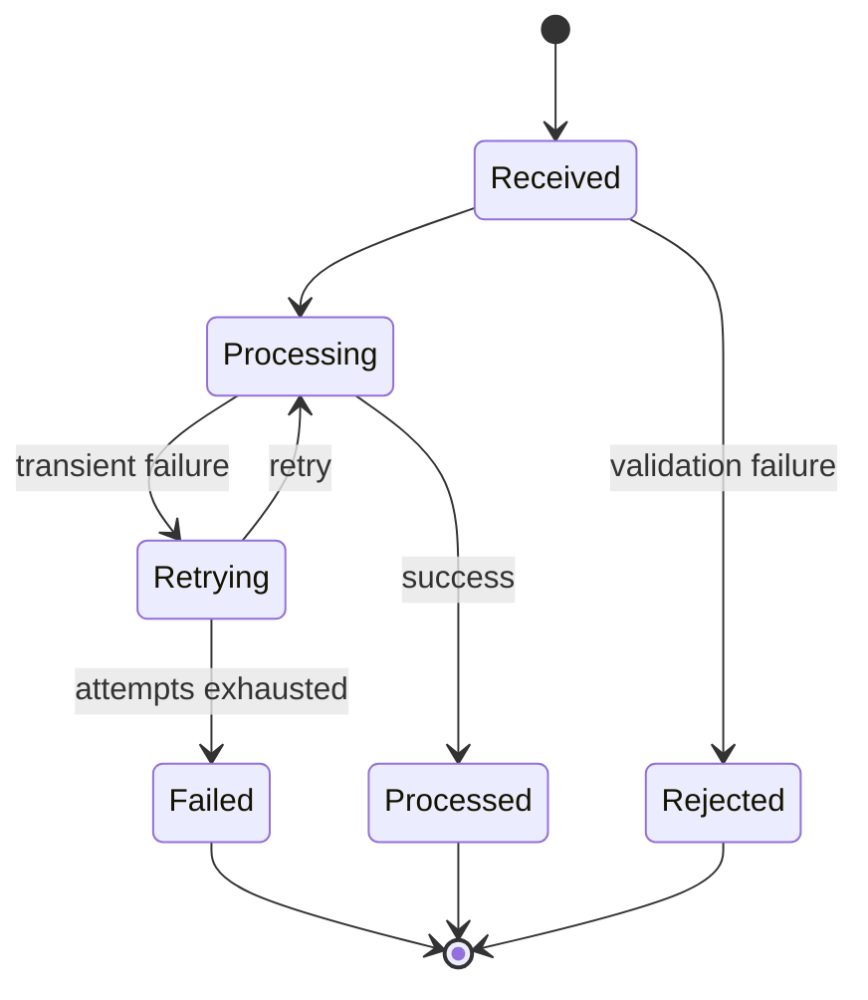

# FlowLens Integration Contracts

## Document Purpose

This document defines the contracts used to simulate communication between FlowLens and Northstar Business Services’ external systems.

The initial project release will not connect to real Salesforce, DocuSign, NetSuite, Jira, or Slack accounts. Instead, it will use documented, testable adapters that reproduce the business events FlowLens would need in a production environment.

## Integration Objectives

FlowLens integrations must:

1. Preserve clear systems of record.
2. Use documented event contracts.
3. Validate all incoming data.
4. Process duplicate events idempotently.
5. Preserve correlation identifiers.
6. Track the complete processing lifecycle.
7. Retry transient failures safely.
8. Create visible exceptions for permanent failures.
9. Avoid silent data loss.
10. Use only synthetic payloads and credentials.

## Integration Landscape

| System | Direction | FlowLens Purpose |
|---|---|---|
| Salesforce | Inbound | Create launches and receive customer or opportunity updates |
| DocuSign | Inbound | Receive executed-contract status |
| NetSuite | Inbound | Receive billing-account and financial-readiness status |
| Jira | Outbound and inbound | Create simulated implementation projects and receive execution status |
| Slack | Outbound | Send linked workflow notifications and alerts |

## Shared Event Envelope

Every inbound simulated integration event must use the same outer structure.

```json
{
  "schema_version": "1.0",
  "event_id": "evt_sf_00010482",
  "source_system": "SALESFORCE",
  "event_type": "opportunity.closed_won",
  "occurred_at": "2026-08-20T16:30:00Z",
  "correlation_id": "5c98382c-63af-4928-81a1-81225fc14c87",
  "data": {}
}
```

## Event Envelope Fields

| Field | Type | Required | Description |
|---|---|---:|---|
| `schema_version` | String | Yes | Version of the event contract |
| `event_id` | String | Yes | Unique identifier assigned by the source |
| `source_system` | ExternalSystem | Yes | Simulated source system |
| `event_type` | String | Yes | Supported source-event type |
| `occurred_at` | ISO 8601 timestamp | Yes | Time the business event occurred |
| `correlation_id` | UUID | Yes | Identifier connecting related activity |
| `data` | Object | Yes | Event-specific synthetic payload |

## Shared Validation Rules

FlowLens must reject an event when:

- A required envelope field is missing.
- `schema_version` is unsupported.
- `event_id` is blank.
- `source_system` is unsupported.
- `event_type` is unsupported for the source.
- `occurred_at` is not a valid ISO 8601 timestamp.
- `correlation_id` is not a valid UUID.
- `data` is not an object.
- Required event-specific fields are missing.
- A field contains an invalid controlled value.
- The payload attempts to include credentials or prohibited data.

Rejected events must not change workflow state.

## Inbound Integration Endpoint

The planned inbound endpoint is:

```text
POST /api/integrations/events
```

### Successful Receipt

```json
{
  "integration_event_id": "9d05228a-f192-4fd1-9f34-bcc4ed8d9d55",
  "external_event_id": "evt_sf_00010482",
  "status": "PROCESSED",
  "duplicate": false,
  "correlation_id": "5c98382c-63af-4928-81a1-81225fc14c87"
}
```

### Previously Processed Event

```json
{
  "integration_event_id": "9d05228a-f192-4fd1-9f34-bcc4ed8d9d55",
  "external_event_id": "evt_sf_00010482",
  "status": "PROCESSED",
  "duplicate": true,
  "correlation_id": "5c98382c-63af-4928-81a1-81225fc14c87"
}
```

A duplicate receipt returns the existing processing result without repeating the workflow action.

### Validation Failure

```json
{
  "error": {
    "code": "INVALID_EVENT_PAYLOAD",
    "message": "The integration event could not be accepted.",
    "details": [
      {
        "field": "data.target_launch_at",
        "issue": "A valid ISO 8601 timestamp is required."
      }
    ]
  },
  "correlation_id": "5c98382c-63af-4928-81a1-81225fc14c87"
}
```

## Integration Status Endpoint

The planned status endpoint is:

```text
GET /api/integrations/events/{integration_event_id}
```

### Example Response

```json
{
  "id": "9d05228a-f192-4fd1-9f34-bcc4ed8d9d55",
  "external_event_id": "evt_sf_00010482",
  "source_system": "SALESFORCE",
  "event_type": "opportunity.closed_won",
  "status": "PROCESSED",
  "attempt_count": 1,
  "received_at": "2026-08-20T16:30:02Z",
  "processed_at": "2026-08-20T16:30:03Z",
  "failed_at": null,
  "last_error": null,
  "correlation_id": "5c98382c-63af-4928-81a1-81225fc14c87"
}
```

## Salesforce Contract

### Supported Event: Opportunity Closed-Won

```text
opportunity.closed_won
```

### Purpose

Creates the canonical FlowLens launch after validation and duplicate detection.

### Example Event

```json
{
  "schema_version": "1.0",
  "event_id": "evt_sf_00010482",
  "source_system": "SALESFORCE",
  "event_type": "opportunity.closed_won",
  "occurred_at": "2026-08-20T16:30:00Z",
  "correlation_id": "5c98382c-63af-4928-81a1-81225fc14c87",
  "data": {
    "opportunity_id": "OPP-10482",
    "account_id": "ACC-2981",
    "customer_name": "Summit Ridge Partners",
    "sales_owner_id": "USR-SALES-014",
    "sales_owner_name": "Maya Brooks",
    "primary_contact": {
      "contact_id": "CON-7204",
      "display_name": "Jordan Ellis"
    },
    "service_scope": "Enterprise implementation",
    "contract_reference": "CTR-88291",
    "target_launch_at": "2026-09-14T14:00:00Z",
    "known_dependencies": [
      "Customer data export",
      "Identity-provider configuration"
    ]
  }
}
```

All values are synthetic.

### Required Salesforce Fields

- `opportunity_id`
- `account_id`
- `customer_name`
- `sales_owner_id`
- `sales_owner_name`
- `primary_contact.contact_id`
- `primary_contact.display_name`
- `service_scope`
- `contract_reference`
- `target_launch_at`

### Processing Result

A valid unique event must:

1. Create an integration-event record.
2. Create one canonical launch.
3. Create Salesforce external references.
4. Enter Handoff Review.
5. Assign the Operations owner.
6. Create the initial next action.
7. Record integration and workflow events.

## Salesforce Update Event

```text
opportunity.updated
```

This event may update approved cached display fields but must not silently change:

- FlowLens workflow stage
- Approval decisions
- Exception resolutions
- Accountable ownership
- Historical events

Source changes that conflict with workflow state must create a status-conflict exception.

## DocuSign Contract

### Supported Event: Contract Completed

```text
contract.completed
```

### Example Event

```json
{
  "schema_version": "1.0",
  "event_id": "evt_ds_00088291",
  "source_system": "DOCUSIGN",
  "event_type": "contract.completed",
  "occurred_at": "2026-08-20T15:44:00Z",
  "correlation_id": "5c98382c-63af-4928-81a1-81225fc14c87",
  "data": {
    "contract_id": "CTR-88291",
    "opportunity_id": "OPP-10482",
    "signature_status": "COMPLETED",
    "completed_at": "2026-08-20T15:44:00Z",
    "contract_type": "ENTERPRISE_SERVICES",
    "requires_legal_review": true,
    "contract_reference_url": "https://example.invalid/contracts/CTR-88291"
  }
}
```

### Processing Result

A valid event must:

- Link the contract to the launch.
- Update the external reference.
- Mark contract-signature requirements complete.
- Trigger Legal review when required.
- Recalculate stage readiness.
- Record an audit event.

FlowLens stores the synthetic reference and required metadata, not an actual contract document.

## NetSuite Contract

### Supported Event: Billing Account Ready

```text
billing_account.ready
```

### Example Event

```json
{
  "schema_version": "1.0",
  "event_id": "evt_ns_00044218",
  "source_system": "NETSUITE",
  "event_type": "billing_account.ready",
  "occurred_at": "2026-08-22T18:15:00Z",
  "correlation_id": "5c98382c-63af-4928-81a1-81225fc14c87",
  "data": {
    "billing_account_id": "BILL-44218",
    "opportunity_id": "OPP-10482",
    "billing_status": "READY",
    "financial_review_required": true,
    "ready_at": "2026-08-22T18:15:00Z"
  }
}
```

### Processing Result

A valid event must:

- Link the billing account to the launch.
- Update billing readiness.
- Mark applicable billing requirements complete.
- Preserve the Finance approval as a separate human decision.
- Recalculate workflow and risk status.
- Record an audit event.

Billing readiness does not automatically create Finance approval.

## Jira Outbound Contract

### Planned Operation: Create Implementation Project

```text
POST simulated-jira/projects
```

### Example Request

```json
{
  "request_id": "req_jira_0010482",
  "correlation_id": "5c98382c-63af-4928-81a1-81225fc14c87",
  "launch_id": "8de17aa4-8475-4d91-8db1-42673e9dd541",
  "customer": {
    "external_id": "ACC-2981",
    "display_name": "Summit Ridge Partners"
  },
  "service_scope": "Enterprise implementation",
  "target_launch_at": "2026-09-14T14:00:00Z",
  "flowlens_reference_url": "https://example.invalid/launches/8de17aa4-8475-4d91-8db1-42673e9dd541"
}
```

### Example Response

```json
{
  "project_id": "JIRA-IMP-2048",
  "status": "CREATED",
  "project_reference_url": "https://example.invalid/jira/JIRA-IMP-2048",
  "correlation_id": "5c98382c-63af-4928-81a1-81225fc14c87"
}
```

### Processing Result

A successful response must:

- Create the Jira external reference.
- Mark the Jira-project requirement complete.
- Record an integration event.
- Record a workflow event.
- Avoid creating duplicate Jira projects when the request is retried.

## Jira Inbound Contract

### Supported Event: Implementation Status Changed

```text
implementation.status_changed
```

### Example Event

```json
{
  "schema_version": "1.0",
  "event_id": "evt_jira_002048_07",
  "source_system": "JIRA",
  "event_type": "implementation.status_changed",
  "occurred_at": "2026-08-27T17:12:00Z",
  "correlation_id": "5c98382c-63af-4928-81a1-81225fc14c87",
  "data": {
    "project_id": "JIRA-IMP-2048",
    "launch_id": "8de17aa4-8475-4d91-8db1-42673e9dd541",
    "implementation_status": "AT_RISK",
    "completed_milestones": 4,
    "total_milestones": 7,
    "blocking_issue_count": 1,
    "target_completion_at": "2026-09-10T20:00:00Z"
  }
}
```

### Processing Result

A valid status event must:

- Update summarized implementation progress.
- Preserve Jira as the detailed execution system.
- Recalculate FlowLens risk.
- Create an exception when a blocking condition exists.
- Record integration and workflow events.

## Slack Outbound Contract

### Planned Notification Types

- Assignment created
- Approval requested
- Approval rejected
- More information requested
- Assignment overdue
- High or critical exception created
- Risk status changed
- Launch approved
- Launch completed

### Example Notification Request

```json
{
  "notification_id": "ntf_6f0cd319",
  "notification_type": "APPROVAL_REQUESTED",
  "recipient": {
    "user_id": "USR-LEGAL-004",
    "channel": "SLACK"
  },
  "launch": {
    "id": "8de17aa4-8475-4d91-8db1-42673e9dd541",
    "customer_display_name": "Summit Ridge Partners"
  },
  "message": "Legal review is required for Summit Ridge Partners.",
  "action_url": "https://example.invalid/launches/8de17aa4-8475-4d91-8db1-42673e9dd541/approvals",
  "correlation_id": "5c98382c-63af-4928-81a1-81225fc14c87"
}
```

Every notification must link to FlowLens.

A notification response does not become an approval unless processed through an authenticated FlowLens approval action.

## Idempotency Strategy

FlowLens uses the combination of:

```text
source_system + external_event_id
```

as the inbound idempotency key.

For outbound operations, FlowLens uses a stable request identifier associated with the workflow action.

### Required Behavior

When the same inbound event is received again:

- FlowLens returns the existing integration-event result.
- Workflow state is not changed again.
- Assignments are not duplicated.
- Approvals are not duplicated.
- Exceptions are not duplicated.
- Audit actions are not duplicated.

When an outbound request is retried:

- The simulated adapter returns the previously created external record when applicable.
- A second Jira project or notification is not created unintentionally.

## Processing Lifecycle



## Retry Strategy

The simulated integration layer uses the following retry schedule for transient processing failures:

| Attempt | Delay |
|---:|---:|
| 1 | Immediate |
| 2 | 5 seconds |
| 3 | 30 seconds |
| 4 | 120 seconds |

After the fourth unsuccessful attempt:

- The event is marked `FAILED`.
- The final sanitized error is stored.
- An integration exception is created.
- The exception is assigned.
- Relevant operations users are notified.
- The failure remains visible in the integration view.

Validation failures are not retried automatically.

## Error Classification

| Error Code | Category | Retryable | Expected Result |
|---|---|---:|---|
| `INVALID_EVENT_PAYLOAD` | Validation | No | Reject event without workflow change |
| `UNSUPPORTED_SCHEMA_VERSION` | Validation | No | Reject event |
| `UNSUPPORTED_EVENT_TYPE` | Validation | No | Reject event |
| `UNKNOWN_LAUNCH_REFERENCE` | Data relationship | No | Create or route for review |
| `DUPLICATE_EVENT` | Idempotency | No | Return existing result |
| `SOURCE_CONFLICT` | Data conflict | No | Create assigned status-conflict exception |
| `ADAPTER_TIMEOUT` | Transient integration | Yes | Retry |
| `ADAPTER_UNAVAILABLE` | Transient integration | Yes | Retry |
| `DATABASE_UNAVAILABLE` | Transient platform | Yes | Retry |
| `PROCESSING_FAILURE` | Internal processing | Depends | Retry when safe |
| `RETRY_EXHAUSTED` | Permanent processing failure | No | Create assigned integration exception |

## Correlation Strategy

The same `correlation_id` must connect:

- The received integration event
- The canonical launch action
- Created assignments
- Created approvals
- Created exceptions
- Workflow events
- Outbound integration requests
- Structured logs

This allows one business operation to be traced across technical and workflow layers.

## Data-Conflict Handling

When an external update conflicts with FlowLens workflow state:

1. Preserve the external source value.
2. Do not silently overwrite the FlowLens decision.
3. Create a status-conflict exception.
4. Identify the conflicting systems and values.
5. Assign the exception to the appropriate role.
6. Recalculate launch risk.
7. Require a documented resolution.
8. Record the resolution through an audit event.

## Security Requirements

The simulated integration design must:

- Use no real API keys.
- Commit no credentials.
- Store future secrets outside source control.
- Validate all payloads.
- Restrict payload size.
- Sanitize error details.
- Avoid logging prohibited data.
- Use HTTPS assumptions in architecture documentation.
- Support future signature verification.
- Document which repository files are synthetic.

## Observability Requirements

Each integration operation must produce structured information containing:

- Integration-event identifier
- External-event identifier
- Source system
- Event type
- Processing status
- Attempt number
- Correlation identifier
- Processing duration
- Stable error code when applicable
- Timestamp

Credentials and unnecessary payload contents must never appear in logs.

## Testing Requirements

Automated integration tests must cover:

- Valid Salesforce launch creation
- Missing Salesforce fields
- Duplicate Salesforce event
- Conflicting Salesforce update
- Completed DocuSign contract
- Billing-ready NetSuite event
- Jira project creation
- Duplicate Jira creation request
- Jira at-risk status
- Slack notification creation
- Invalid event schema
- Unsupported event type
- Transient adapter failure
- Successful retry
- Exhausted retries
- Visible integration exception
- Correlation-identifier preservation
- Synthetic-data enforcement

## Initial Integration Limitations

The initial release will not provide:

- Real OAuth flows
- Real external credentials
- Real webhook-signature verification
- Real Salesforce, DocuSign, NetSuite, Jira, or Slack connectivity
- Guaranteed delivery across production infrastructure
- Production rate-limit management
- Production data retention
- Production service-level commitments

The architecture should allow these capabilities to be added later without replacing the core workflow model.

## Integration Conclusion

The FlowLens integration layer provides controlled and observable communication between simulated systems of record and the canonical workflow.

The contracts prioritize validation, idempotency, correlation, visible failure handling, and source-system ownership so that automation improves coordination without creating new silent failure modes.